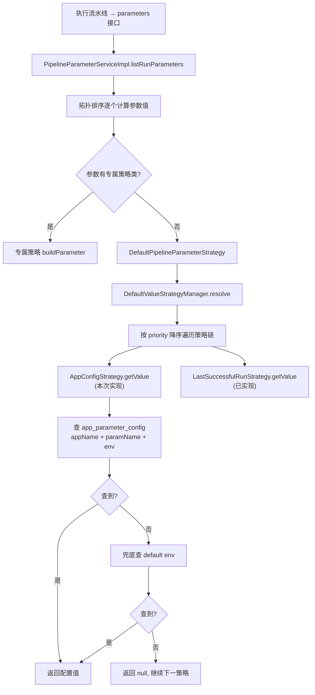
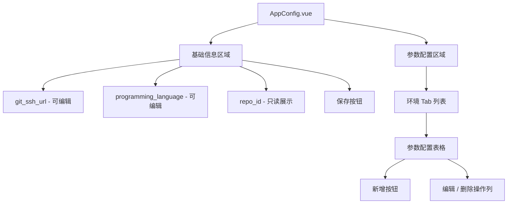
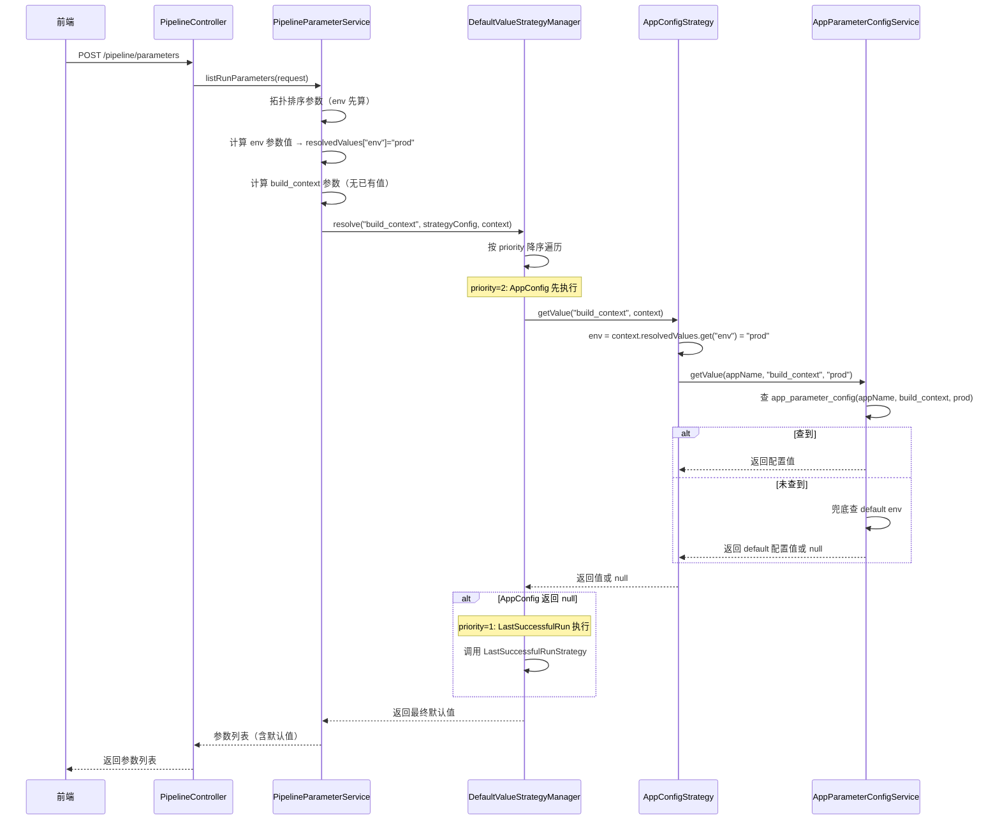

# 应用参数配置（AppParameterConfig）技术设计文档

> **版本**：v1.1  
> **日期**：2026-07-30  
> **状态**：设计中

---

## 一、背景

### 1.1 现状

执行流水线时，`PipelineController#parameters` 接口返回参数列表，参数默认值通过**默认值策略链**计算。当前已实现的策略：

| 策略 | strategyType | 说明 |
|------|-------------|------|
| `LastSuccessfulRunStrategy` | `LastSuccessfulRun` | 取该 pipeline 最近一次成功执行的参数值 |
| `AppConfigStrategy` | `AppConfig` | **空实现**，预留扩展点 |

### 1.2 问题

两类策略适用场景不同：

- **LastSuccessfulRun**：适合「上次填了什么，这次默认还是什么」的参数（如分支名）
- **AppConfig**：适合「在应用维度初始化一次、固定不变」的参数（如构建上下文路径、构建模块路径）

此外，部分参数在不同环境下值不同（如镜像仓库地址），需要区分环境配置；也有很多参数不区分环境，需要支持默认环境（`default`）。

### 1.3 目标

1. 新增 `app_parameter_config` 表，存储应用维度的参数默认值配置，区分环境
2. 实现 `AppConfigStrategy` 策略逻辑
3. 后端提供完整的 CRUD + 辅助查询接口
4. 前端新增「应用配置」页面，支持基础信息编辑 + 分环境参数配置管理

---

## 二、整体架构



---

## 三、后端设计

### 3.1 数据库设计

#### 3.1.1 表结构：`app_parameter_config`

| 字段 | 类型 | 说明 |
|------|------|------|
| `id` | `bigint` | 主键，自增 |
| `app_name` | `varchar(200)` | 应用名称 |
| `parameter_name` | `varchar(100)` | 参数名（关联 `pipeline_parameter.name`） |
| `value` | `varchar(200)` | 参数值 |
| `env` | `varchar(20)` | 环境（`default` 表示默认环境） |
| `create_time` | `datetime` | 创建时间 |
| `update_time` | `datetime` | 更新时间 |
| `deleted` | `tinyint(1)` | 逻辑删除标记，默认 0 |

**唯一约束**：`uk_app_param_env (app_name, parameter_name, env, deleted)`

**索引**：`idx_app_env (app_name, env)`

#### 3.1.2 建表 SQL

```sql
CREATE TABLE `app_parameter_config` (
    `id`            BIGINT       NOT NULL AUTO_INCREMENT COMMENT '主键',
    `app_name`      VARCHAR(200) NOT NULL COMMENT '应用名称',
    `parameter_name` VARCHAR(100) NOT NULL COMMENT '参数名',
    `value`         VARCHAR(200) NOT NULL COMMENT '参数值',
    `env`           VARCHAR(20)  NOT NULL DEFAULT 'default' COMMENT '环境，default 表示默认环境',
    `create_time`   DATETIME     NOT NULL DEFAULT CURRENT_TIMESTAMP COMMENT '创建时间',
    `update_time`   DATETIME     NOT NULL DEFAULT CURRENT_TIMESTAMP ON UPDATE CURRENT_TIMESTAMP COMMENT '更新时间',
    `deleted`       TINYINT(1)   NOT NULL DEFAULT 0 COMMENT '逻辑删除',
    PRIMARY KEY (`id`),
    UNIQUE KEY `uk_app_param_env` (`app_name`, `parameter_name`, `env`, `deleted`),
    KEY `idx_app_env` (`app_name`, `env`)
) ENGINE=InnoDB DEFAULT CHARSET=utf8mb4 COMMENT='应用参数配置';
```

### 3.2 实体与 DAO 层

#### 3.2.1 实体类：`AppParameterConfig`

**路径**：`pipeline-server-dao/.../entity/AppParameterConfig.java`

```java
@Data
@TableName("app_parameter_config")
public class AppParameterConfig {
    @TableId(type = IdType.AUTO)
    private Long id;
    private String appName;
    private String parameterName;
    private String value;
    private String env;
    private LocalDateTime createTime;
    private LocalDateTime updateTime;
    @TableLogic
    private Integer deleted;
}
```

#### 3.2.2 Mapper：`AppParameterConfigMapper`

**路径**：`pipeline-server-dao/.../mapper/AppParameterConfigMapper.java`

```java
@Mapper
public interface AppParameterConfigMapper extends BaseMapper<AppParameterConfig> {

    /** 按 appName + parameterName + env 精确查询（用于策略查询） */
    AppParameterConfig selectByAppParamEnv(
            @Param("appName") String appName,
            @Param("parameterName") String parameterName,
            @Param("env") String env);

    /** 按 appName + env 查询列表（不分页） */
    List<AppParameterConfig> selectListByAppEnv(
            @Param("appName") String appName,
            @Param("env") String env);
}
```

### 3.3 Facade 层（Request / Response）

#### 3.3.1 Request

**`AppParameterConfigCreateRequest`**

| 字段 | 类型 | 说明 |
|------|------|------|
| `appName` | `String` | 应用名称 |
| `parameterName` | `String` | 参数名 |
| `value` | `String` | 参数值 |
| `env` | `String` | 环境 |

**`AppParameterConfigUpdateRequest`**

| 字段 | 类型 | 说明 |
|------|------|------|
| `id` | `Long` | 主键 |
| `value` | `String` | 参数值（仅支持编辑 value） |

**`AppParameterConfigBatchCreateRequest`**（批量新增）

| 字段 | 类型 | 说明 |
|------|------|------|
| `appName` | `String` | 应用名称 |
| `env` | `String` | 环境 |
| `items` | `List<ConfigItem>` | 参数配置列表 |

`ConfigItem`：

| 字段 | 类型 | 说明 |
|------|------|------|
| `parameterName` | `String` | 参数名 |
| `value` | `String` | 参数值 |

**`AppParameterConfigQuery`**

| 字段 | 类型 | 说明 |
|------|------|------|
| `appName` | `String` | 应用名称（必填） |
| `env` | `String` | 环境（必填） |

> 不分页，直接返回全量列表。

#### 3.3.2 Response

**`AppParameterConfigResponse`**（列表展示用，关联 pipeline_parameter 信息）

| 字段 | 类型 | 说明 |
|------|------|------|
| `id` | `Long` | 主键 |
| `appName` | `String` | 应用名称 |
| `parameterName` | `String` | 参数名 |
| `value` | `String` | 参数值 |
| `env` | `String` | 环境 |
| `label` | `String` | 参数中文名（来自 `pipeline_parameter.label`） |
| `description` | `String` | 参数描述（来自 `pipeline_parameter.description`） |

**`AppParameterOptionResponse`**（新增弹框参数下拉用）

| 字段 | 类型 | 说明 |
|------|------|------|
| `name` | `String` | 参数名 |
| `label` | `String` | 参数中文名 |
| `componentType` | `String` | 组件类型 |
| `paramType` | `String` | 参数类型 |
| `optionConfig` | `String` | 选项配置 JSON（SELECT/RADIO 用） |

### 3.4 Controller 层

#### 3.4.1 `AppParameterConfigController`

**路径**：`@RequestMapping("/app-parameter-config")`

| 方法 | 路径 | 说明 |
|------|------|------|
| `POST /` | 新增单条 | 校验 appName + parameterName + env 唯一性 |
| `POST /batch` | 批量新增 | 校验每条唯一性，任一重复则整体报错提示 |
| `PUT /` | 修改 | 仅修改 value |
| `DELETE /{id}` | 删除 | 逻辑删除 |
| `GET /list` | 列表查询（不分页） | 按 appName + env 过滤，关联 pipeline_parameter 返回 label/description |
| `GET /envs` | 获取环境列表 | 见 3.4.2 |

#### 3.4.2 获取 env 列表接口

**`GET /app-parameter-config/envs`**

逻辑：
1. 查询 `pipeline_parameter` 表中 `name = 'env'` 的记录（仅一条）
2. 解析 `option_config` JSON，提取所有 `value` 字段，得到环境字符串列表
3. 在列表第一个位置插入 `"default"`
4. 返回 `Result<List<String>>`

```java
@GetMapping("/envs")
public Result<List<String>> envs() {
    return Result.success(appParameterConfigService.listEnvs());
}
```

#### 3.4.3 `AppInfoController` 新增接口

**`GET /app-info/detail?appName={appName}`**

根据 appName 获取应用详情（用于应用配置页基础信息展示）。

```java
@GetMapping("/detail")
public Result<AppInfoResponse> getByAppName(@RequestParam("appName") String appName) {
    return Result.success(appInfoService.getByAppName(appName));
}
```

#### 3.4.4 `PipelineParameterController` 新增接口

**`GET /pipeline-parameter/configurable-list`**

查询可配置的参数列表（用于新增弹框的参数名下拉）。

查询条件：
- `component_type` IN (`input`, `select`, `radio`, `git-tree`)
- `param_type` = `user`

返回字段：`name`、`label`、`component_type`、`param_type`、`option_config`

```java
@GetMapping("/configurable-list")
public Result<List<PipelineParameterOptionResponse>> configurableList() {
    return Result.success(pipelineParameterService.listConfigurableParameters());
}
```

### 3.5 Service 层

#### 3.5.1 `AppParameterConfigService`

```java
public interface AppParameterConfigService {
    AppParameterConfigResponse create(AppParameterConfigCreateRequest request);
    void batchCreate(AppParameterConfigBatchCreateRequest request);
    AppParameterConfigResponse update(AppParameterConfigUpdateRequest request);
    void deleteById(Long id);
    List<AppParameterConfigResponse> list(AppParameterConfigQuery query);
    List<String> listEnvs();

    /** 策略查询：先查指定 env，兜底查 default */
    String getValue(String appName, String parameterName, String env);
}
```

#### 3.5.2 `AppInfoService` 新增方法

```java
AppInfoResponse getByAppName(String appName);
```

#### 3.5.3 `PipelineParameterService` 新增方法

```java
List<PipelineParameterOptionResponse> listConfigurableParameters();
```

实现逻辑：
```java
// component_type IN (input, select, radio, git-tree) AND param_type = 'user'
LambdaQueryWrapper<PipelineParameter> wrapper = new LambdaQueryWrapper<>();
wrapper.in(PipelineParameter::getComponentType,
            ComponentTypeEnum.INPUT.getCode(),
            ComponentTypeEnum.SELECT.getCode(),
            ComponentTypeEnum.RADIO.getCode(),
            ComponentTypeEnum.GIT_TREE.getCode())
       .eq(PipelineParameter::getParamType, "user");
List<PipelineParameter> list = parameterMapper.selectList(wrapper);
// 转换为 PipelineParameterOptionResponse（仅 name, label, componentType, paramType, optionConfig）
```

### 3.6 AppConfigStrategy 实现

#### 3.6.1 env 值获取

`AppConfigStrategy.getValue` 从 `context.getResolvedValues().get("env")` 获取当前环境值。

> **前提**：env 参数在拓扑排序中先于依赖它的参数被计算。由于 env 参数通常无 `depend_params`，且其他参数不构成 env 的依赖，拓扑排序会自然保证 env 先算。

#### 3.6.2 实现代码

```java
@Slf4j
@Component
public class AppConfigStrategy implements DefaultValueStrategy {

    @Autowired
    private AppParameterConfigService appParameterConfigService;

    @Override
    public String strategyType() {
        return "AppConfig";
    }

    @Override
    public String getValue(String paramName, ParamResolveContext context) {
        String appName = context.getAppName();
        if (!StringUtils.hasText(appName)) {
            return null;
        }

        // 从已解析参数中获取 env 值
        String env = context.getResolvedValues() != null
                ? context.getResolvedValues().get("env")
                : null;

        return appParameterConfigService.getValue(appName, paramName, env);
    }
}
```

#### 3.6.3 `getValue` 兜底逻辑

```java
@Override
public String getValue(String appName, String parameterName, String env) {
    // 1. 先查指定 env
    if (StringUtils.hasText(env)) {
        AppParameterConfig config = mapper.selectByAppParamEnv(appName, parameterName, env);
        if (config != null) {
            return config.getValue();
        }
    }
    // 2. 兜底查 default env
    AppParameterConfig defaultConfig = mapper.selectByAppParamEnv(appName, parameterName, "default");
    return defaultConfig != null ? defaultConfig.getValue() : null;
}
```

### 3.7 策略优先级配置

策略优先级由每个参数的 `pipeline_parameter.default_value_strategy_config` 独立配置，格式：

```json
[
  {"strategyType": "AppConfig", "priority": 2},
  {"strategyType": "LastSuccessfulRun", "priority": 1}
]
```

- `priority` 值越大优先级越高
- `DefaultValueStrategyManager.resolve` 按 priority 降序遍历，取第一个非 null 结果
- 全部未命中则使用 `pipeline_parameter.default_value` 兜底

> 参数管理员在「流水线参数」页面为每个参数配置合适的策略链，不统一规定。

---

## 四、前端设计

### 4.1 菜单与路由

#### 4.1.1 菜单结构

在「应用信息」一级菜单下新增二级菜单「应用配置」：

| index | 菜单 | 路由 |
|-------|------|------|
| `1-1` | 应用列表 | `/app-list` |
| `1-2` | **应用配置** | `/app-config` |

#### 4.1.2 路由配置

```ts
// router/index.ts
{
  path: 'app-config',
  name: 'app-config',
  component: () => import('@/views/app-info/AppConfig.vue'),
},
{
  path: 'app-config/:appName',
  name: 'app-config-detail',
  component: () => import('@/views/app-info/AppConfig.vue'),
},
```

#### 4.1.3 入口

- **独立菜单**：点击「应用配置」进入应用选择页，选择应用后展示配置
- **应用列表跳转**：`AppInfoList.vue` 每行增加「配置」操作按钮，跳转 `/app-config/{appName}`

### 4.2 页面结构：`AppConfig.vue`

页面分为上下两部分：



#### 4.2.1 基础信息区域

- 展示并支持编辑：`git_ssh_url`、`programming_language`
- 只读展示：`repo_id`
- 保存按钮调用 `AppInfoController` 的 `PUT /app-info` 接口

#### 4.2.2 参数配置区域

**环境 Tab**：
- 页面加载时调用 `GET /app-parameter-config/envs` 获取环境列表
- 每个环境一个 Tab，第一个 Tab 固定为 `default`
- 切换 Tab 触发 `GET /app-parameter-config/list?appName={appName}&env={env}` 请求
- **刷新操作（新增/编辑/删除后）保持当前 Tab 不变**，仅重新请求当前 env 的数据，不跳转到其他 Tab

**参数配置表格**：

| 列 | 字段来源 | 说明 |
|----|---------|------|
| 参数名 | `parameter_name` | |
| 参数标签 | `pipeline_parameter.label` | |
| 参数值 | `value` | |
| 描述 | `pipeline_parameter.description` | |
| 操作 | — | 编辑、删除按钮 |

- 表格右上角「新增」按钮，打开新增弹框

### 4.3 新增参数弹框：`AppConfigAddDialog.vue`

#### 4.3.1 布局

- 每行一组：参数名（下拉）+ 参数值（动态组件）+ 删除行按钮（🗑）
- 底部「+ 添加一行」按钮，支持批量新增
- 底部「确定」按钮提交批量新增

#### 4.3.2 参数名下拉

- 请求 `GET /pipeline-parameter/configurable-list` 获取可选参数列表
- 下拉项展示 `label`（参数中文名），值为 `name`
- **支持本地模糊搜索**：`<el-select filterable>`，输入关键字过滤 label 或 name
- 选中后根据 `componentType` 动态渲染参数值组件

#### 4.3.3 参数值动态组件

根据选中参数的 `componentType` 渲染：

| componentType | 组件 | 说明 |
|---------------|------|------|
| `input` | `<el-input>` | 普通输入框 |
| `select` | `<el-select>` + `<el-option>` | 解析 `optionConfig`，展示 value 列表 |
| `radio` | `<el-select>` + `<el-option>` | **与 select 相同**，解析 `optionConfig`，展示 value 列表 |
| `git-tree` | `<GitTreeSelect :appName="appName">` | 复用现有组件，传入 appName |

> **注意**：`radio` 类型统一使用 `<el-select>` 下拉选择组件渲染，不使用 `<el-radio-group>`。

> 组件渲染逻辑参考 `PipelineExecuteDialog.vue` 中的 `v-if/v-else-if` 链。

#### 4.3.4 批量新增校验

- 同一批次中不允许出现重复参数名
- 提交前校验：调用 `POST /app-parameter-config/batch`，后端校验每条 `appName + parameterName + env` 唯一性，任一重复则整体报错，提示具体重复的参数名

### 4.4 编辑参数弹框：`AppConfigEditDialog.vue`

- 仅支持编辑 `value` 字段
- 参数名只读展示
- value 组件类型同样根据 `componentType` 动态渲染
- 提交调用 `PUT /app-parameter-config`

### 4.5 前端 API 层

新增 `src/api/appParameterConfig.ts`：

```ts
export interface AppParameterConfig {
  id?: number
  appName: string
  parameterName: string
  value: string
  env: string
  label?: string
  description?: string
}

export interface AppParameterOption {
  name: string
  label: string
  componentType: string
  paramType: string
  optionConfig?: string
}

// CRUD
export function listAppParameterConfig(query): Promise<AppParameterConfig[]>
export function createAppParameterConfig(data): Promise<AppParameterConfig>
export function batchCreateAppParameterConfig(data): Promise<void>
export function updateAppParameterConfig(data): Promise<AppParameterConfig>
export function deleteAppParameterConfig(id: number): Promise<void>

// 辅助
export function listEnvs(): Promise<string[]>
export function listConfigurableParameters(): Promise<AppParameterOption[]>

// AppInfo
export function getAppInfoByAppName(appName: string): Promise<AppInfo>
```

---

## 五、接口清单汇总

### 5.1 新增接口

| # | 方法 | 路径 | Controller | 说明 |
|---|------|------|-----------|------|
| 1 | POST | `/app-parameter-config` | AppParameterConfigController | 新增单条 |
| 2 | POST | `/app-parameter-config/batch` | AppParameterConfigController | 批量新增 |
| 3 | PUT | `/app-parameter-config` | AppParameterConfigController | 修改（仅 value） |
| 4 | DELETE | `/app-parameter-config/{id}` | AppParameterConfigController | 删除 |
| 5 | GET | `/app-parameter-config/list` | AppParameterConfigController | 列表查询（不分页） |
| 6 | GET | `/app-parameter-config/envs` | AppParameterConfigController | 环境列表 |
| 7 | GET | `/app-info/detail` | AppInfoController | 按 appName 查详情 |
| 8 | GET | `/pipeline-parameter/configurable-list` | PipelineParameterController | 可配置参数列表 |

### 5.2 修改的已有文件

| 文件 | 修改内容 |
|------|---------|
| `AppConfigStrategy.java` | 实现 getValue 逻辑 |
| `AppInfoController.java` | 新增 `GET /detail` 接口 |
| `AppInfoService.java` / `AppInfoServiceImpl.java` | 新增 `getByAppName` 方法 |
| `PipelineParameterController.java` | 新增 `GET /configurable-list` 接口 |
| `PipelineParameterService.java` / `Impl` | 新增 `listConfigurableParameters` 方法 |

### 5.3 新增文件清单

**后端**：
- `AppParameterConfig.java`（entity）
- `AppParameterConfigMapper.java` + XML
- `AppParameterConfigController.java`
- `AppParameterConfigService.java` + `AppParameterConfigServiceImpl.java`
- Request：`AppParameterConfigCreateRequest`、`AppParameterConfigBatchCreateRequest`、`AppParameterConfigUpdateRequest`、`AppParameterConfigQuery`
- Response：`AppParameterConfigResponse`、`AppParameterOptionResponse`

**前端**：
- `src/api/appParameterConfig.ts`
- `src/views/app-info/AppConfig.vue`
- `src/views/app-info/components/AppConfigAddDialog.vue`
- `src/views/app-info/components/AppConfigEditDialog.vue`

---

## 六、关键设计决策

| 决策点 | 选择 | 理由 |
|--------|------|------|
| env 来源 | 从 `context.resolvedValues` 取 | env 作为参数参与拓扑排序，自然先于依赖它的参数计算 |
| env 兜底 | 指定 env → default → null | 兼顾区分环境和不区分环境两种场景 |
| 唯一约束 | appName + parameterName + env | 防止重复配置 |
| 批量新增冲突 | 报错提示 | 避免静默覆盖，用户需明确感知 |
| 策略优先级 | 按参数独立配置 | 不同参数适合不同策略，灵活度最高 |
| 应用配置入口 | 独立菜单 + 列表跳转 | 兼顾直接访问和上下文跳转 |
| repoId | 只读展示 | repoId 由 gitSshUrl 自动查询生成，不应手动编辑 |
| 参数列表接口 | 全局查询 | 参数定义是全局的，不区分 appName |

---

## 七、时序图：执行流水线参数默认值计算


