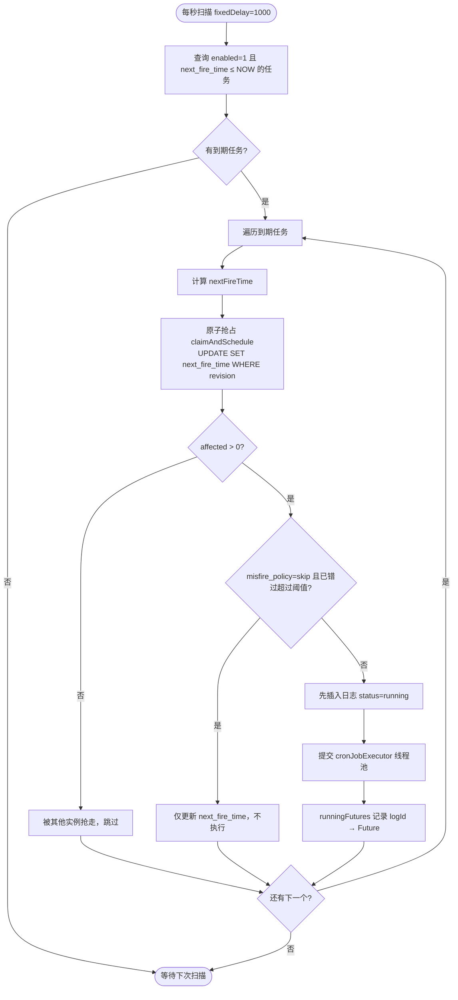
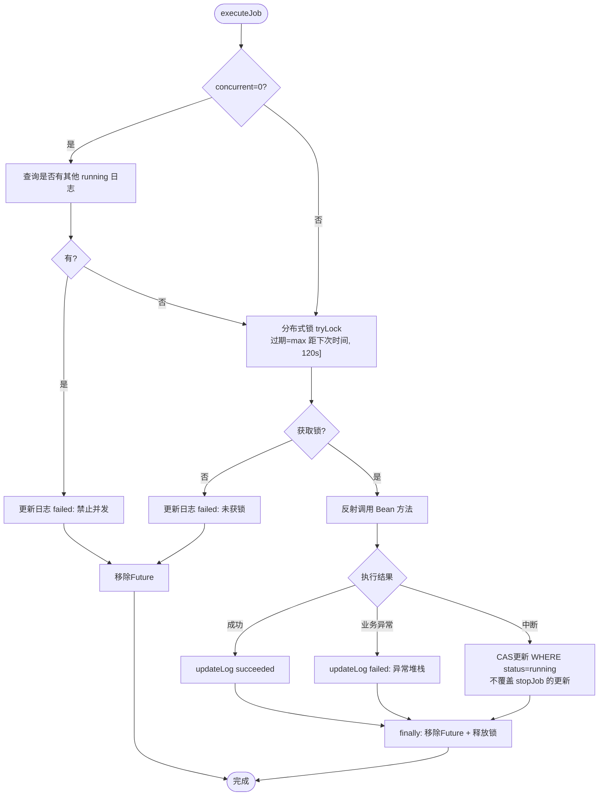
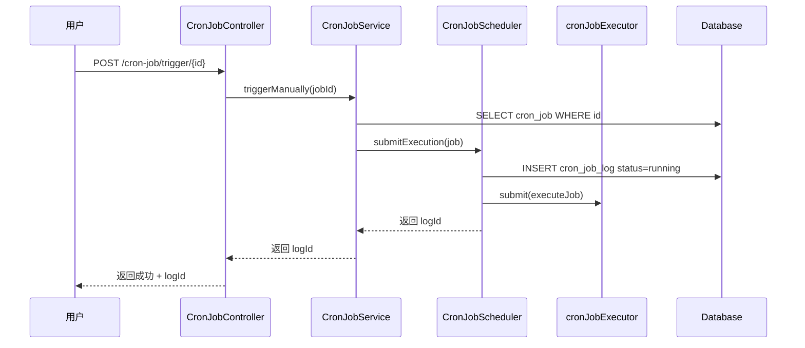
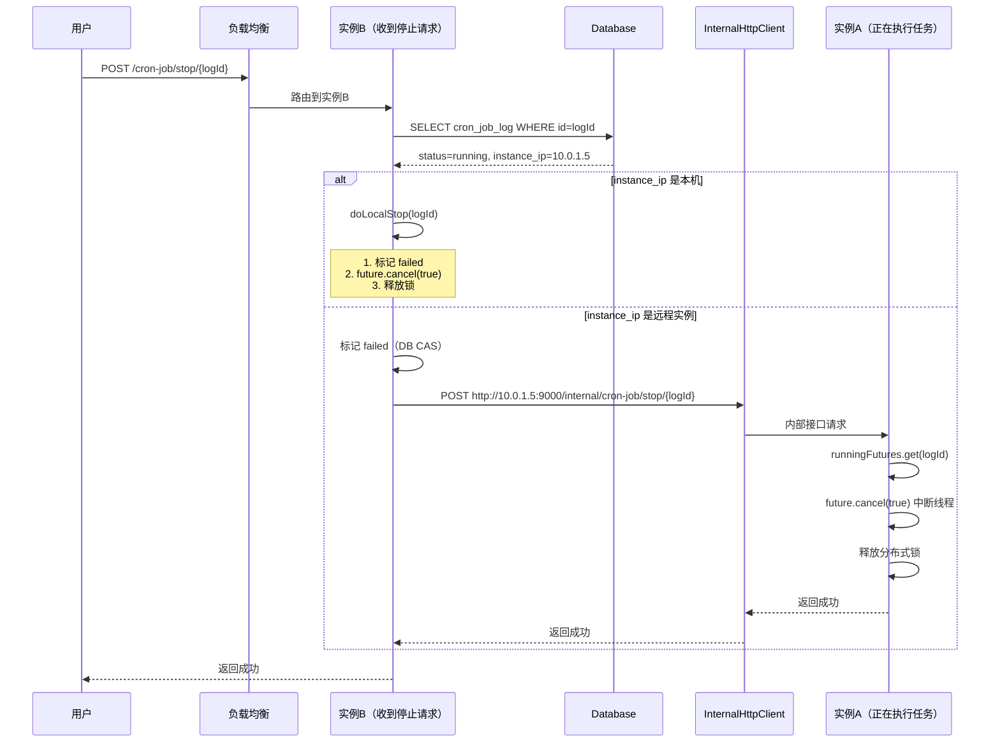
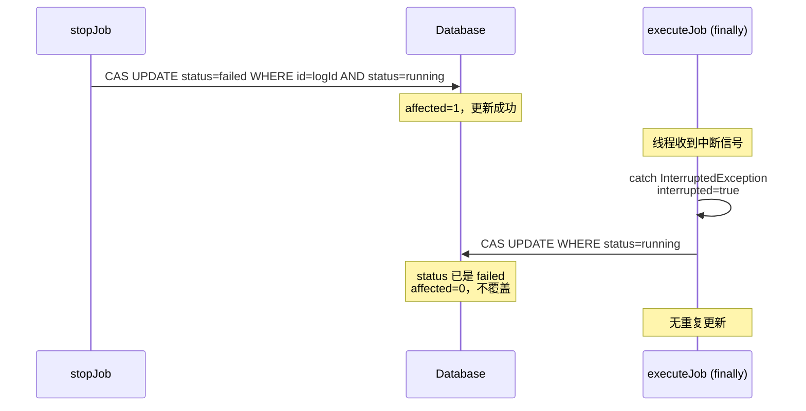

# 定时任务调度模块 - 技术设计方案

## 一、背景与目标

### 1.1 现状

pipeline-server 目前已通过 `@EnableScheduling` 开启了 Spring 调度能力，但尚未有实际的定时任务在使用。随着平台功能扩展，以下场景需要定时任务支持：

- 定时同步流水线执行状态
- 定时清理过期数据 / 临时文件
- 定时触发流水线
- 其他需要周期性执行的运维逻辑

目前缺少一个统一的、可视化的定时任务管理模块，无法通过前端页面动态管理任务的增删改查和执行监控。

### 1.2 目标

基于现有 MySQL + Spring Boot 技术栈，设计一个**轻量级、零额外中间件依赖**的定时任务调度模块，满足：

1. **动态管理**：通过前端页面新增、编辑、启停、手动触发定时任务，无需重启服务。
2. **CRON 调度**：支持标准 CRON 表达式定义执行周期。
3. **分布式安全**：多实例部署时，同一任务同一时间只有一个实例执行。
4. **执行监控**：记录每次执行的开始时间、结束时间、耗时、状态、异常信息。
5. **手动停止**：支持停止正在执行中的任务（通过实例间 HTTP 通知 + 线程中断）。
6. **并发控制**：支持配置任务是否允许并发执行。
7. **零外部依赖**：仅依赖现有 MySQL 和已有的 DB 分布式锁，不引入 Redis / Quartz / XXL-Job。

### 1.3 非目标

- **不做任务分片**：任务量少（≤20），不需要大数据分片并行。
- **不做任务编排**：不支持 DAG 工作流、任务依赖链。
- **不做失败重试**：任务失败不自动重试（可后续扩展）。
- **不做任务告警**：不集成邮件 / 钉钉通知（可后续扩展）。
- **不做跨语言支持**：仅支持调用 JVM 内的 Spring Bean 方法。

---

## 二、整体架构

### 2.1 分层职责

```
┌─────────────────────────────────────────────────────────────┐
│  前端管理页面 (Vue3)                                          │
│  任务列表 │ 新增/编辑 │ 启停 │ 手动触发 │ 停止 │ 执行日志      │
└────────────────────────┬────────────────────────────────────┘
                         │ REST API
┌────────────────────────▼────────────────────────────────────┐
│  API 层                                                       │
│  CronJobController                                           │
│  CronJobInternalController（内部接口，实例间通信）             │
├─────────────────────────────────────────────────────────────┤
│  业务层                                                       │
│  CronJobService（CRUD + 手动触发 + 停止 + 日志查询）           │
├─────────────────────────────────────────────────────────────┤
│  调度核心                                                     │
│  CronJobScheduler                                            │
│    ├── @Scheduled(fixedDelay=1000) 每秒扫描到期任务            │
│    ├── 乐观锁原子抢占（claimAndSchedule）                     │
│    ├── 提交线程池异步执行                                      │
│    └── 执行时分布式锁兜底                                      │
├─────────────────────────────────────────────────────────────┤
│  执行层                                                       │
│  JobInvokeUtil（反射调用 Spring Bean 方法）                   │
│  cronJobExecutor（专用线程池，core=10, max=30, queue=0）      │
├─────────────────────────────────────────────────────────────┤
│  基础设施                                                     │
│  DistributedLockService（已有，执行锁兜底）                    │
│  InternalHttpClient（OkHttp，实例间停止通知）                  │
├─────────────────────────────────────────────────────────────┤
│  数据层                                                       │
│  cron_job（任务定义 + 调度状态）                               │
│  cron_job_log（执行日志）                                     │
│  distributed_lock（已有，分布式锁）                            │
└─────────────────────────────────────────────────────────────┘
```

### 2.2 模块归属

| 层 | 模块 | 包路径 |
|----|------|--------|
| Controller | pipeline-server-service | `com.ci.pipeline.service.controller` |
| Service 接口 + 实现 | pipeline-server-service | `com.ci.pipeline.service.service` / `service.impl` |
| 调度器 | pipeline-server-service | `com.ci.pipeline.service.scheduler` |
| 反射工具 | pipeline-server-service | `com.ci.pipeline.service.util` |
| 内部 HTTP 客户端 | pipeline-server-service | `com.ci.pipeline.service.remote` |
| 线程池配置 | pipeline-server-service | `com.ci.pipeline.service.config` |
| Entity | pipeline-server-dao | `com.ci.pipeline.dao.entity` |
| Mapper | pipeline-server-dao | `com.ci.pipeline.dao.mapper` |
| Mapper XML | pipeline-server-dao | `resources/mapper` |
| Constants | pipeline-server-common | `com.ci.pipeline.common.constants` |
| 建表 SQL | 项目根目录 | `sql/cron_job.sql` |

---

## 三、数据模型设计

### 3.1 任务定义表 `cron_job`

```sql
CREATE TABLE `cron_job` (
    `id`              BIGINT NOT NULL AUTO_INCREMENT COMMENT '主键',
    `name`            VARCHAR(100)  NOT NULL COMMENT '任务名称',
    `bean_name`       VARCHAR(200)  NOT NULL COMMENT 'Spring Bean 名称',
    `method_name`     VARCHAR(100)  NOT NULL COMMENT '方法名称',
    `method_params`   VARCHAR(500)  DEFAULT NULL COMMENT '方法参数，JSON数组格式，如 ["daily", 500, true]',
    `cron_expr`       VARCHAR(128)  NOT NULL COMMENT 'CRON 表达式',
    `enabled`         TINYINT       NOT NULL DEFAULT 1 COMMENT '1=启用 0=停用',
    `misfire_policy`  VARCHAR(20)   NOT NULL DEFAULT 'fire_now' COMMENT '错过策略: fire_now=立即执行 fire_once=执行一次 skip=放弃',
    `concurrent`      TINYINT       NOT NULL DEFAULT 0 COMMENT '0=禁止并发 1=允许并发',
    `next_fire_time`  DATETIME      DEFAULT NULL COMMENT '下次执行时间',
    `last_fire_time`  DATETIME      DEFAULT NULL COMMENT '上次执行时间',
    `revision`        INT           NOT NULL DEFAULT 0 COMMENT '乐观锁版本号',
    `create_time`     DATETIME      NOT NULL DEFAULT CURRENT_TIMESTAMP COMMENT '创建时间',
    `update_time`     DATETIME      NOT NULL DEFAULT CURRENT_TIMESTAMP ON UPDATE CURRENT_TIMESTAMP COMMENT '更新时间',
    `deleted`         TINYINT       NOT NULL DEFAULT 0 COMMENT '逻辑删除',
    PRIMARY KEY (`id`),
    KEY `idx_enabled_next_fire` (`enabled`, `next_fire_time`)
) ENGINE=InnoDB DEFAULT CHARSET=utf8mb3 COMMENT='定时任务定义';
```

### 3.2 字段说明

| 字段 | 类型 | 说明 |
|------|------|------|
| `id` | bigint PK | 自增主键 |
| `name` | varchar(100) | 任务名称，用于展示和日志冗余 |
| `bean_name` | varchar(200) | Spring 容器中 Bean 的名称，如 `pipelineSyncJob` |
| `method_name` | varchar(100) | Bean 上的方法名，如 `syncStatus` |
| `method_params` | varchar(500) | 方法参数，JSON 数组格式，无参方法留空。如 `["daily", 500, true]` |
| `cron_expr` | varchar(128) | 标准 6 位 CRON 表达式（Spring CronExpression 格式） |
| `enabled` | tinyint | 1=启用，0=停用。停用的任务不会被调度扫描 |
| `misfire_policy` | varchar(20) | 错过执行策略，取值对应 `MisfirePolicyEnum` 的 code，见 §4.5 |
| `concurrent` | tinyint | 0=禁止并发（默认），1=允许并发 |
| `next_fire_time` | datetime | 下次执行时间，调度器扫描的核心依据 |
| `last_fire_time` | datetime | 上次触发时间，用于展示 |
| `revision` | int | 乐观锁版本号，原子抢占的核心 |
| `create_time` | datetime | 创建时间 |
| `update_time` | datetime | 更新时间 |
| `deleted` | tinyint | 逻辑删除标志 |

### 3.3 执行日志表 `cron_job_log`

```sql
CREATE TABLE `cron_job_log` (
    `id`            BIGINT NOT NULL AUTO_INCREMENT COMMENT '主键',
    `job_id`        BIGINT       NOT NULL COMMENT '任务ID',
    `job_name`      VARCHAR(100) COMMENT '任务名称（冗余）',
    `bean_name`     VARCHAR(200) COMMENT 'Bean名称（冗余）',
    `method_name`   VARCHAR(100) COMMENT '方法名称（冗余）',
    `method_params` VARCHAR(500) COMMENT '方法参数（冗余）',
    `status`        VARCHAR(20)  NOT NULL COMMENT '执行状态: running/succeeded/failed',
    `message`       TEXT         COMMENT '执行信息或异常堆栈',
    `instance_ip`   VARCHAR(50)  COMMENT '执行实例IP',
    `start_time`    DATETIME     COMMENT '开始时间',
    `end_time`      DATETIME     COMMENT '结束时间',
    `cost_ms`       BIGINT       COMMENT '耗时(毫秒)',
    `create_time`   DATETIME     NOT NULL DEFAULT CURRENT_TIMESTAMP COMMENT '创建时间',
    PRIMARY KEY (`id`),
    KEY `idx_job_id` (`job_id`),
    KEY `idx_status` (`status`)
) ENGINE=InnoDB DEFAULT CHARSET=utf8mb3 COMMENT='定时任务执行日志';
```

### 3.4 设计要点

- **任务定义与调度状态合并**：`next_fire_time`、`last_fire_time`、`revision` 直接放在 `cron_job` 表中，不需要额外的调度表。
- **日志表冗余字段**：`job_name`、`bean_name`、`method_name`、`method_params` 在日志中冗余存储，即使任务被修改或删除，历史日志仍可追溯。
- `instance_ip` 记录执行该任务的实例 IP，用于停止任务时定位实例。

---

## 四、核心原理

### 4.1 调度模型：抢占式扫描

所有实例运行相同的调度逻辑，通过**乐观锁抢占**确保只有一个实例触发执行：

```
每秒扫描 → 查询到期任务 → 乐观锁 UPDATE 抢占 → 抢到的执行，没抢到的跳过
```

**为什么不需要 Leader 选举？**

乐观锁 UPDATE 是原子操作，MySQL 行锁保证同一时刻只有一个 UPDATE 成功。多个实例同时竞争，天然只有一个赢家，这就是最简单的分布式协调。

### 4.2 原子抢占 SQL

一条 UPDATE 同时完成"抢占"和"更新下次执行时间"两个操作，不存在两步之间的竞态窗口：

```sql
UPDATE cron_job
SET next_fire_time = #{nextFireTime},
    last_fire_time = #{now},
    revision       = revision + 1
WHERE id       = #{jobId}
  AND revision = #{oldRevision}
  AND enabled  = 1
```

- `affected > 0`：抢到了，`next_fire_time` 已更新到未来时间，其他实例不会再查到这条记录。
- `affected = 0`：没抢到（revision 不匹配），跳过。

### 4.3 两层防护

| 层级 | 机制 | 作用 |
|------|------|------|
| **调度层** | 乐观锁 `claimAndSchedule` | 确保只有一个实例触发调度 |
| **执行层** | `DistributedLockService.tryLock` | 兜底防止极端竞态下重复执行 |

执行层锁的过期时间动态计算：

```java
long expireSeconds = Math.max(
    (nextFireTime.getTime() - System.currentTimeMillis()) / 1000,
    120  // 兜底 120 秒，覆盖极短间隔任务
);
```

### 4.4 并发控制

`concurrent` 字段控制同一任务在上一次还没执行完时，是否允许再次触发：

| 值 | 行为 | 适用场景 |
|----|------|----------|
| `0`（禁止并发，默认） | 执行前查询是否有 `running` 日志，有则跳过。同时使用分布式锁保证全局唯一。 | 数据同步任务（不能重叠） |
| `1`（允许并发） | 不检查、不加锁，每次到期都执行。 | 独立通知任务（可重叠） |

### 4.5 错过执行策略（misfire_policy）

当任务因所有实例重启等原因错过了执行时间，重启后如何处理：

| 策略 | 行为 | 说明 |
|------|------|------|
| `fire_now`（默认） | 发现过期任务立即补执行一次，然后更新到下一个未来时间 | 启动后首次扫描自然触发 |
| `fire_once` | 同 fire_now，只补一次 | 行为一致，语义上强调"只补一次" |
| `skip` | 直接跳过，更新到下一个未来时间 | 不重要的任务 |

DB 仍以 `varchar(20)` 存编码字符串（便于直接查看/写 SQL），Java 侧用枚举收敛取值范围，避免散落的字符串字面量到处比较，与项目内 `PipelineRunStatusEnum` / `ConfigActionEnum` 等枚举风格保持一致：

```java
package com.ci.pipeline.common.enums;

/**
 * 定时任务错过执行策略枚举。
 * <p>对应 cron_job.misfire_policy 字段。
 */
public enum MisfirePolicyEnum {

    FIRE_NOW("fire_now", "立即补执行一次"),
    FIRE_ONCE("fire_once", "只补执行一次（行为同 fire_now）"),
    SKIP("skip", "跳过本次，不执行");

    private final String code;
    private final String description;

    MisfirePolicyEnum(String code, String description) {
        this.code = code;
        this.description = description;
    }

    public String getCode() {
        return code;
    }

    public String getDescription() {
        return description;
    }

    public static MisfirePolicyEnum ofCode(String code) {
        if (code == null) {
            return null;
        }
        for (MisfirePolicyEnum policy : values()) {
            if (policy.code.equals(code)) {
                return policy;
            }
        }
        return null;
    }
}
```

---

## 五、核心流程

### 5.1 调度扫描流程



### 5.2 任务执行流程



### 5.3 手动触发流程



### 5.4 停止任务流程（实例间 HTTP 通知）



### 5.5 停止任务的状态更新时序



---

## 六、详细设计

### 6.1 反射调用工具 JobInvokeUtil

负责根据 `bean_name`、`method_name`、`method_params` 反射调用 Spring Bean 方法。

> **权限说明**：当前版本明确不做 `bean_name` 白名单 / 调用权限校验——谁能调用 `CronJobController` 的新增/编辑接口，谁就能反射调用任意 Spring Bean 方法。这是本阶段的已知取舍（配合现有登录鉴权，暂不引入额外权限体系），后续如需对外开放给更多角色，再补充白名单或权限收口。

**参数格式**：`method_params` 为 JSON 数组，如 `["daily", 500, true]`，反射时根据目标方法的参数类型自动转换。

```java
public class JobInvokeUtil {

    /**
     * 反射调用 Spring Bean 方法
     *
     * @param ctx          Spring ApplicationContext
     * @param beanName     Bean 名称
     * @param methodName   方法名称
     * @param methodParams 方法参数 JSON 数组，如 ["daily", 500, true]，无参传 null
     */
    public static void invokeMethod(ApplicationContext ctx, String beanName,
                                     String methodName, String methodParams) throws Exception {
        // ① 校验 Bean 是否存在
        if (!ctx.containsBean(beanName)) {
            throw new IllegalStateException("Bean 不存在: " + beanName);
        }
        Object bean = ctx.getBean(beanName);

        // ② 无参方法
        if (StringUtils.isBlank(methodParams)) {
            Method method = findMethod(bean.getClass(), methodName);
            if (method == null) {
                throw new IllegalStateException(
                    "方法不存在: " + beanName + "." + methodName + "()");
            }
            method.invoke(bean);
            return;
        }

        // ③ 有参方法：解析 JSON 数组
        List<Object> paramList = JSON.parseArray(methodParams, Object.class);
        Class<?>[] paramTypes = new Class<?>[paramList.size()];
        Object[] paramValues = new Object[paramList.size()];
        for (int i = 0; i < paramList.size(); i++) {
            Object val = paramList.get(i);
            paramValues[i] = val;
            paramTypes[i] = val.getClass();
        }
        Method method = findMethod(bean.getClass(), methodName, paramTypes);
        if (method == null) {
            throw new IllegalStateException(
                "方法不存在: " + beanName + "." + methodName
                    + "(" + Arrays.toString(paramTypes) + ")");
        }
        method.invoke(bean, paramValues);
    }

    /**
     * 查找方法（支持无参和有参）。
     * <p><b>注意</b>：不能用 {@code clazz.getMethod(name, paramTypes)} 精确匹配——
     * JSON 解析出的参数类型是包装类型（Integer/Boolean...），而目标方法参数如果声明为
     * 基本类型（int/boolean...），精确匹配会直接失败（NoSuchMethodException）。
     * 这里改为遍历比较，用 {@code ClassUtils.resolvePrimitiveIfNecessary} 把基本类型
     * 转换为包装类型后再判断可赋值性，兼容两种声明方式。
     */
    private static Method findMethod(Class<?> clazz, String methodName, Class<?>... paramTypes) {
        for (Method method : clazz.getMethods()) {
            if (!method.getName().equals(methodName)) continue;
            Class<?>[] declaredTypes = method.getParameterTypes();
            if (declaredTypes.length != paramTypes.length) continue;
            boolean match = true;
            for (int i = 0; i < declaredTypes.length; i++) {
                Class<?> resolvedDeclared = ClassUtils.resolvePrimitiveIfNecessary(declaredTypes[i]);
                if (!resolvedDeclared.isAssignableFrom(paramTypes[i])) {
                    match = false;
                    break;
                }
            }
            if (match) return method;
        }
        return null;
    }
}
```

**参数类型映射**：

| JSON 值 | Java 类型 |
|---------|-----------|
| `"daily"` | `String` |
| `500` | `Integer` |
| `500L`（Fastjson 解析） | `Integer`（需注意 Long 场景） |
| `1.5` | `BigDecimal`（Fastjson 默认） |
| `true` | `Boolean` |

> **注意**：Fastjson 解析数字时，整数默认为 `Integer`，小数默认为 `BigDecimal`。如果目标方法参数是 `Long` 或 `Double`，需要在反射查找方法时做类型适配。当前版本建议任务方法参数尽量使用 `String`、`Integer`、`Boolean`。

### 6.2 调度器 CronJobScheduler

```java
@Slf4j
@Component
public class CronJobScheduler {

    @Autowired
    private CronJobMapper cronJobMapper;
    @Autowired
    private CronJobLogMapper cronJobLogMapper;
    @Autowired
    private DistributedLockService distributedLockService;
    @Autowired
    @Qualifier("cronJobExecutor")
    private ThreadPoolTaskExecutor cronJobExecutor;
    @Autowired
    private ApplicationContext applicationContext;

    /** logId → Future，用于本实例内停止任务 */
    private final ConcurrentHashMap<Long, Future<?>> runningFutures = new ConcurrentHashMap<>();

    /**
     * 每秒扫描到期任务（上次执行结束后等 1 秒）
     */
    @Scheduled(fixedDelay = 1000)
    public void scan() {
        List<CronJob> dueJobs = cronJobMapper.selectList(
            new LambdaQueryWrapper<CronJob>()
                .eq(CronJob::getEnabled, 1)
                .eq(CronJob::getDeleted, 0)
                .le(CronJob::getNextFireTime, new Date())
        );
        if (dueJobs.isEmpty()) return;

        for (CronJob job : dueJobs) {
            Date nextFireTime = CronUtils.getNextExecution(job.getCronExpr());
            if (nextFireTime == null) continue;

            // 原子抢占（先占坑，抢占后再判断是否要真正执行）
            int affected = cronJobMapper.claimAndSchedule(
                job.getId(), job.getRevision(), nextFireTime, new Date());
            if (affected == 0) continue;

            // misfire_policy=skip：错过超过阈值（非正常 1s 扫描延迟）则只推进 next_fire_time，不执行
            if (MisfirePolicyEnum.SKIP.getCode().equals(job.getMisfirePolicy()) && isMisfired(job)) {
                log.warn("任务错过执行时间且策略为 skip，跳过本次: jobId={}, name={}", job.getId(), job.getName());
                continue;
            }
            // fire_now / fire_once：无论错过多久，都补执行一次（多个错过窗口被合并为一次）

            submitExecution(job, nextFireTime);
        }
    }

    /** 错过阈值：超过该时长才判定为“错过”，避免把 1s 扫描间隔的正常延迟误判为 misfire */
    private static final long MISFIRE_THRESHOLD_MS = 60_000L;

    private boolean isMisfired(CronJob job) {
        Date originalNextFireTime = job.getNextFireTime();
        return originalNextFireTime != null
            && System.currentTimeMillis() - originalNextFireTime.getTime() > MISFIRE_THRESHOLD_MS;
    }

    /**
     * 提交任务执行（先写日志，再提交线程池，最后注册 Future）
     * <p>顺序说明：
     * <ol>
     *   <li>先插入日志：拿到 logId，用于后续注册和停止</li>
     *   <li>submit 返回 Future：非阻塞，立即返回</li>
     *   <li>注册 Future 到 runningFutures：紧接 submit 之后，窗口极小（纳秒级），
     *       任务线程不可能在这段时间内完成执行</li>
     * </ol>
     * Future 对象只有 submit 才能返回，因此无法做到"先 put 再 submit"。
     * 但 submit 是非阻塞的，put 紧随其后，不存在竞态问题。
     */
    public Long submitExecution(CronJob job, Date nextFireTime) {
        // ① 先插入 running 日志
        CronJobLog jobLog = new CronJobLog();
        jobLog.setJobId(job.getId());
        jobLog.setJobName(job.getName());
        jobLog.setBeanName(job.getBeanName());
        jobLog.setMethodName(job.getMethodName());
        jobLog.setMethodParams(job.getMethodParams());
        jobLog.setStatus("running");
        jobLog.setInstanceIp(IpUtils.getLocalIp());
        jobLog.setStartTime(new Date());
        cronJobLogMapper.insert(jobLog);

        // ② 提交线程池（非阻塞，立即返回 Future）
        Future<?> future = cronJobExecutor.submit(() -> executeJob(job, nextFireTime, jobLog));

        // ③ 注册 Future（紧接 submit 之后，用于停止时查找）
        runningFutures.put(jobLog.getId(), future);

        return jobLog.getId();
    }

    /**
     * 执行任务（运行在线程池线程中，不嵌套提交）
     */
    private void executeJob(CronJob job, Date nextFireTime, CronJobLog jobLog) {
        // ① 并发控制
        if (job.getConcurrent() == 0) {
            int running = cronJobLogMapper.selectCount(
                new LambdaQueryWrapper<CronJobLog>()
                    .eq(CronJobLog::getJobId, job.getId())
                    .eq(CronJobLog::getStatus, "running")
                    .ne(CronJobLog::getId, jobLog.getId()));
            if (running > 0) {
                updateLogStatus(jobLog.getId(), jobLog.getStartTime(), "failed", "已有任务在执行，禁止并发");
                runningFutures.remove(jobLog.getId());
                return;
            }
        }

        // ② 分布式锁（仅 concurrent=0 时加锁）
        String lockKey = "cron-job:execute:" + job.getId();
        String lockValue = null;
        if (job.getConcurrent() == 0) {
            long expireSeconds = Math.max(
                (nextFireTime.getTime() - System.currentTimeMillis()) / 1000, 120);
            lockValue = distributedLockService.tryLock(
                lockKey, (int) expireSeconds, "cron-job:" + job.getName());
            if (lockValue == null) {
                updateLogStatus(jobLog.getId(), jobLog.getStartTime(), "failed", "未能获取执行锁");
                runningFutures.remove(jobLog.getId());
                return;
            }
        }

        // ③ 执行
        boolean succeeded = false;
        boolean interrupted = false;
        String failMessage = null;
        try {
            JobInvokeUtil.invokeMethod(applicationContext,
                job.getBeanName(), job.getMethodName(), job.getMethodParams());
            succeeded = true;
        } catch (InterruptedException e) {
            interrupted = true;
            Thread.currentThread().interrupt();
        } catch (Exception e) {
            failMessage = ExceptionUtils.getStackTrace(e);
        } finally {
            runningFutures.remove(jobLog.getId());
            if (lockValue != null) {
                distributedLockService.unlock(lockKey, lockValue);
            }
            if (succeeded) {
                updateLogStatus(jobLog.getId(), jobLog.getStartTime(), "succeeded", null);
            } else if (interrupted) {
                // CAS 更新：只在还是 running 时才更新，不覆盖 stopJob 的 "手动停止"
                updateLogStatusIfRunning(jobLog.getId(), "failed", "任务被中断");
            } else {
                updateLogStatus(jobLog.getId(), jobLog.getStartTime(), "failed", failMessage);
            }
        }
    }

    /**
     * 本实例停止任务（通过 logId 找到 Future 并中断）
     */
    public boolean stopLocal(Long logId) {
        Future<?> future = runningFutures.get(logId);
        if (future != null) {
            return future.cancel(true);
        }
        return false;
    }

    private void updateLogStatus(Long logId, Date startTime, String status, String message) {
        long costMs = System.currentTimeMillis() - startTime.getTime();
        cronJobLogMapper.update(null,
            new LambdaUpdateWrapper<CronJobLog>()
                .eq(CronJobLog::getId, logId)
                .set(CronJobLog::getStatus, status)
                .set(message != null, CronJobLog::getMessage, message)
                .set(CronJobLog::getEndTime, new Date())
                .set(CronJobLog::getCostMs, costMs));
    }

    private void updateLogStatusIfRunning(Long logId, String status, String message) {
        cronJobLogMapper.updateStatusIfRunning(logId, status, message, new Date());
    }
}
```

### 6.3 停止任务（跨实例 HTTP 通知）

```java
@Slf4j
@Service
public class CronJobServiceImpl implements CronJobService {

    @Autowired
    private CronJobLogMapper cronJobLogMapper;
    @Autowired
    private CronJobScheduler cronJobScheduler;
    @Autowired
    private InternalHttpClient internalHttpClient;

    /**
     * 停止运行中的任务
     * <p>流程：
     * <ol>
     *   <li>查询日志，获取 instance_ip</li>
     *   <li>CAS 标记 failed（任何实例都能做）—— 先更新 DB 保证状态正确</li>
     *   <li>如果执行实例是本机 → 本地中断 Future</li>
     *   <li>如果执行实例是远程 → HTTP 通知该实例中断</li>
     * </ol>
     *
     * <p><b>为什么先更新 DB 再 cancel？</b>
     * <ul>
     *   <li>cancel 可能失败：线程不响应中断、Future 已完成、远程实例网络不通等</li>
     *   <li>远程实例可能已宕机：HTTP 通知发不出去，执行线程已死，finally 不会执行</li>
     *   <li>先更新 DB 是兜底保障：无论 cancel 成功与否，DB 状态都是 failed</li>
     *   <li>executeJob 的 finally 中用 CAS 更新（WHERE status='running'），
     *       如果 stopJob 已更新过，affected=0，不会覆盖</li>
     * </ul>
     */
    @Override
    public boolean stopJob(Long logId) {
        CronJobLog jobLog = cronJobLogMapper.selectById(logId);
        if (jobLog == null || !"running".equals(jobLog.getStatus())) {
            return false;
        }

        // ① 先 CAS 标记 failed（兜底保障：无论后续 cancel 是否成功，DB 状态已正确）
        cronJobLogMapper.updateStatusIfRunning(logId, "failed", "手动停止", new Date());

        // ② 尝试中断执行线程
        String targetIp = jobLog.getInstanceIp();
        String localIp = IpUtils.getLocalIp();

        if (StringUtils.equals(targetIp, localIp)) {
            // 本实例：直接中断
            cronJobScheduler.stopLocal(logId);
        } else {
            // 远程实例：HTTP 通知
            try {
                internalHttpClient.postStopNotification(targetIp, logId);
            } catch (Exception e) {
                log.warn("通知远程实例 {} 停止任务 {} 失败: {}", targetIp, logId, e.getMessage());
                // 失败不回滚 DB 标记，DB 已是 failed 状态
                // 执行线程的 finally 会 CAS 兜底（但此时 status 已不是 running，不会覆盖）
            }
        }

        // ③ 分布式锁由执行线程的 finally 释放（lockValue 在执行线程手中）
        // 如果执行实例已宕机，锁依赖过期时间自动释放（最多 120 秒）
        return true;
    }
}
```

### 6.4 内部接口 CronJobInternalController

用于实例间停止通知，不需要登录校验：

> **权限说明**：当前版本明确不对该内部接口做鉴权（依赖集群内网络边界，不对公网暴露）。这是本阶段的已知取舍，后续如有需要可加共享密钥 / 签名头校验。

```java
@Slf4j
@RestController
@RequestMapping("/internal/cron-job")
@RequireLogin(false)  // 内部接口，无需登录
public class CronJobInternalController {

    @Autowired
    private CronJobScheduler cronJobScheduler;

    /**
     * 内部接口：停止本实例上运行的任务
     * <p>仅限实例间通信调用，不对外暴露。
     */
    @PostMapping("/stop/{logId}")
    public Result<Boolean> stop(@PathVariable("logId") Long logId) {
        boolean stopped = cronJobScheduler.stopLocal(logId);
        return Result.success(stopped);
    }
}
```

### 6.5 内部 HTTP 客户端 InternalHttpClient

基于项目已有的 OkHttpClient：

```java
@Slf4j
@Component
public class InternalHttpClient {

    @Value("${server.port:9000}")
    private int serverPort;

    @Autowired
    @Qualifier("internalOkHttpClient")
    private OkHttpClient okHttpClient;

    private static final MediaType JSON_TYPE = MediaType.get("application/json; charset=utf-8");

    /**
     * 通知远程实例停止任务
     */
    public void postStopNotification(String targetIp, Long logId) throws IOException {
        String url = String.format("http://%s:%d/internal/cron-job/stop/%d", targetIp, serverPort, logId);
        Request request = new Request.Builder()
            .url(url)
            .post(RequestBody.create("", JSON_TYPE))
            .build();
        try (Response response = okHttpClient.newCall(request).execute()) {
            if (!response.isSuccessful()) {
                log.warn("停止通知失败: url={}, code={}", url, response.code());
            }
        }
    }
}
```

### 6.6 线程池配置

在 `ThreadPoolExecutorPoolConfig` 中新增：

```java
@Bean("cronJobExecutor")
public ThreadPoolTaskExecutor cronJobExecutor() {
    ThreadPoolTaskExecutor executor = new ThreadPoolTaskExecutor();
    executor.setCorePoolSize(10);
    executor.setMaxPoolSize(30);
    executor.setQueueCapacity(20);      // 不能设为 0：CallerRunsPolicy 触发时会退化到调用方线程（即
                                         // @Scheduled 的 scan() 线程）同步执行任务，会直接卡住扫描；
                                         // 且 submit() 会在返回 Future 前就跑完任务，导致
                                         // runningFutures 注册时机错乱（先执行完、再 put，Future 永久残留）。
                                         // 给一定队列容量，把“打满”这种极端场景变得更不容易触发。
    executor.setKeepAliveSeconds(60);
    executor.setThreadNamePrefix("cron-job-");
    executor.setRejectedExecutionHandler((r, e) -> {
        // 打满时先记录告警再降级到调用方线程执行，避免静默阻塞 scan() 且不可观测
        log.warn("cronJobExecutor 线程池已打满(active={}, queue={})，任务将退化为同步执行",
            e.getActiveCount(), e.getQueue().size());
        if (!e.isShutdown()) {
            r.run();
        }
    });
    executor.setWaitForTasksToCompleteOnShutdown(true);
    executor.setAwaitTerminationSeconds(60);
    executor.initialize();
    log.info("定时任务执行线程池初始化完成, core=10, max=30, queue=20");
    return executor;
}

@Bean("internalOkHttpClient")
public OkHttpClient internalOkHttpClient() {
    return new OkHttpClient.Builder()
        .connectTimeout(3, TimeUnit.SECONDS)
        .readTimeout(5, TimeUnit.SECONDS)
        .writeTimeout(5, TimeUnit.SECONDS)
        .build();
}
```

### 6.7 IP 工具类 IpUtils

```java
public final class IpUtils {

    private static final String LOCAL_IP = initLocalIp();

    private IpUtils() {}

    public static String getLocalIp() {
        return LOCAL_IP;
    }

    private static String initLocalIp() {
        try {
            Enumeration<NetworkInterface> interfaces = NetworkInterface.getNetworkInterfaces();
            while (interfaces.hasMoreElements()) {
                NetworkInterface ni = interfaces.nextElement();
                if (ni.isLoopback() || ni.isDown() || !ni.isUp()) continue;
                Enumeration<InetAddress> addresses = ni.getInetAddresses();
                while (addresses.hasMoreElements()) {
                    InetAddress addr = addresses.nextElement();
                    if (addr instanceof Inet4Address && !addr.isLoopbackAddress()) {
                        return addr.getHostAddress();
                    }
                }
            }
        } catch (Exception e) {
            // ignore
        }
        return "127.0.0.1";
    }
}
```

### 6.8 Cron 工具类 CronUtils

基于 Spring 的 `CronExpression`（Spring 5.3+，Boot 2.7 已内置）：

```java
public final class CronUtils {

    private CronUtils() {}

    /**
     * 验证 CRON 表达式是否有效
     */
    public static boolean isValid(String cronExpr) {
        try {
            CronExpression.parse(cronExpr);
            return true;
        } catch (Exception e) {
            return false;
        }
    }

    /**
     * 计算下次执行时间
     */
    public static Date getNextExecution(String cronExpr) {
        try {
            CronExpression cron = CronExpression.parse(cronExpr);
            LocalDateTime next = cron.next(LocalDateTime.now());
            return next == null ? null : Date.from(next.atZone(ZoneId.systemDefault()).toInstant());
        } catch (Exception e) {
            return null;
        }
    }
}
```

---

## 七、API 接口设计

### 7.1 任务管理接口 CronJobController

| 方法 | 路径 | 说明 |
|------|------|------|
| POST | `/cron-job/page` | 分页查询任务列表 |
| GET | `/cron-job/{id}` | 获取任务详情 |
| POST | `/cron-job` | 新增任务 |
| PUT | `/cron-job` | 更新任务 |
| DELETE | `/cron-job/{id}` | 删除任务 |
| PUT | `/cron-job/{id}/enable` | 启用任务 |
| PUT | `/cron-job/{id}/disable` | 停用任务 |
| POST | `/cron-job/trigger/{id}` | 手动触发任务 |
| POST | `/cron-job/next-fire-time` | 预览 CRON 下次执行时间（前端编辑时实时预览） |

### 7.2 执行日志接口

| 方法 | 路径 | 说明 |
|------|------|------|
| POST | `/cron-job/log/page` | 分页查询执行日志 |
| GET | `/cron-job/log/{id}` | 获取日志详情 |
| POST | `/cron-job/log/{id}/stop` | 停止运行中的任务 |
| DELETE | `/cron-job/log/clean` | 清理历史日志（按时间范围） |

### 7.3 内部接口 CronJobInternalController

| 方法 | 路径 | 说明 | 登录 |
|------|------|------|------|
| POST | `/internal/cron-job/stop/{logId}` | 停止本实例上的任务 | 否 |

---

## 八、新增/编辑任务时的处理

### 8.1 新增任务

```java
public Long create(CronJobCreateRequest request) {
    // 1. 校验 CRON 表达式
    if (!CronUtils.isValid(request.getCronExpr())) {
        throw new BizException("无效的 CRON 表达式");
    }

    // 2. 校验 Bean 和方法是否存在
    validateBeanMethod(request.getBeanName(), request.getMethodName(), request.getMethodParams());

    // 3. 校验错过执行策略合法性
    if (request.getMisfirePolicy() != null && MisfirePolicyEnum.ofCode(request.getMisfirePolicy()) == null) {
        throw new BizException("无效的错过执行策略");
    }

    // 4. 计算首次执行时间
    Date nextFireTime = CronUtils.getNextExecution(request.getCronExpr());

    // 5. 插入
    CronJob job = new CronJob();
    job.setName(request.getName());
    job.setBeanName(request.getBeanName());
    job.setMethodName(request.getMethodName());
    job.setMethodParams(request.getMethodParams());
    job.setCronExpr(request.getCronExpr());
    job.setEnabled(request.getEnabled() != null ? request.getEnabled() : 1);
    job.setMisfirePolicy(request.getMisfirePolicy() != null ? request.getMisfirePolicy() : MisfirePolicyEnum.FIRE_NOW.getCode());
    job.setConcurrent(request.getConcurrent() != null ? request.getConcurrent() : 0);
    job.setNextFireTime(nextFireTime);
    job.setRevision(0);
    cronJobMapper.insert(job);

    return job.getId();
}
```

### 8.2 更新任务

更新时需要重置 `next_fire_time` 和 `revision`：

```java
public boolean update(CronJobUpdateRequest request) {
    CronJob existing = cronJobMapper.selectById(request.getId());
    if (existing == null) throw new BizException("任务不存在");

    // 校验
    if (!CronUtils.isValid(request.getCronExpr())) {
        throw new BizException("无效的 CRON 表达式");
    }
    validateBeanMethod(request.getBeanName(), request.getMethodName(), request.getMethodParams());
    if (request.getMisfirePolicy() != null && MisfirePolicyEnum.ofCode(request.getMisfirePolicy()) == null) {
        throw new BizException("无效的错过执行策略");
    }

    // 更新（重置 next_fire_time 和 revision）
    Date nextFireTime = CronUtils.getNextExecution(request.getCronExpr());
    cronJobMapper.update(null,
        new LambdaUpdateWrapper<CronJob>()
            .eq(CronJob::getId, request.getId())
            .set(CronJob::getName, request.getName())
            .set(CronJob::getBeanName, request.getBeanName())
            .set(CronJob::getMethodName, request.getMethodName())
            .set(CronJob::getMethodParams, request.getMethodParams())
            .set(CronJob::getCronExpr, request.getCronExpr())
            .set(CronJob::getMisfirePolicy, request.getMisfirePolicy())
            .set(CronJob::getConcurrent, request.getConcurrent())
            .set(CronJob::getNextFireTime, nextFireTime)
            .set(CronJob::getRevision, 0));  // 重置版本号
    return true;
}
```

### 8.3 启用/停用

```java
public boolean toggleEnabled(Long id, int enabled) {
    CronJob job = cronJobMapper.selectById(id);
    Date nextFireTime = enabled == 1 ? CronUtils.getNextExecution(job.getCronExpr()) : null;
    cronJobMapper.update(null,
        new LambdaUpdateWrapper<CronJob>()
            .eq(CronJob::getId, id)
            .set(CronJob::getEnabled, enabled)
            .set(CronJob::getNextFireTime, nextFireTime)
            .set(CronJob::getRevision, 0));
    return true;
}
```

---

## 九、关于停止任务的说明

### 9.1 Java 线程中断的本质

Java 中**无法真正强制停止一个正在执行的方法**。`Future.cancel(true)` 底层调用 `Thread.interrupt()`，仅设置中断标志：

| 场景 | interrupt() 效果 |
|------|------------------|
| 线程在 `Thread.sleep()` / `Object.wait()` / IO 阻塞 | 抛出 `InterruptedException`，可以捕获并退出 |
| 线程在执行 CPU 密集型代码 | **完全无效**，中断标志被设置但代码不检查就不会退出 |
| 线程在等待 HTTP 响应（阻塞 IO） | 取决于底层实现，部分会抛 `InterruptedIOException` |

### 9.2 本模块的停止策略

采用**实例间 HTTP 通知 + 线程中断 + DB 标记**的组合方案：

1. **DB 标记**：`stopJob` 先 CAS 更新日志为 `failed`（任何实例都能做）
2. **HTTP 通知**：根据 `instance_ip` 通知执行实例
3. **线程中断**：执行实例收到通知后 `future.cancel(true)`
4. **finally 兜底**：执行线程的 `finally` 块用 CAS 更新（不覆盖已标记的 `failed`）

### 9.3 前端提示建议

停止按钮旁建议提示：

> "停止操作会尝试中断任务执行。如果任务正在等待外部响应（如 HTTP 请求），可能需要等待其自然完成。"

### 9.4 分布式锁释放问题

`stopJob` 在非执行实例上调用时，无法获取 `lockValue`（在执行线程手中），因此无法精确释放锁。依赖以下机制保证锁最终释放：

- 锁有过期时间（最多 120 秒），到期自动释放
- 执行线程的 `finally` 块会释放锁（如果线程被中断，`finally` 仍会执行）

---

## 十、前端页面设计

### 10.1 菜单位置

定时任务页面放在前端「后台配置」一级菜单下，作为子菜单项。

**当前菜单结构**（`AppAside.vue` 硬编码）：

```
后台配置 (index=3)
  ├── 3-2  字典配置       /dict/type
  ├── 3-3  任务模板       /task-template
  ├── 3-4  流水线模板     /pipeline-template
  ├── 3-5  流水线参数     /pipeline-parameter
  ├── 3-6  触发事件枚举   /trigger-event-enum
  ├── 3-7  模板事件配置   /template-event-bind
  ├── 3-8  通用配置       /generic-config
  └── 3-9  定时任务       /cron-job        ← 新增
```

### 10.2 页面规划

| 页面 | 路由 | 功能 |
|------|------|------|
| 任务列表 | `/cron-job` | 分页展示所有任务，支持搜索、启停、编辑、删除、手动触发 |
| 任务编辑 | 弹窗 / 抽屉 | 新增/编辑任务，包含 CRON 预览下次执行时间 |
| 执行日志 | `/cron-job/log` 或弹窗 | 分页展示执行记录，支持查看详情、停止运行中任务 |

---

## 十一、文件清单

| # | 文件 | 模块 | 职责 |
|---|------|------|------|
| 1 | `sql/cron_job.sql` | 根目录 | 建表 SQL |
| 2 | `CronJob.java` | dao | 任务定义 Entity |
| 3 | `CronJobLog.java` | dao | 执行日志 Entity |
| 4 | `CronJobMapper.java` | dao | 任务 Mapper（含 `claimAndSchedule`） |
| 5 | `CronJobLogMapper.java` | dao | 日志 Mapper（含 `updateStatusIfRunning`） |
| 6 | `CronJobMapper.xml` | dao | 任务 Mapper XML |
| 7 | `CronJobLogMapper.xml` | dao | 日志 Mapper XML |
| 8 | `CronJobController.java` | service | 任务管理 REST API |
| 9 | `CronJobInternalController.java` | service | 内部接口（实例间停止通知） |
| 10 | `CronJobService.java` | service | 业务接口 |
| 11 | `CronJobServiceImpl.java` | service | 业务实现 |
| 12 | `CronJobScheduler.java` | service | 调度核心（扫描 + 抢占 + 执行） |
| 13 | `JobInvokeUtil.java` | service | 反射调用工具 |
| 14 | `InternalHttpClient.java` | service | 实例间 HTTP 通信 |
| 15 | `IpUtils.java` | common | 本机 IP 获取 |
| 16 | `CronUtils.java` | common | CRON 表达式工具 |
| 17 | `CronJobConstants.java` | common | 常量定义 |
| 18 | `ThreadPoolExecutorPoolConfig.java` | service | 新增 `cronJobExecutor` + `internalOkHttpClient` Bean |
| 19 | `MisfirePolicyEnum.java` | common | 错过执行策略枚举（fire_now/fire_once/skip），见 §4.5 |

---

## 十二、多实例场景下的行为

假设 3 个实例 A/B/C，任务每分钟执行一次：

```
时间线:  ──10s────20s── ... ──60s──→

实例A:   扫描...扫描...      扫描到期！→ claimAndSchedule 成功 → 执行
实例B:   扫描...扫描...      扫描到期！→ claimAndSchedule 失败（revision不匹配）→ 跳过
实例C:   扫描...扫描...      扫描到期！→ claimAndSchedule 失败 → 跳过

结果：任务只执行一次，由最先抢到的实例A执行 ✅
```

**天然负载均衡**：多个任务会自然分散到不同实例，不需要自定义负载均衡算法。

**停止场景**：

```
用户请求停止 → 负载均衡路由到实例B
实例B查询日志 → instance_ip=10.0.1.5（实例A）
实例B → HTTP POST http://10.0.1.5:9000/internal/cron-job/stop/{logId}
实例A收到 → runningFutures.get(logId) → future.cancel(true)
```
