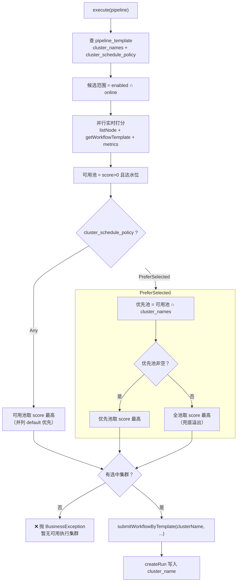
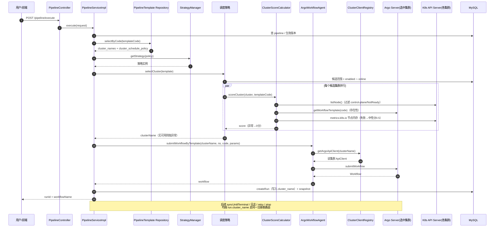
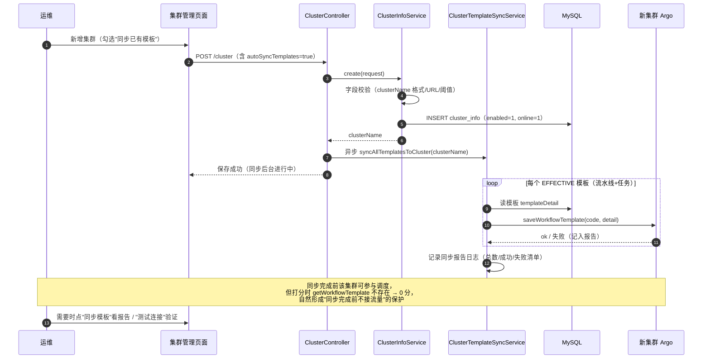

# 多集群调度 - 技术设计方案

## 一、背景与目标

### 1.1 现状

pipeline-server 目前只支持接入**单个 K8s 集群（单套 Argo Workflows）**，存在以下问题：

1. **高可用不足**：唯一集群故障（API Server 不可达 / Argo Server 挂 / 集群满载）时，所有流水线无法执行，平台整体不可用。
2. **容量瓶颈**：单集群的节点规模和 Argo 并发能力有上限，无法通过加集群横向扩容。
3. **配置僵化**：集群与 Argo 配置硬编码在 `application-local.yml`（`argo.server.*` / `kubernetes.client.*`），任何变更（换 token、摘流集群）都需要重启服务。
4. **客户端单例硬绑定**：`ArgoClientConfig` / `KubernetesClientConfig` 在启动时构建唯一的 `ApiClient` Bean，且 Argo 侧调用了 `Configuration.setDefaultApiClient()`（静态全局），运行时无法切换或多实例并存。
5. **执行记录无集群维度**：`pipeline_run` 表只记录 Argo Workflow 名（`name` 字段），日志查询、状态同步、重试、停止全部依赖"唯一集群"这个隐含假设。

目前已新搭建第二个 K8s 集群，需要平台具备多集群接入与调度能力。

### 1.2 目标

1. **多集群接入**：支持配置任意多个 K8s 集群（每集群一套 Argo Workflows），集群配置独立建表（`cluster_info`）并提供**集群管理页面**，增删集群、摘流、换 token 均在页面完成、运行时热生效（无需重启）。
2. **智能调度**：执行流水线时按策略 + **实时查询**的集群健康度与负载水位自动选择集群；故障集群在打分中自然出局（0 分），恢复后自动参与调度。
3. **模板多集群一致**：流水线模板 / 任务模板的发布、删除对所有集群生效，保证任意集群可执行任意模板。
4. **执行链路全路由**：run 的提交、状态同步、日志、重试、停止全部路由到正确的集群。
5. **平滑迁移**：存量数据（run / 模板）无需洗数，升级后行为兼容。

### 1.3 非目标

- **不做跨集群容错迁移**：Workflow 提交到某集群后，该集群故障不会自动迁移到其他集群重跑（Argo Workflow 无法跨集群迁移）。
- **不做集群间负载均衡的高级算法**（权重 / 一致性哈希），第一期只做水位打分。
- **不做调度侧健康状态缓存**：每次调度实时查询集群 API（准确性优先于延迟，理由见第七章）。
- **不做集群资源配额 / 池化**（如按业务方分配独占集群额度）。

---

## 二、整体架构

### 2.1 分层职责

```
┌────────────────────────────────────────────────────────────────┐
│  前端                                                          │
│  集群管理页面（列表/新增/编辑/摘流开关/测试连接/同步模板）        │
│  流水线模板表单（执行集群多选 + 调度策略下拉）                    │
├────────────────────────────────────────────────────────────────┤
│  配置层                                                         │
│  cluster_info 表（集群定义 + 调度参数，独立建表）                 │
│        │ 读取 + 内容指纹缓存                                    │
│        ▼                                                       │
│  ClusterConfigService（配置解析 / 指纹比对 / 变更重建通知）        │
├────────────────────────────────────────────────────────────────┤
│  客户端层                                                       │
│  ClusterClientRegistry（clusterName → Argo ApiClient + K8s      │
│  ApiClient 实例注册表，配置指纹变化自动失效重建）                  │
│        ▼                                                       │
│  ArgoWorkflowAgent（17 个方法，全部增加 clusterName 首参）        │
│  KubernetesAgent（4 个日志方法 + 新增节点/指标查询方法）           │
├────────────────────────────────────────────────────────────────┤
│  调度层（每次调度实时查询集群 API，并行打分）                      │
│  ClusterScheduler（策略接口）                                    │
│    ├── AnyClusterScheduleStrategy          任意集群             │
│    └── PreferSelectedClusterScheduleStrategy 优先选中集群        │
│  ClusterScheduleStrategyManager（Spring Map 路由）               │
│  ClusterScoreCalculator（单集群实时打分：探活+负载+模板存在性）    │
├────────────────────────────────────────────────────────────────┤
│  执行层                                                         │
│  PipelineServiceImpl.execute（选集群 → 提交 → run 记录集群）      │
│  PipelineRunSyncServiceImpl / PipelineRunLogService /           │
│  PipelineRunServiceImpl（retry/stop/detail，按 run 路由集群）    │
├────────────────────────────────────────────────────────────────┤
│  模板同步层                                                     │
│  ClusterTemplateSyncService（发布/删除/新集群接入/手动重推，       │
│  并行同步所有 enabled 集群 + 同步报告）                           │
└────────────────────────────────────────────────────────────────┘
```

### 2.2 模块归属

| 层 | 内容 | 模块 | 包路径 |
|----|------|------|--------|
| 枚举 | `ClusterSchedulePolicyEnum` | pipeline-server-common | `com.ci.pipeline.common.enums` |
| 常量 | `ClusterConstants` | pipeline-server-common | `com.ci.pipeline.common.constants` |
| Entity | `ClusterInfo`（新表） | pipeline-server-dao | `com.ci.pipeline.dao.entity` |
| Mapper / XML | `ClusterInfoMapper` | pipeline-server-dao | `com.ci.pipeline.dao.mapper` / `resources/mapper` |
| Repository | `ClusterInfoRepository` | pipeline-server-dao | `com.ci.pipeline.dao.repository` |
| Entity 字段 | `PipelineTemplate` / `PipelineRun` 加字段 | pipeline-server-dao | `com.ci.pipeline.dao.entity` |
| 配置服务 | `ClusterConfigService` | pipeline-server-service | `com.ci.pipeline.service.service` |
| 客户端注册表 | `ClusterClientRegistry` | pipeline-server-service | `com.ci.pipeline.service.remote` |
| Agent 适配 | `ArgoWorkflowAgent` / `KubernetesAgent` 签名变更 | pipeline-server-service | `com.ci.pipeline.service.remote` |
| 打分器 | `ClusterScoreCalculator` | pipeline-server-service | `com.ci.pipeline.service.scheduler.cluster` |
| 调度策略 | `ClusterScheduler` 及实现 | pipeline-server-service | `com.ci.pipeline.service.scheduler.cluster` |
| 模板同步 | `ClusterTemplateSyncService` | pipeline-server-service | `com.ci.pipeline.service.service` |
| Controller | `ClusterController` | pipeline-server-service | `com.ci.pipeline.service.controller` |
| DTO | 集群管理 + 模板请求/响应 | pipeline-server-facade | `com.ci.pipeline.facade.request / response` |
| SQL | `sql/multi_cluster.sql` + `init.sql` 适配 | 项目根目录 | `sql/` |

---

## 三、集群配置模型（cluster_info 表）

### 3.1 为什么独立建表（而不是 generic_config JSON）

| 维度 | generic_config 存 JSON | 独立表 |
|---|---|---|
| 字段校验 | 整包 JSON，保存时无法逐字段校验（URL 合法性 / 阈值范围 / clusterName 格式），错误配置拖到运行时才暴露 | CRUD 接口字段级校验，保存即拦截 |
| 变更原子性 | 编辑大 JSON 是整包覆盖，两人并发编辑互相覆盖 | 行级更新天然隔离；摘流 = 改一行 `online` |
| 页面支撑 | 结构化页面操作（开关/按钮）需映射 JSON 补丁，别扭 | 列表 / 摘流开关 / 测试连接 / 同步模板都是行级操作 |
| 引用校验 | 拦截"删除被 run 引用的集群"需解析 JSON 再比对 | `pipeline_run.cluster_name` 直查 |
| 默认集群唯一性 | 数组字段，事务内难保证 | `is_default` 列，事务内先清后设 |

全局调度参数（默认集群、在线名单）不再单独存配置，收编为表字段（`is_default` / `online`）。

### 3.2 表结构

```sql
CREATE TABLE `cluster_info` (
  `id`                       bigint NOT NULL AUTO_INCREMENT COMMENT '主键',
  `cluster_name`             varchar(100) NOT NULL COMMENT '集群唯一标识，小写字母数字中划线',
  `description`              varchar(500) DEFAULT NULL COMMENT '集群描述',
  `argo_url`                 varchar(500) NOT NULL COMMENT 'Argo Server 地址',
  `argo_token`               varchar(2000) NOT NULL COMMENT 'Argo 认证 token（含 Bearer 前缀）',
  `argo_namespace`           varchar(100) NOT NULL DEFAULT 'argo' COMMENT 'Workflow/WorkflowTemplate 所在命名空间',
  `k8s_master_url`           varchar(500) NOT NULL COMMENT 'K8s API Server 地址',
  `k8s_token`                varchar(2000) NOT NULL COMMENT 'K8s 认证 token（不含 Bearer 前缀）',
  `k8s_verifying_ssl`        tinyint(1) NOT NULL DEFAULT 0 COMMENT '是否校验 K8s 证书',
  `connect_timeout_ms`       int NOT NULL DEFAULT 5000 COMMENT '连接超时（毫秒）',
  `read_timeout_ms`          int NOT NULL DEFAULT 10000 COMMENT '读取超时（毫秒）',
  `free_memory_threshold`    decimal(4,2) NOT NULL DEFAULT 0.20 COMMENT '调度准入水位：平均空闲内存占比低于该值不参与调度',
  `max_running_workflows`    int DEFAULT NULL COMMENT '运行中 Workflow 数硬上限，NULL 不启用',
  `enabled`                  tinyint(1) NOT NULL DEFAULT 1 COMMENT '集群生命周期：1-启用 0-下线（下线后不调度、不同步模板）',
  `online`                   tinyint(1) NOT NULL DEFAULT 1 COMMENT '调度摘流开关：0-临时摘流（不调度但模板继续同步）',
  `is_default`               tinyint(1) NOT NULL DEFAULT 0 COMMENT '默认集群：存量 run 路由兜底 / 未指定集群场景的默认值，全局唯一',
  `revision`                 int NOT NULL DEFAULT 0 COMMENT '乐观锁版本号',
  `creator`                  varchar(45) NOT NULL COMMENT '创建人',
  `create_time`              datetime NOT NULL DEFAULT CURRENT_TIMESTAMP COMMENT '创建时间',
  `updater`                  varchar(45) DEFAULT NULL COMMENT '最后修改人',
  `update_time`              datetime NOT NULL DEFAULT CURRENT_TIMESTAMP ON UPDATE CURRENT_TIMESTAMP COMMENT '更新时间',
  `deleted`                  tinyint(1) NOT NULL DEFAULT 0 COMMENT '逻辑删除：0-未删除 1-已删除',
  PRIMARY KEY (`id`),
  KEY `idx_cluster_name` (`cluster_name`)
) ENGINE=InnoDB DEFAULT CHARSET=utf8mb3 COMMENT='执行集群定义表';
```

**字段语义要点**：

| 字段 | 说明 |
|---|---|
| `cluster_name` | 集群唯一标识（业务层唯一性校验，与项目其他表一致不在 DB 层加唯一索引，避免与逻辑删除冲突），被 `pipeline_template.cluster_names` / `pipeline_run.cluster_name` 引用 |
| `enabled` | 集群生命周期。`0` = 彻底下线：不参与调度、**模板发布/删除不再同步到它** |
| `online` | **调度摘流开关**（维修窗口用）：`0` = 临时摘流，不参与调度，但**模板同步照常**——恢复上线时模板不缺，立即可用 |
| `is_default` | 默认集群，全局最多一条。用途：① 存量 `pipeline_run.cluster_name` 为空时的路由兜底；② 模板手动重推等未指定集群场景的默认值。事务内"先清后设"保证唯一 |
| `connect_timeout_ms` / `read_timeout_ms` | 默认 5000 / 10000。内网 RTT 极低，连接超过 5s 基本意味着集群已死；死集群的静默丢包（防火墙 DROP / 主机断电 / 网络分区）会烧满超时，收紧默认值把单集群打分失败等待压到最短 |
| `free_memory_threshold` | 调度准入水位（默认 0.2）：平均空闲内存占比低于该值的集群不参与调度 |
| `max_running_workflows` | 可选硬性并发上限，`NULL` 不启用；启用后运行中 Workflow 数达到上限即视为满载（保底防御，防止内存指标失真时过量调度） |

### 3.3 配置读取与热生效：`ClusterConfigService`

```
ClusterConfigService
├── listAll()                     → 全部集群（含禁用，管理页用）
├── listEnabled()                 → enabled 集群（模板同步范围）
├── listSchedulable()             → enabled ∩ online（调度候选范围）
├── getByClusterName(name)        → 按名查找（不存在抛 BusinessException）
├── getDefaultClusterName()       → is_default 集群（无则取第一条 enabled，再无抛异常）
├── getNamespace(clusterName)     → 该集群的 argo_namespace
└── getConfigFingerprint()        → 当前配置内容指纹（SHA-256，供注册表比对）
```

**热生效机制（内容指纹缓存）**：

- 内部持有 `volatile` 缓存（查询结果 + 指纹），每次读取比对查询结果内容 hash：
  - 指纹未变 → 直接返回缓存（避免每次调度都查 DB）；
  - 指纹变化 → 重新加载、刷新缓存，并回调 `ClusterClientRegistry.onConfigChanged()` 触发客户端实例重建。
- **解决"客户端缓存永不失效"问题**：传统实现用 `ConcurrentHashMap.computeIfAbsent` 只建不清，改配置后旧客户端（旧 token / 旧超时）一直存活直到重启。本方案通过指纹比对让客户端生命周期跟随配置。

**降级兜底（迁移期安全网）**：

- 若 `cluster_info` 表为空，但 yml 中仍有 `argo.server.*` / `kubernetes.client.*` 配置，则自动用 yml 配置合成一个名为 `default` 的集群定义（`ClusterConfigService` 内部逻辑，不落库）。
- 保证升级部署后、运维还没来得及在页面录入集群的窗口期，平台仍按原单集群方式可用，不会启动即故障。

### 3.4 CRUD 校验规则（`ClusterInfoService`）

**新增 / 编辑**：

1. `clusterName` 非空、格式 `^[a-z0-9-]{1,100}$`、未删除记录中唯一（编辑时排除自身）；
2. `argoUrl` / `k8sMasterUrl` 非空且为合法 URL；
3. `freeMemoryThreshold` ∈ (0, 1]；`maxRunningWorkflows` 为空或 > 0；
4. 设置 `is_default=1` 时事务内先将其他集群置 0；
5. 保存前提供**测试连接**（可选调用，见 12.1）：用表单参数实时构建临时客户端，探测 Argo `getInfo()` + K8s `listNode(limit=1)`，返回连通性结果，避免录入错误地址。

**摘流 / 恢复**：`online` 开关，行级更新，立即生效（下一次调度读取即生效）。

**删除**：

1. 逻辑删除（项目统一模式）；
2. **引用拦截**：`pipeline_run.cluster_name` 存在该集群的历史记录 → 禁止删除，提示改用 `enabled=0` 下线（否则历史 run 的日志/详情无法路由）；
3. 被 `pipeline_template.cluster_names` 引用不拦截删除（模板调度时自动忽略不存在的集群名，PreferSelected 兜底其他集群），但删除响应中返回引用该集群的模板数量作提示。

---

## 四、数据模型变更

### 4.1 `pipeline_template` 新增字段

```sql
ALTER TABLE `pipeline_template`
  ADD COLUMN `cluster_names` varchar(500) DEFAULT NULL
    COMMENT '候选执行集群，逗号分隔多个 clusterName；NULL/空 表示不限制集群',
  ADD COLUMN `cluster_schedule_policy` varchar(45) NOT NULL DEFAULT 'Any'
    COMMENT '集群调度策略：Any-任意集群 / PreferSelected-优先选中集群';
```

| 字段 | 语义 |
|---|---|
| `cluster_names` | 候选集群白名单，**只圈定范围**。空 = 不限制（所有在线集群均可） |
| `cluster_schedule_policy` | **怎么从候选里挑**：`Any` 忽略 `cluster_names`；`PreferSelected` 优先 `cluster_names` 内的集群，不可用时兜底其他在线集群 |

> 两个字段配合的语义：`cluster_names` 决定"偏好哪些集群"，`cluster_schedule_policy` 决定"偏好强度"。不设 `OnlySelected`（硬约束、交集为空直接失败）类型——当前没有强隔离场景，减少概念；未来有合规隔离需求时再扩展枚举即可。

### 4.2 `pipeline_run` 新增字段

```sql
ALTER TABLE `pipeline_run`
  ADD COLUMN `cluster_name` varchar(100) DEFAULT NULL
    COMMENT '执行集群标识（提交时选定的集群），日志/同步/重试/停止按此路由；存量为空时兜底默认集群',
  ADD KEY `idx_cluster_name` (`cluster_name`);
```

- `createRun` 时写入提交集群的 `clusterName`；
- **不冗余 namespace 列**：namespace 从集群配置实时读取，避免集群配置调整 namespace 后新旧 run 行为不一致（run 提交后 namespace 实际不会变，实时读是安全的）；
- 存量 run 的 `cluster_name` 为 NULL，路由时兜底 `is_default` 默认集群（见 10.2）。

### 4.3 SQL 文件适配

| 文件 | 变更 |
|---|---|
| `sql/multi_cluster.sql`（新增） | `cluster_info` 建表 + 上述两条 ALTER + 存量集群种子 INSERT（把原 yml 中 192.168.10.130 录入为 cluster-a，`is_default=1`） |
| `sql/init.sql` | 新增 `cluster_info` 的 CREATE TABLE；`pipeline_template` / `pipeline_run` 的 CREATE TABLE 加入新列；文件末尾追加 cluster_info 种子 INSERT（init.sql 现无种子数据，本次开创种子区段） |
| `sql/pipeline_template.sql` / `sql/pipeline_run.sql` | 单表 DDL 同步加列，保持与 init.sql 一致 |

`sql/multi_cluster.sql` 种子数据示例：

```sql
-- 存量集群录入（token 由运维替换为真实值，即原 application-local.yml 中的配置）
INSERT INTO `cluster_info`
  (`cluster_name`, `description`, `argo_url`, `argo_token`, `argo_namespace`,
   `k8s_master_url`, `k8s_token`, `k8s_verifying_ssl`,
   `connect_timeout_ms`, `read_timeout_ms`, `free_memory_threshold`,
   `enabled`, `online`, `is_default`, `creator`)
VALUES
  ('cluster-a', '默认集群（原 192.168.10.130）',
   'https://192.168.10.130:2746', 'Bearer REPLACE_ME', 'argo',
   'https://192.168.10.130:6443', 'REPLACE_ME', 0,
   5000, 10000, 0.20,
   1, 1, 1, 'admin');
```

---

## 五、枚举与常量

### 5.1 `ClusterSchedulePolicyEnum`（新增，pipeline-server-common）

```java
public enum ClusterSchedulePolicyEnum {
    ANY("Any", "任意集群"),
    PREFER_SELECTED("PreferSelected", "优先选中集群");

    private final String code;
    private final String description;

    // 构造器 + getter 略，风格对齐 PipelineTemplateVersionStatusEnum
    public static ClusterSchedulePolicyEnum ofCode(String code) { ... }   // null 安全
    public static boolean isValidCode(String code) { ... }
}
```

### 5.2 `ClusterConstants`（新增，pipeline-server-common）

```java
public final class ClusterConstants {
    private ClusterConstants() {}

    /** cluster_names 字段分隔符 */
    public static final String CLUSTER_NAMES_SEPARATOR = ",";
    /** 默认调度策略 */
    public static final String DEFAULT_SCHEDULE_POLICY = "Any";
    /** 默认空闲内存准入水位 */
    public static final double DEFAULT_FREE_MEMORY_THRESHOLD = 0.2D;
    /** 默认连接超时（毫秒） */
    public static final int DEFAULT_CONNECT_TIMEOUT_MS = 5000;
    /** 默认读取超时（毫秒） */
    public static final int DEFAULT_READ_TIMEOUT_MS = 10000;
    /** clusterName 格式 */
    public static final String CLUSTER_NAME_PATTERN = "^[a-z0-9-]{1,100}$";
    /** yml 兜底集群名（表为空时由 yml 合成） */
    public static final String FALLBACK_CLUSTER_NAME = "default";
    /** K8s control-plane 角色标签 */
    public static final String NODE_ROLE_CONTROL_PLANE = "node-role.kubernetes.io/control-plane";
    /** K8s NoSchedule 污点效果值 */
    public static final String TAINT_NO_SCHEDULE = "NoSchedule";
    /** 节点 Ready condition 类型 */
    public static final String NODE_CONDITION_READY = "Ready";
    /** 节点 metrics API 组路径（metrics.k8s.io） */
    public static final String NODE_METRICS_API_PATH = "apis/metrics.k8s.io/v1beta1";
    /** 节点 metrics 资源复数名 */
    public static final String NODE_METISTICS_RESOURCE_PLURAL = "nodes";
    /** metrics 降级时的中性分（既不优先也不淘汰） */
    public static final double NEUTRAL_SCORE_WHEN_METRICS_STALE = 0.5D;
    /** metrics 降级判定：缺 usage 的节点占比阈值 */
    public static final double METRICS_MISSING_RATIO_THRESHOLD = 0.5D;
}
```

---

## 六、客户端注册中心：`ClusterClientRegistry`

### 6.1 设计

替代现有 `ArgoClientConfig` / `KubernetesClientConfig` 的单例 Bean 模式：

```
ClusterClientRegistry
├── argoClients:    ConcurrentHashMap<String, ApiClient>     // clusterName → Argo ApiClient
├── k8sClients:     ConcurrentHashMap<String, ApiClient>     // clusterName → K8s ApiClient
├── getArgoApiClient(clusterName)    → 按需创建/复用
├── getKubernetesApiClient(clusterName) → 按需创建/复用
├── onConfigChanged()                → 指纹变化时清理失效实例
└── buildArgoClient(ClusterInfo) / buildK8sClient(ClusterInfo)  // 工厂方法
```

**关键点**：

1. **工厂方法迁移现有构建逻辑**：trust-all SSL（OkHttp sslSocketFactory + hostnameVerifier）、Argo Instant TypeAdapter 注册，从 `ArgoClientConfig` / `KubernetesClientConfig` 原样迁入，行为不变；
2. **删除 `Configuration.setDefaultApiClient()` 静态调用**：该调用设置 JVM 级全局默认客户端，多实例会互相覆盖。现有代码全部通过 `new WorkflowServiceApi(apiClient)` 显式传参构造，不依赖静态默认值，删除安全；
3. **失效重建**：`ClusterConfigService` 检测到指纹变化时回调 `onConfigChanged()`——对比新旧配置，仅清理"配置发生变化或已删除"的集群实例，未变集群的客户端保持复用（避免换一个集群 token 导致全部集群连接重建）；
4. 原 `ArgoClientConfig` / `KubernetesClientConfig` / `ArgoServerProperties` / `KubernetesClientProperties` 标记 `@Deprecated` 保留（供 3.3 节 yml 兜底合成读取），不再注册 Bean。

### 6.2 超时设置

每个集群独立配置 `connectTimeoutMs`（默认 5000）/ `readTimeoutMs`（默认 10000），构建时设置到 ApiClient 的 OkHttpClient。

> 传统实现常用 30s 超时，但内网 RTT < 5ms，连接建立超过 5s 基本意味着集群已死；死集群的静默丢包（防火墙 DROP / 主机断电 / 网络分区）会烧满整个超时，并行打分时死集群拖慢整体耗时。收紧默认值 + 并行打分（第七章）双管齐下。

---

## 七、集群实时打分：`ClusterScoreCalculator`

### 7.1 设计决策：实时查询，不做后台健康缓存

**为什么不采用"后台定时探活 + 缓存健康状态"方案**：

1. **准确性优先于延迟**：缓存值存在一个检查周期的滞后，"集群刚故障 / 刚满载"的窗口期内调度会打到坏集群，用户直接感知到执行失败——这个代价高于节省 1 秒延迟的收益；
2. **缓存方案复杂度高**：需要熔断状态机（closed/open/half-open）、缓存失效策略、多实例各自的缓存一致性，引入大量状态管理代码；
3. **实时方案的正确性由并行化保证**：候选集群**并行**打分，整体耗时 = 最慢一个集群的打分时间（正常集群 < 1s；死集群等满 connect 超时 5s），**不随集群数线性增长**，延迟可控。

**每次调度对每个候选集群实时执行**（`ClusterScoreCalculator`，单集群一次调用内完成）：

```
scoreCluster(cluster) → ClusterScore {
    ① K8s 节点查询：CoreV1Api.listNode()
         ├─ 调用失败（超时/拒绝）→ 0 分出局（集群不可达，天然隔离）
         └─ 过滤可调度节点：
             - 剔除 node-role.kubernetes.io/control-plane 且 NoSchedule 的节点
             - 剔除 Ready condition != True 的节点   ← NotReady 节点对象还在
                                                       但不可调度，会虚增得分
             可调度节点为空 → 0 分
    ② Argo 模板存在性检查：getWorkflowTemplate(namespace, templateCode)
         └─ null（模板未同步到该集群）→ 0 分
             ← 新集群刚接入、模板还没同步到位时，把问题挡在提交前，
               而不是提交后才收到 "workflowtemplates.argoproj.io not found"
    ③ 节点内存采样：CustomObjectsApi 访问 metrics.k8s.io/v1beta1/nodes
         nodeFreePercent = (allocatable.memory - usage.memory) / allocatable.memory
         score = avg(nodeFreePercent)
    ④ 可选硬上限：maxRunningWorkflows 启用时，listWorkflows(Running) 统计
         running ≥ maxRunningWorkflows → 0 分（满载出局）
}
```

> ①②③④ 全部失败安全（fail-safe）：任何一步异常 → 该集群 0 分，不影响其他集群评估。单集群打分整体包 try-catch。

### 7.2 metrics 失败降级（重要）

**传统做法的坑**：节点 usage 一律取自 metrics-server，一旦 metrics-server 挂掉或部分节点无指标，所有节点空闲率被保守记为 0% → **健康集群被误杀，全平台无法调度**。

**本方案的降级策略**：

| 情况 | 处理 |
|---|---|
| metrics API 调用成功，全部节点有 usage | 正常计算 `score` |
| metrics API 成功，但**超过一半**节点缺 usage | 视为 metrics 异常 → 走降级 |
| metrics API 调用失败（超时/404/未部署） | 走降级 |
| 降级规则 | 给**中性分 0.5**（既不优先也不淘汰），集群可用性由 ①② 的成功与否决定 |

> 设计原则：**metrics 是负载参考，不是健康判据**。集群是否可调度只由"节点可查 + 模板存在"决定，metrics 缺失只影响"选谁"，不影响"能不能选"。

### 7.3 集群状态观察（页面按需实时探测）

集群管理页提供**"测试连接"**按钮（`POST /cluster/test-connection`）：用表单参数实时构建临时客户端，探测 Argo `getInfo()` + K8s `listNode(limit=1)`，返回连通性与延迟。不做常驻后台状态采集，页面展示的"状态"即探测那一刻的实时结果。

---

## 八、调度策略设计

### 8.1 策略接口与路由

```
com.ci.pipeline.service.scheduler.cluster
├── ClusterScheduler                          // 接口：String selectCluster(PipelineTemplate template)
├── ClusterScheduleStrategyManager            // Spring Map<beanName, bean> 路由
├── AbstractClusterScheduler                  // 抽象基类：候选池构造 + 打分选择
├── AnyClusterScheduleStrategy                // @Component("AnyClusterSchedule")
└── PreferSelectedClusterScheduleStrategy     // @Component("PreferSelectedClusterSchedule")
```

```java
public interface ClusterScheduler {
    /** 为流水线模板选择执行集群，无可用集群抛 BusinessException */
    String selectCluster(PipelineTemplate template);
}
```

`ClusterScheduleStrategyManager` 复用项目已有策略模式风格（参照 `DefaultValueStrategyManager`）：Spring 注入 `Map<String, ClusterScheduler>`（key = Bean 名），`ClusterSchedulePolicyEnum` 维护 `code → Bean 名` 映射，零 if-else 路由。

### 8.2 候选池构造与打分（两策略共用，`AbstractClusterScheduler`）

```
候选范围 = enabled ∩ online 的集群（来自 ClusterConfigService，读 DB 缓存）

并行实时打分（clusterScoreExecutor 线程池 / parallelStream）：
    每个候选集群 → ClusterScoreCalculator.scoreCluster(cluster, templateCode)
    任何异常 → 0 分（fail-safe）

可用集群 = score > 0（节点可查 + 模板存在 + 未满载）
           且 (score ≥ freeMemoryThreshold 或 metrics 降级中性分)
```

- 打分**并行**执行，整体耗时 = 最慢集群（正常 < 1s，死集群等满 connect 超时 5s），不随集群数线性增长；
- `freeMemoryThreshold` 是**最低健康水位**语义：低于水位的集群视为满载不参与调度（metrics 降级的中性分 0.5 不受水位拦截）。

### 8.3 Any 策略（任意集群）

```
selectCluster(template):
    候选池 = (enabled ∩ online 集群) 并行打分后 score > 0 且达水位的集合（忽略 template.clusterNames）
    候选池为空 → 抛 BusinessException("当前暂无可用执行集群，请检查集群配置与在线状态")
    return 候选池中 score 最高者（并列取 is_default 集群优先，再取字典序保证稳定）
```

### 8.4 PreferSelected 策略（优先选中集群）

```
selectCluster(template):
    全池 = (enabled ∩ online 集群) 并行打分后的可用集合
    优先池 = 全池 ∩ template.clusterNames（解析逗号分隔）
    if 优先池非空:
        return 优先池中 score 最高者
    // 优先池为空：选中集群全部不可用/未配置/被摘流 → 兜底
    if 全池非空:
        return 全池中 score 最高者          // 可用性优先，自动溢出到其他集群
    抛 BusinessException("当前暂无可用执行集群，请检查集群配置与在线状态")
```

> 不做粘性（最近成功集群优先）：纯打分决策行为简单可预测，新集群接入后天然按水位分摊流量，不存在"流量锁死在老集群"的问题；镜像缓存亲和的收益让位于调度透明性。

### 8.5 决策流程图



---

## 九、Argo / K8s Agent 接口适配

### 9.1 `ArgoWorkflowAgent` 签名变更（17 个方法）

所有方法**增加 `String clusterName` 首参**，namespace 不再从全局 properties 读取，改为 `clusterConfigService.getNamespace(clusterName)`：

```java
public interface ArgoWorkflowAgent {
    IoArgoprojWorkflowV1alpha1WorkflowTemplate lintWorkflowTemplate(String clusterName, String namespace, IoArgoprojWorkflowV1alpha1WorkflowTemplate workflowTemplate);
    IoArgoprojWorkflowV1alpha1WorkflowTemplate createWorkflowTemplate(String clusterName, String namespace, IoArgoprojWorkflowV1alpha1WorkflowTemplate workflowTemplate);
    IoArgoprojWorkflowV1alpha1WorkflowTemplate updateWorkflowTemplate(String clusterName, String namespace, String name, IoArgoprojWorkflowV1alpha1WorkflowTemplate workflowTemplate);
    void deleteWorkflowTemplate(String clusterName, String namespace, String name);
    IoArgoprojWorkflowV1alpha1WorkflowTemplate saveWorkflowTemplate(String clusterName, String namespace, IoArgoprojWorkflowV1alpha1WorkflowTemplate workflowTemplate);
    IoArgoprojWorkflowV1alpha1WorkflowTemplate getWorkflowTemplate(String clusterName, String namespace, String name);
    IoArgoprojWorkflowV1alpha1Workflow submitWorkflow(String clusterName, String namespace, IoArgoprojWorkflowV1alpha1Workflow workflow, List<String> parameters);
    IoArgoprojWorkflowV1alpha1Workflow submitWorkflowByTemplate(String clusterName, String namespace, String templateName, List<String> parameters);
    IoArgoprojWorkflowV1alpha1Workflow getWorkflow(String clusterName, String namespace, String name);
    IoArgoprojWorkflowV1alpha1WorkflowList listWorkflows(String clusterName, String namespace, List<String> phases);
    IoArgoprojWorkflowV1alpha1Workflow retryWorkflow(String clusterName, String namespace, String name);
    IoArgoprojWorkflowV1alpha1Workflow stopWorkflow(String clusterName, String namespace, String name);
    IoArgoprojWorkflowV1alpha1Workflow terminateWorkflow(String clusterName, String namespace, String name);
    IoArgoprojWorkflowV1alpha1Workflow resumeWorkflow(String clusterName, String namespace, String name);
    IoArgoprojWorkflowV1alpha1Workflow suspendWorkflow(String clusterName, String namespace, String name);
    void deleteWorkflow(String clusterName, String namespace, String name);
}
```

实现类 `ArgoWorkflowAgentImpl`：
- 删除 `@Autowired ApiClient` 单例与 `@PostConstruct`，改为每次调用从 `ClusterClientRegistry.getArgoApiClient(clusterName)` 取 client，`new WorkflowServiceApi(client)` / `new WorkflowTemplateServiceApi(client)`（API 对象极轻量，随用随建无性能问题）；
- 内部 `saveWorkflowTemplate` 的存在性探测、`updateWorkflowTemplate` 的 resourceVersion 回填，同样以传入的 `clusterName` 执行。

### 9.2 `KubernetesAgent` 签名变更 + 新增方法

```java
public interface KubernetesAgent {
    // 既有 4 个日志方法，增加 clusterName 首参
    String getPodLog(String clusterName, String namespace, String podName);
    String getPodLog(String clusterName, String namespace, String podName, String container);
    String getPodLog(String clusterName, String namespace, String podName, PodLogQuery query);
    InputStream streamPodLog(String clusterName, String namespace, String podName, String container, Integer tailLines);

    // 新增：供健康检查使用
    List<V1Node> listNodes(String clusterName);                          // 全量节点
    Map<String, Long> getNodeMemoryUsageBytes(String clusterName);       // nodeName → usage 字节（metrics.k8s.io，失败抛异常由调用方降级）
}
```

`streamPodLog` 手拼 URL 的逻辑不变，仅 basePath / token 改为从对应集群的 ApiClient 获取。

### 9.3 调用点适配清单（21 处）

**A. run 相关 —— 按 `run.getClusterName()` 路由（9 处）**

| # | 调用点 | 方法 | 路由 |
|---|---|---|---|
| 1 | `PipelineRunSyncServiceImpl.syncUntilTerminal` L111 | `getWorkflow` | `run.clusterName` |
| 2 | `PipelineRunSyncServiceImpl.waitForArgoStable` L185 | `getWorkflow` | `run.clusterName` |
| 3 | `PipelineRunSyncServiceImpl.fetchPodLogBestEffort` L367 | `getPodLog` | `run.clusterName` |
| 4 | `PipelineRunServiceImpl.retry` L234 | `retryWorkflow` | `run.clusterName` |
| 5 | `PipelineRunServiceImpl.stop` L286 | `terminateWorkflow` | `run.clusterName` |
| 6 | `PipelineRunServiceImpl.getExecuteDetail` L347 | `getWorkflow` | `run.clusterName` |
| 7 | `PipelineRunServiceImpl.getArgoPhase` L428 | `getWorkflow` | `run.clusterName` |
| 8 | `PipelineRunLogService.pushLogLoop` L199 | `streamPodLog` | `run.clusterName` |
| 9 | `PipelineRunLogService.fetchLiveLog` L293 | `getPodLog` | `run.clusterName` |

统一封装私有工具方法：

```java
/** run 路由解析：存量 run cluster_name 为空时兜底默认集群 */
private String resolveClusterName(PipelineRun run) {
    return StringUtils.isNotBlank(run.getClusterName())
            ? run.getClusterName()
            : clusterConfigService.getDefaultClusterName();
}
```

namespace 同理封装 `resolveNamespace(clusterName)`（从集群配置读取）。

**B. 模板发布/删除 —— 遍历所有 enabled 集群（4 处）**

| # | 调用点 | 方法 | 适配 |
|---|---|---|---|
| 10 | `PipelineTemplateVersionServiceImpl.changeStatus` L261 | `saveWorkflowTemplate` | 并行同步所有 enabled 集群（见第十一章） |
| 11 | `PipelineTemplateVersionServiceImpl.deleteById` L191 | `deleteWorkflowTemplate` | 同上 |
| 12 | `TaskTemplateVersionServiceImpl.changeStatus` L237 | `saveWorkflowTemplate` | 同上 |
| 13 | `TaskTemplateVersionServiceImpl.deleteById` L168 | `deleteWorkflowTemplate` | 同上 |

**C. 执行提交（1 处）**

| # | 调用点 | 方法 | 适配 |
|---|---|---|---|
| 14 | `PipelineServiceImpl.execute` L245 | `submitWorkflowByTemplate` | 调度器选定的 clusterName（见第十章） |

**D. Demo 演示（5 处）**

| # | 调用点 | 适配 |
|---|---|---|
| 15-17 | `DemoController` L44/57/70（lint/create/get 模板） | 加可选 `clusterName` 请求参数，缺省默认集群 |
| 18-19 | `DemoController` L87/99/112/133（submit/list/get workflow、pod log） | 同上 |

**E. 调度打分（新增调用）**

| # | 调用点 | 方法 |
|---|---|---|
| 20 | `ClusterScoreCalculator` | `listNodes` / `getNodeMemoryUsageBytes` / `getWorkflowTemplate`（+ 可选 `listWorkflows`） |
| 21 | `ClusterInfoService`（测试连接） | `listNodes(limit=1)` / Argo `InfoServiceApi.getInfo()`（临时客户端） |

---

## 十、执行链路适配

### 10.1 `PipelineServiceImpl.execute` 改造

```
execute(request):
    1. pipeline = pipelineRepository.selectById(pipelineId)              // 不变
    2. effective = versionRepo.selectEffectiveByCode(templateCode)       // 不变
    3. finalParameters = buildAndValidateParameters(...)                 // 不变
    4. paramList = toArgoParameters(finalParameters)                     // 不变
    5. ★ template = pipelineTemplateRepository.selectByCode(templateCode)  // 新增：读调度字段
    6. ★ clusterName = clusterScheduleStrategyManager
            .getStrategy(template.getClusterSchedulePolicy())            // 策略路由
            .selectCluster(template)                                     // 选集群（并行实时打分）
    7. ★ workflow = argoWorkflowAgent.submitWorkflowByTemplate(
            clusterName, namespace(clusterName), templateCode, paramList)
    8. ★ pipelineRunService.createRun(pipeline, effective, workflow,
            finalParameters, clusterName)                                // run 落地集群
    9. return (runId, workflowName)
```

`createRun` 签名增加 `clusterName` 参数，insert 时写入。

### 10.2 存量兼容

- 存量 run `cluster_name = NULL` → `resolveClusterName` 兜底 `is_default` 集群（迁移期默认集群即原单集群，行为与升级前完全一致）；
- 存量模板 `cluster_names = NULL` + `cluster_schedule_policy = 'Any'`（DDL 默认值）→ Any 策略忽略 cluster_names，行为不变；
- 事件触发链路（`PipelineEventServiceImpl.triggerAndExecute` → `pipelineService.execute`）与未来 cron 触发链路复用同一 execute，自动继承多集群能力，无需单独适配。

### 10.3 提交失败语义

- 调度阶段无可用集群 → 抛 `BusinessException`（提示检查集群配置与在线状态），不落 run 记录；
- 调度成功但 Argo 提交失败（网络抖动 / 集群刚满载）→ 抛出原始异常，不落记录；调用方重试即可（与现有行为一致）。

---

## 十一、模板多集群同步设计

### 11.0 同步服务：`ClusterTemplateSyncService`

模板同步逻辑从两个 VersionServiceImpl 中抽出，收敛为独立服务（流水线模板 / 任务模板复用）：

```
ClusterTemplateSyncService
├── syncTemplateToAllClusters(templateCode, templateDetail, SyncMode)   // 发布/删除入口调用
├── syncAllTemplatesToCluster(clusterName)                              // ★ 新集群接入：全量同步
├── resyncTemplate(templateCode, clusterName)                           // 手动重推单个模板
└── 内部：并行执行 + ClusterSyncResult 明细收集
```

### 11.1 同步范围与时机

| 操作 | 同步范围 | 时机 |
|---|---|---|
| 流水线模板版本发布 EFFECTIVE | 所有 **enabled** 集群 | `changeStatus` 内 |
| 流水线模板版本删除 | 所有 **enabled** 集群 | `deleteById` 内，先 Argo 后 DB（维持现有顺序） |
| 任务模板版本发布 / 删除 | 同上 | `TaskTemplateVersionServiceImpl` 对称适配 |
| **新集群接入** | 该新集群 | 新增/启用集群时（见 11.4） |

> 摘流（`online=0`）的集群**仍参与模板同步**：摘流是"临时不调度"，模板保持同步才能在恢复上线时立即可用。`enabled=0` 的集群才是彻底下线，不再同步。

### 11.2 部分成功策略 + 手动重推

Argo 无跨集群事务，N 个集群同步可能出现部分失败。采用**部分成功 + 明细返回 + 手动补偿**：

```
syncTemplateToAllClusters(code, workflowTemplate):
    results = enabledClusters.parallelStream()          // clusterSyncExecutor 线程池并行
        .map(cluster -> try {
               argoWorkflowAgent.saveWorkflowTemplate(cluster.name, ns, tpl);
               ClusterSyncResult.success(cluster.name)
           } catch (Exception e) {
               log.error(...);
               ClusterSyncResult.failure(cluster.name, e.getMessage())
           })
        .collect(toList())

    if 任一失败:
        // DB 状态照常变更（多数集群已成功，回滚反而造成更大不一致）
        // 接口响应中携带失败明细，提示用户重推
        changeVersionStatusResponse.setSyncResults(results)
        changeVersionStatusResponse.setPartialSyncFailure(true)
    return results
```

**手动重推接口**（失败集群补偿）：

```
POST /pipeline-template/sync-clusters?pipelineTemplateCode=xxx[&clusterName=yyy]
POST /task-template/sync-clusters?taskTemplateCode=xxx[&clusterName=yyy]
```

- 不指定 `clusterName` 时重推所有 enabled 集群（幂等：saveWorkflowTemplate 本身是 create-or-update）；
- 实现：取该 code 当前 EFFECTIVE 版本的 `templateDetail` → 逐集群 `saveWorkflowTemplate` → 返回明细；
- 前端版本管理页在发布响应含失败明细时，提示"部分集群同步失败，可点击重试"（调用重推接口）。

### 11.3 模板一致性说明

- 同一 `pipeline_template_code` 在所有集群的 WorkflowTemplate 名相同（= code，`validateTemplateNameMatchCode` 约束不变），内容一致（同一份 `templateDetail`）；
- 执行时 `submitWorkflowByTemplate` 由各集群自己的 Argo 解析模板；调度打分中的 `getWorkflowTemplate` 存在性检查（7.1 ②）会把"模板未同步到位的集群"挡在提交前——同步是发布动作的职责，调度负责兜底校验。

### 11.4 新集群接入：已有模板一键同步

**不采用手动 kubectl apply**：绕过平台直接写集群会造成 DB 与集群内容漂移（DB 是模板唯一事实源），且运维需直接持有各集群的 Argo 凭证，权限外泄。平台内同步有三个入口：

| 入口 | 触发方式 | 行为 |
|---|---|---|
| **新增集群时自动同步** | 新增集群弹窗勾选"同步已有模板"（默认勾选） | 保存成功后**异步**执行 `syncAllTemplatesToCluster(clusterName)`：遍历所有 EFFECTIVE 的流水线模板 + 任务模板，逐个 `saveWorkflowTemplate` 到新集群；进度与结果记日志，失败不阻塞集群录入 |
| **集群管理页手动触发** | 列表行"同步模板"按钮 → `POST /cluster/{clusterName}/sync-templates` | **同步**执行全量推送，接口返回 `ClusterSyncReport`（总数 / 成功数 / 失败明细），前端展示报告 |
| **单模板重推** | 版本管理页"重试同步" / `POST /pipeline-template/sync-clusters` | 补偿个别失败模板（幂等） |

```
syncAllTemplatesToCluster(clusterName):
    pipelineTemplates = 所有 EFFECTIVE 流水线模板版本（code → templateDetail）
    taskTemplates     = 所有 EFFECTIVE 任务模板版本
    for each (code, detail) in pipelineTemplates + taskTemplates:   // clusterSyncExecutor 并行
        try { argoWorkflowAgent.saveWorkflowTemplate(clusterName, ns, parse(detail)) }
        catch (e) { 记入失败清单 }
    return ClusterSyncReport { total, success, failures: [(code, reason)] }
```

> 新集群在模板全量同步完成前即可参与调度，但打分阶段 `getWorkflowTemplate` 不存在的模板会使其 0 分——自然形成"同步完成前不接流量"的保护，无需额外的接入状态字段。

---

## 十二、接口设计

### 12.1 集群管理 `ClusterController`（`/cluster`）

| 接口 | 说明 |
|---|---|
| `GET /cluster/page` | 分页列表（分页统一 GET + query 对象绑定，项目惯例）。支持 `clusterName` / `enabled` / `online` 筛选；返回脱敏 token（只回显后 4 位） |
| `POST /cluster` | 新增集群。请求体含 `autoSyncTemplates`（默认 true）：保存成功后异步全量同步模板（11.4） |
| `PUT /cluster` | 编辑集群（clusterName 不可改——被 run/template 引用；token 留空表示不修改） |
| `DELETE /cluster/{id}` | 逻辑删除。被 `pipeline_run` 引用时拦截（3.4 节） |
| `POST /cluster/{clusterName}/online` | 摘流开关切换（`online` 0/1 切换，行级更新立即生效） |
| `POST /cluster/test-connection` | **测试连接**：用请求体参数（未落库）实时构建临时客户端，探测 Argo `getInfo()` + K8s `listNode(limit=1)`，返回各探测项结果与耗时。新增/编辑弹窗内嵌使用 |
| `POST /cluster/{clusterName}/sync-templates` | 全量同步所有 EFFECTIVE 模板到该集群（同步执行，返回 `ClusterSyncReport`） |
| `GET /cluster/options` | enabled 集群下拉选项（模板表单"执行集群"多选框数据源）：`[{clusterName, description}]` |
| `GET /cluster/schedule-policies` | 调度策略下拉：`[{code:"Any",description:"任意集群"},{code:"PreferSelected",description:"优先选中集群"}]` |

### 12.2 模板接口适配（pipeline-template）

| 接口 | 变更 |
|---|---|
| `POST /pipeline-template`（create） | 请求体新增 `clusterNames: List<String>`（可选）、`clusterSchedulePolicy: String`（可选，默认 Any）；校验：policy 必须是合法枚举值；clusterNames 中每个集群必须存在于集群定义（存在性校验，不要求 enabled——允许先配模板再上线集群） |
| `PUT /pipeline-template`（update） | 同上 |
| `GET /pipeline-template/{id}` / 分页 | 响应新增 `clusterNames: List<String>`（DB 逗号串 → 数组）、`clusterSchedulePolicy` |
| `POST /pipeline-template/sync-clusters` | 新增，见 11.2 |

`clusterNames` 存储格式：List 与 DB 逗号串互转（`String.join(",", list)` / `split`），工具方法放 `ClusterConfigService`。

### 12.3 任务模板接口适配（task-template）

- 任务模板**不加调度字段**（任务模板不独立执行，由流水线模板编排引用）；
- 仅新增 `POST /task-template/sync-clusters` 重推接口。

### 12.4 请求/响应 DTO 变更清单（facade 模块）

| DTO | 变更 |
|---|---|
| `ClusterInfoCreateRequest` | 新增：集群定义字段 + `autoSyncTemplates` |
| `ClusterInfoUpdateRequest` | 新增：token 可空（空=不修改） |
| `ClusterInfoQueryRequest` | 新增：分页查询 |
| `ClusterInfoResponse` | 新增：token 脱敏回显 |
| `ClusterTestConnectionRequest` / `ClusterTestConnectionResponse` | 新增：测试连接 |
| `ClusterSyncReportResponse` | 新增：全量同步报告（total/success/failures） |
| `ClusterOptionResponse` | 新增：下拉选项 |
| `PipelineTemplateCreateRequest` | 修改：+ `clusterNames`、`clusterSchedulePolicy` |
| `PipelineTemplateUpdateRequest` | 修改：同上 |
| `PipelineTemplateResponse` | 修改：同上 |
| `PipelineTemplateVersionChangeStatusResponse`（新增或扩展现有响应） | + `partialSyncFailure: boolean`、`syncResults: List<ClusterSyncResultResponse>` |
| `ClusterSyncResultResponse` | 新增 |

---

## 十三、前端适配（pipeline-frontend）

### 13.1 API 层

新增 `src/api/cluster.ts`：

```
listClusters(query)            GET    /cluster/page            分页列表
createCluster(data)            POST   /cluster                 新增（含 autoSyncTemplates）
updateCluster(data)            PUT    /cluster                 编辑
deleteCluster(id)              DELETE /cluster/{id}            删除
toggleOnline(clusterName)      POST   /cluster/{name}/online   摘流开关
testConnection(data)           POST   /cluster/test-connection 测试连接
syncTemplates(clusterName)     POST   /cluster/{name}/sync-templates  全量同步模板
listClusterOptions()           GET    /cluster/options         下拉选项
listSchedulePolicies()         GET    /cluster/schedule-policies
```

`src/api/pipelineTemplate.ts`：
- `PipelineTemplate` 类型加 `clusterNames?: string[]`、`clusterSchedulePolicy?: string`；
- 新增 `syncTemplateClusters(code: string, clusterName?: string)`（`POST /pipeline-template/sync-clusters`）。

### 13.2 集群管理页面（新增 `src/views/cluster/ClusterList.vue`，路由 `/cluster`）

参照 cron-job 管理页风格（列表 + 弹窗表单）：

```
列表列：clusterName │ 描述 │ Argo 地址 │ 默认 │ 启用(开关) │ 在线(开关) │ 更新时间 │ 操作
操作按钮：编辑 │ 测试连接 │ 同步模板 │ 删除

新增/编辑弹窗字段：
    clusterName        文本（编辑时禁改）
    description        文本
    argoUrl / argoToken / argoNamespace
    k8sMasterUrl / k8sToken / k8sVerifyingSsl(开关)
    connectTimeoutMs / readTimeoutMs        默认 5000 / 10000
    freeMemoryThreshold                     默认 0.2
    maxRunningWorkflows                     可空
    enabled / online / isDefault            开关
    [新增 only] autoSyncTemplates           勾选（默认勾选）：保存后自动同步已有模板
    [测试连接] 按钮：调 test-connection，弹窗内展示 Argo/K8s 连通结果与耗时

"同步模板"按钮：调 sync-templates，返回 ClusterSyncReport（总数/成功/失败明细）弹窗展示
"在线"开关切换：二次确认（提示摘流期间该集群不接新任务）
```

菜单注册：`AppAside.vue` 三处同步改（activeMenu computed / handleMenuClick case / el-menu-item），参照 cron-job 菜单接入模式。

### 13.3 模板表单（`PipelineTemplateList.vue` 新增/编辑弹窗）

新增两个字段（参照 `pipelineTemplateGroup` 的 API 下拉模式）：

```
执行集群（el-select multiple，可清空）
    数据源：GET /cluster/options
    值：clusterName 数组 → 提交 clusterNames
    placeholder："不选则不限制集群"
调度策略（el-select 单选）
    数据源：GET /cluster/schedule-policies
    值：Any / PreferSelected，默认 Any
    联动提示：选择 PreferSelected 且未选执行集群时，
             表单校验提示"优先选中集群需选择至少一个执行集群"（软校验，允许保存但给出警告）
```

### 13.4 版本管理页（`PipelineTemplateVersionManage.vue`）

- 发布（`changeVersionStatus`）响应若 `partialSyncFailure=true`：`ElMessage.warning` 列出失败集群 + 提供"重试同步"按钮（调 `syncTemplateClusters`）；
- 任务模板版本管理页对称适配。

---

## 十四、线程池

`ThreadPoolExecutorPoolConfig` 新增一个 Bean（参照已有 `cronJobExecutor` 模式）：

```java
@Bean("clusterSyncExecutor")
// 模板多集群并行同步 / 新集群全量同步：core=4, max=8, queue=100
// 拒绝策略：CallerRuns（同步退化为串行，可接受）
```

> 调度打分的并行直接用 `parallelStream`（候选集群数少、打分是短任务，无需独立线程池）。

---

## 十五、灰度与迁移方案

### 15.1 升级步骤（零停机）

1. **执行 SQL**：`sql/multi_cluster.sql`（建 `cluster_info` 表 + 两条 ALTER + 存量集群种子 INSERT，token 填原 yml 中 192.168.10.130 的真实值，`is_default=1`）；
2. **部署新版本服务**：
   - 表中已有 cluster-a → 直接按 cluster-a 运行（与原单集群等价）；
   - 若第 1 步漏做 → yml 兜底合成 `default` 集群（3.3 节），行为仍等价，观察日志提示补录；
3. **验证**：执行一条流水线 → run 记录 `cluster_name=cluster-a` → 日志/停止/重试正常；
4. **接入新集群**：集群管理页新增 cluster-b（勾选"同步已有模板"）→ 等待异步全量同步完成（或点"同步模板"看报告）→ 打开 `online` 开关 → 执行流水线验证可调度到 cluster-b；
5. **回滚安全**：服务回滚到旧版本，旧代码不认识新列但不影响（MyBatis-Plus 实体无该字段即忽略），run 正常。

### 15.2 回滚方案

- 服务回滚到旧版本：多余列/新表不影响旧代码运行；
- 新集群摘流：`online=0` + `enabled=0`，模板同步不再触达。

### 15.3 观察指标（日志）

| 事件 | 日志级别 | 内容 |
|---|---|---|
| 配置指纹变化 | info | 重建客户端的集群清单 |
| 调度选择 | info | 模板 code、策略、各候选集群得分、选中集群 |
| 打分失败（单集群） | warn | clusterName、失败原因（超时/节点空/模板缺失） |
| 模板同步部分失败 | warn | 失败集群与原因 |
| 新集群全量同步报告 | info | 总数 / 成功数 / 失败清单 |
| metrics 降级 | warn（首次）/debug（后续） | clusterName、降级原因 |

---

## 十六、已知限制与后续优化方向

| # | 限制 | 后续方向 |
|---|---|---|
| 1 | 集群故障时已提交的 Workflow 不迁移，只能等恢复或用户手动停止重跑 | 跨集群故障转移（检测 Running run 所在集群不可达 → 提示/自动在新集群重提） |
| 2 | 打分仅看节点空闲内存，未考虑 CPU/POD 数/镜像缓存亲和 | `ClusterScoreCalculator` SPI 化，支持多指标加权 |
| 3 | Argo controller 存活未独立探活（Argo Server 活着但 controller 挂时，Workflow 提交成功却不执行） | 打分增加 controller deployment 副本数检查（需 K8s apps/v1 读权限） |
| 4 | 集群配置含明文 token 存 DB | 接入加密存储（如 Jasypt）/ K8s Secret 引用 |
| 5 | 每次调度实时查询集群 API，集群数很多时 API 调用量线性增长 | 集群数 > 10 时再评估引入短 TTL（如 3~5s）的打分结果缓存，当前规模（2~5 集群）无必要 |
| 6 | 模板同步无自动对账 | 定时任务比对各集群 WorkflowTemplate 与 DB EFFECTIVE 版本的 hash，不一致自动补推（第二期） |

---

## 附录 A：改动文件清单

### pipeline-server-common（新增 2 / 修改 0）

| 文件 | 类型 | 内容 |
|---|---|---|
| `enums/ClusterSchedulePolicyEnum.java` | 新增 | Any / PreferSelected |
| `constants/ClusterConstants.java` | 新增 | 默认值、分隔符、K8s 标签、metrics 路径等 |

### pipeline-server-dao（新增 3 / 修改 2）

| 文件 | 类型/变更 |
|---|---|
| `entity/ClusterInfo.java` | 新增：集群定义实体 |
| `mapper/ClusterInfoMapper.java` + `resources/mapper/ClusterInfoMapper.xml` | 新增 |
| `repository/ClusterInfoRepository.java` | 新增：瘦封装（selectByClusterName / 分页 / 引用统计查询） |
| `entity/PipelineTemplate.java` | 修改：+ `clusterNames` / `clusterSchedulePolicy` |
| `entity/PipelineRun.java` | 修改：+ `clusterName` |

### pipeline-server-facade（新增 7 / 修改 3）

| 文件 | 类型/变更 |
|---|---|
| `request/ClusterInfoCreateRequest.java` | 新增 |
| `request/ClusterInfoUpdateRequest.java` | 新增（token 可空=不修改） |
| `request/ClusterInfoQueryRequest.java` | 新增 |
| `request/ClusterTestConnectionRequest.java` | 新增 |
| `response/ClusterInfoResponse.java` | 新增（token 脱敏） |
| `response/ClusterTestConnectionResponse.java` | 新增 |
| `response/ClusterSyncReportResponse.java` / `ClusterSyncResultResponse.java` / `ClusterOptionResponse.java` | 新增 |
| `request/PipelineTemplateCreateRequest.java` | 修改：+2 字段 |
| `request/PipelineTemplateUpdateRequest.java` | 修改：+2 字段 |
| `response/PipelineTemplateResponse.java` | 修改：+2 字段 |

### pipeline-server-service（新增 10 / 修改 12）

| 文件 | 类型/变更 |
|---|---|
| `service/service/ClusterInfoService.java` + `impl/ClusterInfoServiceImpl.java` | 新增：集群 CRUD + 校验 + 测试连接 |
| `service/service/ClusterConfigService.java` + `impl/ClusterConfigServiceImpl.java` | 新增：配置读取/指纹缓存/yml 兜底 |
| `service/service/ClusterTemplateSyncService.java` + `impl/ClusterTemplateSyncServiceImpl.java` | 新增：多集群同步 + 新集群全量同步 + 重推 |
| `remote/ClusterClientRegistry.java` | 新增：客户端注册表 |
| `remote/ArgoWorkflowAgent.java` | 修改：17 方法加 clusterName |
| `remote/impl/ArgoWorkflowAgentImpl.java` | 修改：注册表取 client |
| `remote/KubernetesAgent.java` | 修改：4 方法加 clusterName + 新增 2 方法 |
| `remote/impl/KubernetesAgentImpl.java` | 修改：同上 |
| `scheduler/cluster/ClusterScheduler.java` | 新增：策略接口 |
| `scheduler/cluster/ClusterScoreCalculator.java` | 新增：单集群实时打分 |
| `scheduler/cluster/AbstractClusterScheduler.java` | 新增：候选池 + 并行打分基类 |
| `scheduler/cluster/AnyClusterScheduleStrategy.java` | 新增 |
| `scheduler/cluster/PreferSelectedClusterScheduleStrategy.java` | 新增 |
| `scheduler/cluster/ClusterScheduleStrategyManager.java` | 新增 |
| `controller/ClusterController.java` | 新增：9 个端点 |
| `config/ArgoClientConfig.java` / `KubernetesClientConfig.java` | 修改：删除 Bean 注册与 setDefaultApiClient，标记 @Deprecated |
| `config/ThreadPoolExecutorPoolConfig.java` | 修改：+ clusterSyncExecutor |
| `service/impl/PipelineServiceImpl.java` | 修改：execute 选集群 + createRun 传集群 |
| `service/impl/PipelineRunServiceImpl.java` | 修改：retry/stop/detail/getArgoPhase/createRun 路由 |
| `service/impl/PipelineRunSyncServiceImpl.java` | 修改：sync/stable/log 路由 |
| `service/sse/PipelineRunLogService.java` | 修改：日志双链路路由 |
| `service/impl/PipelineTemplateVersionServiceImpl.java` | 修改：发布/删除改调 ClusterTemplateSyncService |
| `service/impl/TaskTemplateVersionServiceImpl.java` | 修改：同上 |
| `controller/PipelineTemplateController.java` / `TaskTemplateController.java` | 修改：DTO 适配 + 重推端点 |
| `controller/DemoController.java` | 修改：可选 clusterName 参数 |

### SQL（新增 1 / 修改 3）

| 文件 | 变更 |
|---|---|
| `sql/multi_cluster.sql` | 新增：cluster_info 建表 + ALTER ×2 + 种子 INSERT |
| `sql/init.sql` | 修改：新增 cluster_info 表 + CREATE TABLE 加列 + 种子区段 |
| `sql/pipeline_template.sql` | 修改：加列 |
| `sql/pipeline_run.sql` | 修改：加列 + 索引 |

### pipeline-frontend（修改 3 / 新增 2）

| 文件 | 变更 |
|---|---|
| `src/api/cluster.ts` | 新增：集群管理 API |
| `src/views/cluster/ClusterList.vue` | 新增：集群管理页面（路由 `/cluster`） |
| `src/api/pipelineTemplate.ts` | 修改：类型 + 1 个新 API |
| `src/views/pipeline-template/PipelineTemplateList.vue` | 修改：表单 +2 字段 |
| `src/views/pipeline-template/PipelineTemplateVersionManage.vue` | 修改：部分同步失败提示 + 重推 |
| `src/components/layout/AppAside.vue` | 修改：菜单三处同步加"集群管理" |

---

## 附录 B：执行时序图（多集群视角）



---

## 附录 C：新集群接入时序图


