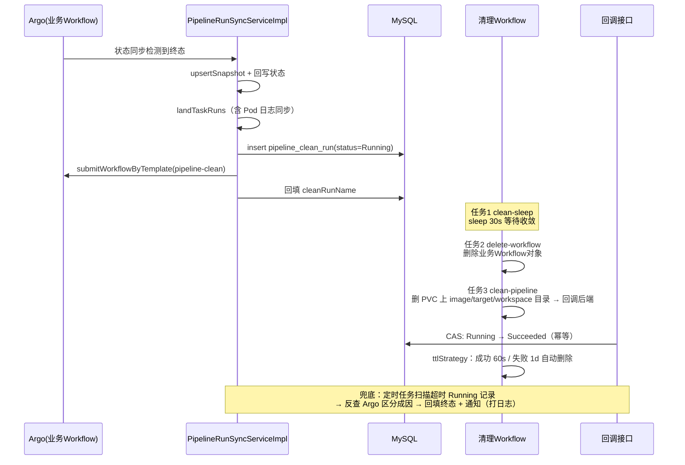

# 流水线终态清理能力 - 技术设计方案

## 一、背景与目标

### 1.1 现状

pipeline-server 的流水线执行到达终态（Succeeded / Cancelled）后，`PipelineRunSyncServiceImpl#applyWorkflow` 会完成三件事：

1. 刷新执行详情快照（`upsertSnapshot`）；
2. 乐观锁回写 `pipeline_run` 状态；
3. 终态时落地任务节点记录（`landTaskRuns`，内部含 Pod 日志同步 `fetchPodLogBestEffort`）。

但流水线执行过程中产生的**中间产物**没有被清理：

- Argo Workflow 对象本身（业务 Workflow 终态后一直残留在集群中）；
- PVC 共享存储上的中间产物目录：`/shared-data/workspace/{pipeline-run-name}/`、`/shared-data/target/{pipeline-run-name}/`、`/shared-data/image/{pipeline-run-name}/`。

随着运行次数增长，这些残留会持续占用 etcd / k8s API 与 NFS 存储，需要引入**终态后自动清理**能力。

### 1.2 目标

1. 流水线到达终态、Pod 日志同步落地之后，自动触发一条**清理流水线**（独立于业务流水线的 Argo Workflow）。
2. 清理流水线的运行记录（pipelineRunName、开始时间、状态）**落地到 DB**，可查询、可观测。
3. 提供**定时兜底任务**：检查未成功执行的清理记录并通知（本期通知为空实现，仅打日志）。
4. 设计清理流水线模板 YAML + 三个任务模板 YAML：
   - `clean-sleep`：cix 镜像 sleep 等待状态收敛；
   - `delete-workflow`：删除业务 Workflow 对象；
   - `clean-pipeline`：删除 PVC 上 `image` / `target` / `workspace` 目录下对应的 pipelineRunName 子目录 + 回调后端通知清理成功。
5. 新增**回调通知接口**：入参 `pipelineRunName`，将运行中的清理流水线状态置为成功，保证幂等。

### 1.3 非目标

- 不清理 Nexus 上的正式制品（那是交付物，不是中间产物）；
- 不做 PVC 全局周期性兜底清理（后续可独立为 CronWorkflow）；
- 通知仅打日志，不接企微/钉钉。

---

## 二、整体方案

### 2.1 端到端流程



### 2.2 触发点设计

在 `applyWorkflow` 中，终态分支（`SUCCEEDED / CANCELLED`）的 `landTaskRuns(...)` 调用**之后**追加触发清理：

```java
if (target == PipelineRunStatusEnum.SUCCEEDED || target == PipelineRunStatusEnum.CANCELLED) {
    landTaskRuns(run.getId(), workflow);
    // ★ 新增：终态落地完成后触发清理流水线（best-effort，失败不影响主流程）
    pipelineCleanService.triggerCleanAsync(run.getId());
}
```

关键约束：

- **异步触发 + 专用线程池**：`applyWorkflow` 运行在状态同步线程（`pipelineRunSyncExecutor`）里，清理触发若复用该线程池会形成**线程池嵌套**（同步线程等待清理任务、清理任务又排在同一池的队列里，极端情况下互相等待）。因此新建专用线程池 `pipelineCleanExecutor`（core=2, max=4, 有界队列 + CallerRuns 拒绝策略），与状态同步线程池完全隔离，提交即返回，不阻塞终态处理。
- **幂等保护**：`landTaskRuns` 本身可能被 `applyWorkflow` 与 `handleTerminal`（停止场景）两条路径触达，且乐观锁冲突重试可能重复进入终态分支。幂等由 `pipeline_clean_run` 表的**业务运行名唯一约束**保证（见 §3.2，`uk_run_name`），重复触发时插入冲突直接忽略。
- **best-effort**：清理触发失败只打 error 日志，不抛异常、不影响终态落地事务（触发动作放在事务提交之后执行）。

---

## 三、数据模型设计

### 3.1 落地方式选型

| 方案 | 说明 | 优点 | 缺点 |
|------|------|------|------|
| A：加字段到 `pipeline_run` | 新增 `clean_run_name` / `clean_start_time` / `clean_status` 三列 | 不加表，查询 join 少 | `pipeline_run` 已经承载状态/时间/失败信息/集群等大量字段，再混入清理生命周期职责不清；清理记录的扩展（重试次数、通知时间等）只能继续加列；Mapper XML 的 `Base_Column_List`/`BaseResultMap` 需同步维护，历史踩过坑 |
| B：**新开表 `pipeline_clean_run`（推荐）** | 一条业务运行对应一条清理记录 | 每个表足够简单、职责单一；`pipeline_run` 保持稳定不膨胀；清理状态机、兜底扫描、后续扩展（通知记录、重试）都在自己表内闭环；扫描索引可按清理场景独立设计 | 查询清理状态需按 `run_name` 关联（一对一，代价很小） |

**结论：选方案 B。** 清理是独立的生命周期（触发 → 运行 → 成功/失败），与业务运行状态机解耦后，兜底任务、回调接口、后续通知扩展都不需要动 `pipeline_run` 的任何代码与 XML。同时新表字段**尽量精简**：回调与兜底都只需要 `run_name`（业务 pipelineRunName，Argo 侧唯一）作为关联键，`pipeline_run_id`、`pipeline_id`、`cluster_name`、`start_time` 均不落——`start_time` 用 `create_time` 即可（触发即开始），集群信息需要时从 `pipeline_run` 反查。

### 3.2 建表 SQL（`sql/pipeline_clean_run.sql`）

```sql
CREATE TABLE `pipeline_clean_run` (
    `id`             BIGINT NOT NULL AUTO_INCREMENT COMMENT '主键',
    `run_name`       VARCHAR(200) NOT NULL COMMENT '业务流水线的 pipelineRunName（Argo Workflow 名称，唯一）',
    `clean_run_name` VARCHAR(200) DEFAULT NULL COMMENT '清理流水线的 pipelineRunName（提交成功后回填）',
    `status`         VARCHAR(45)  NOT NULL DEFAULT 'Running' COMMENT '状态，复用 PipelineRunStatusEnum：Running / Succeeded / Failed',
    `end_time`       DATETIME     DEFAULT NULL COMMENT '清理结束时间（回调/兜底回填）',
    `create_time`    DATETIME     NOT NULL DEFAULT CURRENT_TIMESTAMP COMMENT '创建时间（即清理触发/开始时间）',
    `update_time`    DATETIME     NOT NULL DEFAULT CURRENT_TIMESTAMP ON UPDATE CURRENT_TIMESTAMP COMMENT '更新时间',
    PRIMARY KEY (`id`),
    UNIQUE KEY `uk_run_name` (`run_name`),
    KEY `idx_status_create_time` (`status`, `create_time`)
) ENGINE=InnoDB DEFAULT CHARSET=utf8mb3 COMMENT='流水线终态清理记录';
```

设计要点：

- `uk_run_name`：一条业务运行最多触发一次清理，**数据库层幂等**；同时是回调接口的查询键；
- `clean_run_name` 允许 null：先插记录（占位 + 幂等）再提交 Argo，提交成功后回填，提交失败由兜底任务发现（`Running` 且 `clean_run_name` 为空超时）。

**关于 `idx_status_create_time` 索引的合理性**：

- 该索引对本场景是**合理且必要**的，担心的"范围太大"不会发生，原因：
- 扫描条件是 `status='Running' AND create_time < 阈值`，等值列在前、范围列在后，符合最左前缀原则，MySQL 会先用 `status='Running'` 定位索引区间，再在区间内按 `create_time` 过滤；
- **`Running` 是极小集合**：正常路径下清理记录在几分钟内就会被回调置为 `Succeeded`（或被兜底置为 `Failed`），`Running` 状态的存量 ≈ 最近 20 分钟内触发且尚未收敛的记录，通常只有几条到几十条；`create_time < 阈值` 只在这个小集合内做二次过滤，不会全表扫；
- 反例说明：如果只建 `idx_create_time(create_time)`，`create_time < 阈值` 才真的是大范围（覆盖全部历史记录）；加上 `status` 前缀正是为了把范围收敛到 Running 子集；
- 即使极端情况下（回调全部丢失）Running 记录堆积，扫描也有 `LIMIT 100` 保护，单轮开销可控。

### 3.3 状态机与状态枚举

**复用已有的 `PipelineRunStatusEnum`**，不新增枚举。清理记录只用其中三个值，编码与 Argo phase 天然一致（兜底反查 Argo 时可直接 `PipelineRunStatusEnum.ofCode(phase)` 映射）：

- `Running`：已触发/运行中（插入时默认值）
- `Succeeded`：清理成功（回调置位 / 兜底反查回填）
- `Failed`：清理失败或超时（兜底反查回填）

```
            insert(占位)              submit成功回填name
   ──── ──> Running ──────────────────────> Running ─────┐
              │                                    │      │ 回调接口(CAS)
              │ 提交失败/超时(兜底)                  │ 超时(兜底反查Argo)
              ▼                                    ▼      ▼
            Failed <──────────────────────  Failed      Succeeded(终态)
```

- **只允许 Running → 终态**，终态不可再变更（幂等的核心，见 §5.3）。

---

## 四、清理流水线模板设计

模板文件落在 pipeline-manifests 仓库，与现有目录结构对齐：

```
pipelinetemplate/
  pipeline-clean.yaml                      # 清理流水线模板（编排）
basetasktemplate/
  clean/
    clean-sleep.yaml                        # 任务模板：sleep 等待状态收敛
    delete-workflow.yaml                    # 任务模板：删除业务 Workflow 对象
    clean-pipeline.yaml                     # 任务模板：删除中间产物目录 + 回调通知
```

### 4.1 任务模板：`clean-sleep.yaml`

入参：`clean-wait-seconds`（默认 30）。

逻辑：**sleep 等待**。目的：终态处理线程触发清理时，Argo 侧 Pod 可能仍处于 terminating（尤其 Cancelled 场景），日志采集、节点状态收敛需要缓冲窗口；把延迟放在清理流水线内部（而非后端线程 sleep），不阻塞后端。

独立成节点的目的：argocli 镜像基于 scratch 无 sh，无法与 sleep 共存于同一 script，也不必为此自定义打包镜像；用 cix 镜像单独 sleep，职责最简单。

```yaml
apiVersion: argoproj.io/v1alpha1
kind: WorkflowTemplate
metadata:
  name: clean-sleep
  namespace: argo
  labels:
    app.kubernetes.io/name: clean-sleep
    app.kubernetes.io/version: "0.0.1"
    app.kubernetes.io/part-of: pipeline
    kubernetes.io/os: linux
  annotations:
    app.kubernetes.io/description: "终态清理任务：等待指定秒数，给 Pod 终止与日志收敛留缓冲窗口。"
spec:
  workflowMetadata:
    labels:
      app.kubernetes.io/name: clean-sleep
      app.kubernetes.io/part-of: pipeline
  serviceAccountName: argo
  entrypoint: entrypoint
  templates:
    - name: entrypoint
      activeDeadlineSeconds: 120
      nodeSelector:
        kubernetes.io/os: linux
      inputs:
        parameters:
          - name: clean-wait-seconds
            default: "30"
            description: "等待秒数，给 Pod 终止与日志收敛留缓冲"
      container:
        image: "yangtu/cix:0.1.2"
        imagePullPolicy: IfNotPresent
        command: [sh, -c]
        args: ["echo '等待 {{inputs.parameters.clean-wait-seconds}}s（Pod 终止/日志收敛缓冲窗口）...'; sleep '{{inputs.parameters.clean-wait-seconds}}'"]
```

### 4.2 任务模板：`delete-workflow.yaml`

入参：`pipeline-run-name`（业务流水线的 pipelineRunName）。

逻辑：**使用 argo CLI 删除业务 Workflow 对象**（等待收敛由上游 `clean-sleep` 节点完成）。

镜像使用 `quay.io/argoproj/argocli:v3.4.8`（自带 argo CLI，与集群 Argo 版本对齐）。注意：argocli 基于 scratch 无 sh，**只能用 `container` 直接执行 argo 二进制，不能用 `script`**；认证走 Pod 的 SA（`serviceAccountName: argo`，需具备 workflow 删除权限），in-cluster 直连 API。

```yaml
apiVersion: argoproj.io/v1alpha1
kind: WorkflowTemplate
metadata:
  name: delete-workflow
  namespace: argo
  labels:
    app.kubernetes.io/name: delete-workflow
    app.kubernetes.io/version: "0.0.1"
    app.kubernetes.io/part-of: pipeline
    kubernetes.io/os: linux
  annotations:
    app.kubernetes.io/description: "终态清理任务：使用 argo CLI 删除业务 Workflow 对象。"
spec:
  workflowMetadata:
    labels:
      app.kubernetes.io/name: delete-workflow
      app.kubernetes.io/part-of: pipeline
  # argocli 镜像基于 scratch 无 sh，只能用 container 直接执行 argo 二进制（不能用 script）；
  # 认证走 Pod 的 SA（serviceAccountName=argo 需具备 workflow 删除权限），in-cluster 直连 API。
  serviceAccountName: argo
  entrypoint: entrypoint
  templates:
    - name: entrypoint
      activeDeadlineSeconds: 300
      nodeSelector:
        kubernetes.io/os: linux
      inputs:
        parameters:
          - name: pipeline-run-name
            description: "业务流水线的 pipelineRunName（Argo Workflow 名称）"
          - name: argo-namespace
            default: "argo"
            description: "业务 Workflow 所在 namespace"
      container:
        image: quay.io/argoproj/argocli:v3.4.8
        imagePullPolicy: IfNotPresent
        command: [argo]
        args: ["-n", "{{inputs.parameters.argo-namespace}}", "delete", "{{inputs.parameters.pipeline-run-name}}"]
```

### 4.3 任务模板：`clean-pipeline.yaml`

入参：`pipeline-run-name`（业务流水线的 pipelineRunName）。

逻辑：**删除 PVC 共享存储上 `image` / `target` / `workspace` 三个目录下对应的 `{pipeline-run-name}` 子目录 → curl POST 后端回调接口**，通知"该业务流水线的清理已成功"。回调地址通过 ConfigMap `pipeline-server-config` 注入的 `PIPELINE_SERVER_URL` 环境变量拼接（与 `push-raw-nexus3` 的制品回传方式一致），不硬编码 k8s Service 地址。

```yaml
apiVersion: argoproj.io/v1alpha1
kind: WorkflowTemplate
metadata:
  name: clean-pipeline
  namespace: argo
  labels:
    app.kubernetes.io/name: clean-pipeline
    app.kubernetes.io/version: "0.0.1"
    app.kubernetes.io/part-of: pipeline
    kubernetes.io/os: linux
  annotations:
    app.kubernetes.io/description: "终态清理任务：删除 PVC 共享存储上的中间产物目录，并回调 pipeline-server 将清理记录置为成功。"
spec:
  workflowMetadata:
    labels:
      app.kubernetes.io/name: clean-pipeline
      app.kubernetes.io/part-of: pipeline
  serviceAccountName: argo
  entrypoint: entrypoint
  volumes:
    # 共享存储 PVC（与业务流水线同卷，清理其上的中间产物目录）
    - name: shared-data
      persistentVolumeClaim:
        claimName: nfs-pvc
  templates:
    - name: entrypoint
      activeDeadlineSeconds: 300
      nodeSelector:
        kubernetes.io/os: linux
      inputs:
        parameters:
          - name: pipeline-run-name
            description: "业务流水线的 pipelineRunName（Argo Workflow 名称）"
          - name: shared-data-root
            default: "/shared-data"
            description: "PVC 挂载根路径"
      script:
        image: "yangtu/cix:0.1.2"
        imagePullPolicy: IfNotPresent
        command: [sh, -eux]
        envFrom:
          # pipeline-server 后端地址（PIPELINE_SERVER_URL），与 push-raw-nexus3 的回传方式一致
          # 注意：envFrom 必须放在 script（container）内部，放在模板层级会被 CRD 裁剪导致变量不生效
          - configMapRef:
              name: pipeline-server-config
        volumeMounts:
          - name: shared-data
            mountPath: /shared-data
        source: |
          PIPELINE_RUN_NAME="{{inputs.parameters.pipeline-run-name}}"
          SHARED_DATA_ROOT="{{inputs.parameters.shared-data-root}}"

          # 1. 删除 PVC 上的中间产物目录：image / target / workspace 下对应的 pipelineRunName 子目录
          for dir in image target workspace; do
            target="${SHARED_DATA_ROOT}/${dir}/${PIPELINE_RUN_NAME}"
            if [ -d "$target" ]; then
              rm -rf "$target"
              echo "已删除产物目录: $target"
            else
              echo "产物目录不存在，跳过: $target"
            fi
          done

          # 2. 回调 pipeline-server，将清理记录置为成功（接口幂等，失败重试由 retryStrategy 兜底）
          if [ -z "${PIPELINE_SERVER_URL:-}" ]; then
            echo "[Error] PIPELINE_SERVER_URL 为空，请检查 ConfigMap（pipeline-server-config）"
            exit 1
          fi
          curl -sS -f --retry 3 --retry-max-time 60 --retry-all-errors \
            -X POST "${PIPELINE_SERVER_URL}/pipeline-clean/callback" \
            -H "Content-Type: application/json" \
            -d '{"pipelineRunName": "'"${PIPELINE_RUN_NAME}"'"}'
          echo "清理回调完成"
      retryStrategy:
        limit: 3
        retryPolicy: "OnError"   # 网络抖动重试；接口幂等，重复回调无副作用
```

要点：

- **删目录与回调合并在同一 script**：保证"目录删成功才回调"的原子性（与 push-raw-nexus3 上传后回传的思路一致）；
- `retryStrategy`：回调是幂等的（见 §5.3），失败重试安全；
- 回调失败且重试耗尽 → 清理 Workflow 整体 Failed → 由后端兜底定时任务发现（§6）。

### 4.4 流水线模板：`pipeline-clean.yaml`

```yaml
apiVersion: argoproj.io/v1alpha1
kind: WorkflowTemplate
metadata:
  name: pipeline-clean
  namespace: argo
  labels:
    app.kubernetes.io/name: pipeline-clean
    app.kubernetes.io/version: "0.0.1"
    app.kubernetes.io/part-of: pipeline
    kubernetes.io/os: linux
  annotations:
    app.kubernetes.io/description: "流水线终态清理流水线：clean-sleep 等待收敛 → delete-workflow 删除业务 Workflow → clean-pipeline 删除中间产物目录并回调后端置成功。"
spec:
  workflowMetadata:
    labels:
      app.kubernetes.io/name: pipeline-clean
      app.kubernetes.io/part-of: pipeline
  serviceAccountName: argo
  entrypoint: main
  # TTL 自动删除：成功 60s 后删（清理本身成功即无保留价值）；
  # 失败 1 天后删（保留排查窗口，兜底任务在 20 分钟内已反查回填终态，1 天足够人工翻看）
  ttlStrategy:
    secondsAfterSuccess: 60
    secondsAfterFailure: 86400
  arguments:
    parameters:
      - name: pipeline-run-name
        description: "业务流水线的 pipelineRunName（必填）"
      - name: clean-wait-seconds
        default: "30"
        description: "删除前等待秒数"
  templates:
    - name: main
      dag:
        tasks:
          - name: clean-sleep
            templateRef:
              name: clean-sleep
              template: entrypoint
            arguments:
              parameters:
                - name: clean-wait-seconds
                  value: "{{workflow.parameters.clean-wait-seconds}}"
          - name: delete-workflow
            depends: clean-sleep
            templateRef:
              name: delete-workflow
              template: entrypoint
            arguments:
              parameters:
                - name: pipeline-run-name
                  value: "{{workflow.parameters.pipeline-run-name}}"
          - name: clean-pipeline
            depends: delete-workflow
            templateRef:
              name: clean-pipeline
              template: entrypoint
            arguments:
              parameters:
                - name: pipeline-run-name
                  value: "{{workflow.parameters.pipeline-run-name}}"
```

要点：

- 线性 DAG：`clean-sleep → delete-workflow → clean-pipeline`，任一环节失败则后续不执行、整体 Failed，由兜底任务反查接管——**失败不会被误标成功**；
- **父模板必须声明子模板依赖的卷**：Argo 的 `templateRef` 不会带入子模板 `spec.volumes`，需在父 Workflow 的 `spec.volumes` 中声明同名卷（`shared-data`），否则报 `volume 'shared-data' not found in workflow spec`；
- **TTL 自动删除**：成功 60s / 失败 1 天。失败对象保留 1 天是兜底任务区分成败的依据（兜底扫描周期 5 分钟、超时阈值 20 分钟，远小于 1 天，反查时对象必然还在）；成功对象 60s 后即删，不留垃圾。

---

## 五、后端改造设计

### 5.1 模块与代码归属

| 层 | 内容 | 位置 |
|----|------|------|
| Controller | `PipelineCleanController`（回调接口） | `service.controller` |
| Service | `PipelineCleanService` / `PipelineCleanServiceImpl`（触发 + 回调 + 兜底检查） | `service.service` / `service.service.impl` |
| 定时任务 | `PipelineCleanGuardJob`（兜底扫描，cron_job 表配置调度，见 §5.4） | `service.job`（与 `PipelineRunSyncGuardJob` 同目录） |
| Entity | `PipelineCleanRun` | `dao.entity` |
| Mapper + XML | `PipelineCleanRunMapper` | `dao.mapper` / `resources/mapper` |
| 枚举/常量 | `PipelineCleanConstants`（状态复用已有 `PipelineRunStatusEnum`，不新增枚举） | `common.constants` |
| 建表 SQL | `sql/pipeline_clean_run.sql` | 项目根目录 `sql/` |

### 5.2 触发清理：`triggerCleanAsync(pipelineRunId)`

```java
public void triggerCleanAsync(Long pipelineRunId) {
    pipelineCleanExecutor.execute(() -> {
        try {
            doTriggerClean(pipelineRunId);
        } catch (Exception e) {
            log.error("触发清理流水线失败, pipelineRunId={}", pipelineRunId, e);
        }
    });
}

private void doTriggerClean(Long pipelineRunId) {
    PipelineRun run = pipelineRunRepository.selectById(pipelineRunId);
    if (run == null || !StringUtils.hasText(run.getName())) {
        return;
    }
    // 1. 先插占位记录（uk_run_name 保证幂等；冲突说明已触发过，直接返回）
    PipelineCleanRun cleanRun = new PipelineCleanRun();
    cleanRun.setRunName(run.getName());
    cleanRun.setStatus(PipelineRunStatusEnum.RUNNING.getCode());
    try {
        pipelineCleanRunRepository.insert(cleanRun);
    } catch (DuplicateKeyException e) {
        log.info("清理记录已存在，跳过重复触发, runName={}", run.getName());
        return;
    }
    // 2. 提交清理 Workflow（模板名固定 pipeline-clean，参数 pipeline-run-name）
    String clusterName = clusterConfigService.resolveRunClusterName(run);
    List<String> params = List.of("pipeline-run-name=" + run.getName());
    IoArgoprojWorkflowV1alpha1Workflow workflow = argoWorkflowAgent
            .submitWorkflowByTemplate(clusterName, clusterConfigService.getNamespace(clusterName),
                    PipelineCleanConstants.CLEAN_TEMPLATE_NAME, params);
    // 3. 回填 cleanRunName（提交失败抛异常 → 记录保持 Running + name 为空，由兜底任务发现）
    String cleanRunName = workflow.getMetadata() != null ? workflow.getMetadata().getName() : null;
    pipelineCleanRunRepository.updateCleanRunName(cleanRun.getId(), cleanRunName);
    log.info("清理流水线已提交, runName={}, cleanRunName={}, clusterName={}",
            run.getName(), cleanRunName, clusterName);
}
```

说明：

- **先插记录再提交**：占位即幂等锁，避免"提交成功但记录没落地"的悬空 Workflow；
- 集群选择：与业务运行同集群（`resolveRunClusterName`），清理的是该集群上的 Workflow，天然正确；
- 专用线程池 `pipelineCleanExecutor`（core=2, max=4, 有界队列），与状态同步线程池隔离。

### 5.3 回调接口：幂等置成功

```
POST /api/v1/pipeline-clean/callback
Content-Type: application/json

{ "pipelineRunName": "go-cicd-pipeline-abc123" }
```

处理流程：

1. 按 `run_name` 查 `pipeline_clean_run`（唯一索引 `uk_run_name`）；
2. 记录不存在 → 返回成功（防止清理 Workflow 重试时记录已被处理/删除导致任务反复 Failed）；
3. **CAS 更新**：`UPDATE pipeline_clean_run SET status='Succeeded', end_time=NOW() WHERE run_name=? AND status='Running'`；
   - 命中 1 行 → 首次回调，置成功；
   - 命中 0 行 → 已是终态（重复回调），直接返回成功——**天然幂等**；
4. 状态机只允许 `Running → Succeeded`，终态不可再变，重复/乱序回调无副作用。

**免登录**：该接口是清理 Workflow（集群内 Pod）回调用，不携带用户会话，**不接入登录拦截器**（从拦截器白名单排除）；仅限集群内网访问。

```java
public void handleCallback(String pipelineRunName) {
    if (!StringUtils.hasText(pipelineRunName)) {
        throw new BusinessException("pipelineRunName 不能为空");
    }
    PipelineCleanRun cleanRun = pipelineCleanRunRepository.selectByRunName(pipelineRunName);
    if (cleanRun == null) {
        log.warn("回调对应的清理记录不存在，忽略, pipelineRunName={}", pipelineRunName);
        return;
    }
    int rows = pipelineCleanRunRepository.casMarkSucceeded(cleanRun.getId());
    log.info("清理回调处理完成, runName={}, cleanRunId={}, updated={}",
            cleanRun.getRunName(), cleanRun.getId(), rows);
}
```

> 安全性备注：接口部署在集群内网，清理 Workflow 通过集群内 Service 访问；如后续暴露到集群外，需增加 token 校验（本期非目标）。

### 5.4 兜底定时任务：`PipelineCleanGuardJob`

问题：回调可能丢失（网络、Pod 被驱逐、重试耗尽）、提交可能失败、清理 Workflow 可能卡死。需要定时扫描补偿。

**调度方式：复用已有的 cron_job 定时任务模块**（与 `PipelineRunSyncGuardJob` 一致）：本类只写业务实现（Spring Bean + `execute` 方法），**不写 `@Scheduled`**，由 `CronJobScheduler` 按下表配置的 cron 表达式反射调用：

```sql
-- sql/pipeline_clean_run.sql 中同步提供（也加入 init.sql）
INSERT INTO `cron_job`
(`name`, `bean_name`, `method_name`, `method_params`, `cron_expr`, `enabled`, `misfire_policy`, `concurrent`)
VALUES
('流水线终态清理兜底检查', 'pipelineCleanGuardJob', 'execute', NULL, '0 */5 * * * ?', 1, 'skip', 0);
```

```java
@Slf4j
@Component("pipelineCleanGuardJob")
public class PipelineCleanGuardJob {
    // 清理 Workflow 的理论最大时长：sleep 30s + 删除 + 回调重试，给 15 分钟 + 缓冲
    private static final int TIMEOUT_MINUTES = 20;

    /**
     * 兜底检查入口（由 cron_job 定时任务反射调用，无参数）。
     */
    public void execute() {
        Date deadline = new Date(System.currentTimeMillis() - TIMEOUT_MINUTES * 60_000L);
        List<PipelineCleanRun> timeouts = pipelineCleanRunRepository.listTimeoutRunning(deadline);
        for (PipelineCleanRun cleanRun : timeouts) {
            // 1. 反查 Argo 区分成因，回填终态（先更新再通知，终态不可再变 → 通知天然防重发）
            resolveAndMarkTerminal(cleanRun);
            // 2. 通知（空实现，本期仅打日志）
            notifyCleanFailed(cleanRun);
        }
    }

    /**
     * 反查 Argo：按 clean_run_name 查清理 Workflow 的实际 phase，映射回填终态。
     */
    private void resolveAndMarkTerminal(PipelineCleanRun cleanRun) {
        // clean_run_name 为空 → 提交阶段就失败，直接置 Failed
        if (!StringUtils.hasText(cleanRun.getCleanRunName())) {
            pipelineCleanRunRepository.casMarkFailed(cleanRun.getId());
            return;
        }
        PipelineRun run = pipelineRunRepository.selectByName(cleanRun.getRunName());
        String clusterName = clusterConfigService.resolveRunClusterName(run);
        try {
            IoArgoprojWorkflowV1alpha1Workflow wf = argoWorkflowAgent.getWorkflow(
                    clusterName, clusterConfigService.getNamespace(clusterName), cleanRun.getCleanRunName());
            String phase = wf != null && wf.getStatus() != null ? wf.getStatus().getPhase() : null;
            PipelineRunStatusEnum status = PipelineRunStatusEnum.ofCode(phase);
            if (status == PipelineRunStatusEnum.SUCCEEDED || status == null) {
                // Succeeded：回调丢失但实际已成功；null：成功后被 TTL 删除 → "删除即成功"推定
                pipelineCleanRunRepository.casMarkSucceeded(cleanRun.getId());
            } else {
                // Failed / Error / 仍在 Running（卡死）
                pipelineCleanRunRepository.casMarkFailed(cleanRun.getId());
            }
        } catch (Exception e) {
            // 反查异常保守处理：置 Failed，等下一轮扫描或人工介入
            log.warn("兜底反查 Argo 失败, cleanRunId={}", cleanRun.getId(), e);
            pipelineCleanRunRepository.casMarkFailed(cleanRun.getId());
        }
    }

    private void notifyCleanFailed(PipelineCleanRun cleanRun) {
        // TODO: 后续接入企微/钉钉；当前仅日志
        log.warn("清理流水线未成功, runName={}, cleanRunName={}, status={}, createTime={}",
                cleanRun.getRunName(), cleanRun.getCleanRunName(),
                cleanRun.getStatus(), cleanRun.getCreateTime());
    }
}
```

扫描 SQL（走 `idx_status_create_time`，等值列在前、范围列在后）：

```sql
SELECT * FROM pipeline_clean_run
WHERE status = 'Running' AND create_time < #{deadline}
LIMIT 100;
```

反查判定口径（超时记录按 `clean_run_name` 反查 Argo 的实际 phase）：

| 反查结果 | 判定 | 兜底动作 |
|--------|------|----------|
| clean_run_name 为空 | 提交阶段失败 | 置 Failed + 日志 |
| Workflow 不存在 | 成功后被 TTL（60s）删除 → "删除即成功"推定 | 置 Succeeded |
| Workflow 存在且 Succeeded | 回调丢失 | 置 Succeeded + 日志（可打点回调丢失率） |
| Workflow 存在且 Failed / Error | 清理失败 | 置 Failed + 日志 |
| Workflow 存在且仍在 Running | 卡死（超过 activeDeadlineSeconds 理论上限） | 置 Failed + 日志，必要时人工介入 |

多实例部署时，CAS 更新（`WHERE status='Running'`）保证同一记录只会被一个实例成功处理，无需额外分布式锁。

---

## 六、接口与查询

### 6.1 新增接口清单

| 方法 | 路径 | 说明 |
|------|------|------|
| POST | `/api/v1/pipeline-clean/callback` | 清理完成回调（幂等），入参 `pipelineRunName` |

### 6.2 可选查询接口（本期可不做，预留）

| 方法 | 路径 | 说明 |
|------|------|------|
| GET | `/api/v1/pipeline-clean?runName=` | 按业务 pipelineRunName 查询清理状态 |

---

## 七、上线与实施步骤

1. **DB**：执行 `sql/pipeline_clean_run.sql`（建表 + cron_job 定时任务 DML）；同时把建表语句与 DML **同步加入 `sql/init.sql`**（新环境一键初始化）；
2. **模板发布**：pipeline-manifests 新增 `basetasktemplate/clean/clean-sleep.yaml`、`delete-workflow.yaml`、`clean-pipeline.yaml`、`pipelinetemplate/pipeline-clean.yaml`，通过现有模板同步机制发布到各集群 Argo（`metadata.name` 与模板编码一致）；
3. **后端**：按 §5 顺序开发 Entity/Mapper/Service/Controller/Job，`applyWorkflow` 终态分支追加 `triggerCleanAsync`；回调路径加入登录拦截器白名单；
4. **验证**：
   - 跑一条业务流水线到终态 → 观察 `pipeline_clean_run` 生成 Running 记录 → 清理 Workflow 执行（Workflow 删除 + image/target/workspace 目录删除）→ 回调后记录变 Succeeded → 清理 Workflow 60s 后自动消失；
   - 手动重复调回调接口 → 返回成功且状态不变（幂等验证）；
   - 停掉回调（改错 callback-url）→ 等待超时 → 兜底任务反查 Argo（Succeeded → 回填 Succeeded；Failed → 回填 Failed）并打 warn 日志；
   - 同一 runName 重复触发 → 唯一约束拦截，日志出现"跳过重复触发"。

## 八、风险与注意事项

1. **MyBatis XML 同步**：新增表虽无历史包袱，但自定义 SQL 需保证 `Base_Column_List` / `BaseResultMap` 与列一致（历史教训）；
2. **清理删除的是业务 Workflow**：删除后执行详情依赖 `pipeline_run_snapshot` 快照与 `pipeline_task_run` 落地记录——两者在终态处理时已持久化，删除 Workflow 不影响页面回溯；但**日志查看依赖已落地的 logContent**，删除后无法再实时拉 Pod 日志，属预期行为；
3. **回调接口安全**：本期仅集群内可达；暴露外网前必须加认证；
4. **失败清理 Workflow 残留**：失败 TTL 1 天后自动删除；兜底任务在 20 分钟内已反查回填终态，1 天窗口足够人工排查；
5. **sleep 30s 固定值**：对 Succeeded 场景偏保守（Pod 已正常退出），但实现简单、统一；后续可按终态类型区分等待时长（参数 `clean-wait-seconds` 已预留）。
