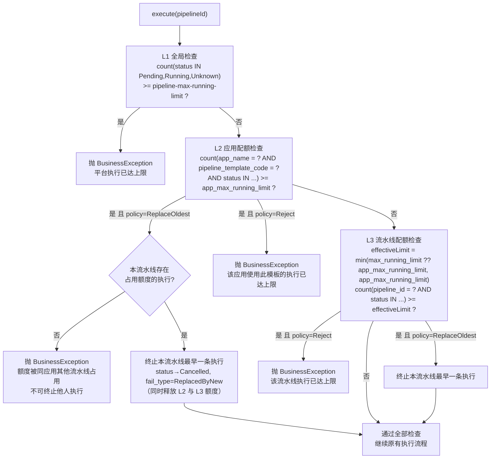

# 流水线并发控制 - 技术设计方案

| 项 | 内容 |
|---|---|
| 模块 | pipeline-server |
| 关联模块 | 流水线执行、模板管理、通用配置 |

---

## 1. 背景与目标

当前流水线执行没有任何并发限制：任意流水线可被无限次触发，所有执行直接提交到 Argo Workflows。存在三类问题：

1. **平台容量风险**：大量执行同时涌入会耗尽 K8s 集群资源（Pod、CPU、内存），拖垮所有业务
2. **应用滥用风险**：单个应用（appName）可无限触发执行，挤占其他应用的资源
3. **部署类流水线的执行互斥问题**：涉及部署的流水线（如发布、泳道部署）本质上不应并发执行——同一目标的并发部署会产生覆盖、冲突甚至回滚。对这类流水线，并发控制的正确语义是：要么**拒绝**新执行，要么**替换**（终止旧执行、执行新的），由用户按模板语义选择

本方案引入**三层并发控制**：

| 层级 | 控制维度 | 配置来源 | 作用 |
|---|---|---|---|
| L1 全局限流 | 全平台所有执行 | 通用配置表 `pipeline-max-running-limit` | 平台容量保护伞 |
| L2 应用配额 | appName × 模板 | `pipeline_template.app_max_running_limit` | 防单应用滥用 |
| L3 流水线配额 | 单条流水线 | `pipeline.max_running_limit` | 精细化管控 |

超限处理策略（`over_limit_policy`）二选一：

- **Reject**：拒绝本次执行，返回明确错误信息
- **ReplaceOldest**：终止最早一条执行中的记录，腾出额度后放行本次执行

## 2. 核心设计决策

| 决策点 | 结论 | 理由 |
|---|---|---|
| 额度统计口径 | `Pending` + `Running` + `Unknown` 状态的记录占用额度 | Failed/Error 不占额度，失败后可立即重试；Unknown 是短暂态需计入防止漏算 |
| L3 与 L2 的关系 | L3 未配置时 fallback 到 L2；L3 配置值 **clamp 到 L2**（超过则取 L2 值） | 模板值既是默认值也是上限，平台方可兜底保护容量 |
| 并发竞争窗口 | 接受少量超卖（check-then-act 不加锁） | CI 场景对精确计数不敏感，避免分布式锁拖慢提交主流程 |
| ReplaceOldest 终止语义 | 记录置为 `Cancelled`，`fail_type = ReplacedByNew` | 复用现有停止逻辑，与用户手动停止可区分，便于审计 |
| ReplaceOldest 替换范围 | 仅允许终止**当前流水线自己**的最早执行；整个检查过程最多终止一条 | 不能为了一条流水线的新执行去终止同应用下其他流水线的执行 |
| 未配置时的兜底 | limit 兜底 1、策略兜底 Reject，定义为常量 | DDL 已有默认值，常量仅用于代码可读性与运行时防御 |

## 3. 数据模型变更

### 3.1 pipeline_template 新增字段

```sql
ALTER TABLE `pipeline_template`
  ADD COLUMN `app_max_running_limit` int NOT NULL DEFAULT 1
    COMMENT '应用维度最大并发执行数：同一 appName 使用本模板的未完成执行数上限（统计 Pending/Running/Unknown），默认1即不允许并发' AFTER `cluster_schedule_policy`,
  ADD COLUMN `over_limit_policy` varchar(45) NOT NULL DEFAULT 'Reject'
    COMMENT '超限策略：Reject-拒绝新执行 / ReplaceOldest-终止最早执行腾位' AFTER `app_max_running_limit`;
```

### 3.2 pipeline 新增字段

```sql
ALTER TABLE `pipeline`
  ADD COLUMN `max_running_limit` int DEFAULT NULL
    COMMENT '本流水线最大并发执行数；NULL 表示未配置，fallback 到模板的 app_max_running_limit；配置值超过模板值时按模板值生效（clamp）' AFTER `pipeline_template_code`,
  ADD COLUMN `over_limit_policy` varchar(45) DEFAULT NULL
    COMMENT '超限策略：Reject / ReplaceOldest；NULL 表示未配置，fallback 到模板的 over_limit_policy' AFTER `max_running_limit`;
```

**设计说明**：

- `pipeline.max_running_limit` 允许 NULL —— 惰性默认：未配置时运行时取模板值，模板调整后所有未自定义的流水线立即生效，无存量数据迁移
- `pipeline.over_limit_policy` 同样允许 NULL，fallback 到模板；模板侧 DDL 默认 Reject，即未显式配置时默认拒绝新执行

### 3.3 通用配置初始化数据

```sql
INSERT INTO `generic_config` (`config_key`, `config_value`, `value_format`, `description`, `creator`, `create_time`, `update_time`, `deleted`)
VALUES ('pipeline-max-running-limit', '1000', 'txt', '全平台最大并发执行数（限流）：全平台 Pending/Running/Unknown 状态的流水线执行总数达到该值时，拒绝新的执行提交', 'system', NOW(), NOW(), 0);
```

> 注：字段名以 `generic_config` 表实际结构为准，若该表有 `description` 长度限制或非空约束不同，按实际调整。

### 3.4 yml 兜底默认值

`application.yml` 新增：

```yaml
pipeline:
  concurrency:
    # 全局最大运行数兜底默认值（generic_config 中 pipeline-max-running-limit 未配置时生效）
    max-running-limit: 1000
```

读取优先级：`generic_config` 表 > yml 默认值。

### 3.5 init.sql 变更清单

| 位置 | 变更 |
|---|---|
| `pipeline_template` CREATE TABLE | 加入 `app_max_running_limit`、`over_limit_policy` 两列 |
| `pipeline` CREATE TABLE | 加入 `max_running_limit`、`over_limit_policy` 两列 |
| init.sql 种子数据区段 | 追加 `generic_config` 的 `pipeline-max-running-limit` INSERT |

## 4. 额度计算规则

### 4.1 占用额度的状态集合

```java
// PipelineRunStatusEnum 中 Pending / Running / Unknown 占用额度
public static boolean occupyQuota(PipelineRunStatusEnum status) {
    return status == PENDING || status == RUNNING || status == UNKNOWN;
}
```

### 4.2 三层检查顺序与 SQL 口径



**关键规则**：

1. **L1 只做 Reject**：全局限流是容量保护伞，不做 Replace（终止别人的执行来给新执行腾位，在全局维度语义不合理）
2. **L2/L3 的策略取值**：优先取 `pipeline.over_limit_policy`，NULL 则取 `pipeline_template.over_limit_policy`，均未配置时兜底 `Reject`
3. **L3 生效上限计算**：`effectiveLimit = min(pipeline.max_running_limit, template.app_max_running_limit)`，未配置时直接用模板值；模板值异常时兜底常量 `1`
4. **ReplaceOldest 的替换范围仅限本流水线**：L2 超限时，若本流水线存在占用额度的执行，替换其最早一条（`id` 最小）——该记录同时计入 L2 与 L3 的额度，终止它即同时满足两层，**整个检查过程最多终止一条执行**；若本流水线无占用（额度被同应用其他流水线占满），则拒绝，不允许终止他人执行
5. **L2 已替换则跳过 L3**：替换后本流水线占用数已减一，L3 必然满足，无需重复检查

### 4.3 竞争窗口说明

检查（count）与提交（submitWorkflow）之间存在时间窗口，多实例并发提交时可能少量超限（如 limit=5 实际跑到 6）。**本方案接受该误差**：

- CI 场景额度本身是软保护，非精确配额计费
- 加分布式锁串行化会显著拖慢提交吞吐，得不偿失
- 后续若需精确控制，可在 `execute` 外围加 `distributed_lock`（表已具备），作为增强项

## 5. 代码设计

### 5.1 新增组件

```
pipeline-server-service/
└── src/main/java/com/ci/pipeline/service/
    ├── concurrency/                          ← 新增包
    │   ├── PipelineConcurrencyChecker.java   # 并发检查编排（L1→L2→L3，超限处理委托策略分发器）
    │   ├── OverLimitPolicyStrategyManager.java # 策略分发器（Spring Map 注入，枚举 bean 名路由）
    │   ├── policy/
    │   │   ├── OverLimitPolicyStrategy.java  # 超限策略接口（isBlock 判断 + beforeExecute 动作）
    │   │   └── impl/
    │   │       ├── RejectOverLimitStrategy.java       # @Component("RejectOverLimit")
    │   │       └── ReplaceOldestOverLimitStrategy.java # @Component("ReplaceOldestOverLimit")
    │   └── config（PipelineConcurrencyProperties 在 service.config 包）
    └── service/impl/
        └── PipelineServiceImpl.java          # execute() 注入检查调用
```

`OverLimitPolicyEnum` 放 `pipeline-server-common` 的 `enums` 包，与 `PipelineRunStatusEnum` 同级；
枚举携带 `strategyBeanName` 路由键（code → Spring Bean 名），与实现类 `@Component` 显式命名对应。

**策略模式**：

- 新增策略 = 加枚举项（含 strategyBeanName）+ 同名 `@Component` 实现类，检查编排零改动（开闭原则）
- 判断与动作分离：`isBlock()` 只读判断是否阻断（runPrecheck 语义），`beforeExecute()` 在超限且不阻断时执行腾位等副作用动作（beforeExec 语义）
- 分发器按 `Map<String, OverLimitPolicyStrategy>` 注入全部实现，编码非法时兑底 Reject

### 5.2 核心类骨架

```java
@Component
public class PipelineConcurrencyChecker {

    @Autowired private GenericConfigRepository genericConfigRepository;
    @Autowired private PipelineRunRepository pipelineRunRepository;
    @Autowired private OverLimitPolicyStrategyManager overLimitPolicyStrategyManager;
    @Autowired private PipelineConcurrencyProperties properties;

    /** 占用额度的状态集合 */
    private static final List<String> OCCUPYING_STATUSES = List.of("Pending", "Running", "Unknown");

    /**
     * 执行前并发检查：L1 全局 → L2 应用×模板 → L3 流水线。
     * 任一层超限且策略判定阻断时抛 BusinessException；
     * ReplaceOldest 则终止本流水线最早一条占用记录后放行（全程最多终止一条）。
     */
    public void checkBeforeExecute(Pipeline pipeline, PipelineTemplate template) {
        checkGlobalLimit();                                 // L1
        boolean replaced = checkAppTemplateLimit(pipeline, template);  // L2，返回是否已执行替换
        if (!replaced) {
            checkPipelineLimit(pipeline, template);   // L2 已替换时 L3 必然满足，跳过
        }
    }

    /** L2/L3 超限统一处理：委托策略实现判断阻断 / 腾位 */
    private boolean handleOverLimit(pipeline, template, limit, occupying, rejectMessage, args...) {
        OverLimitPolicyStrategy strategy =
                overLimitPolicyStrategyManager.getStrategy(resolvePolicyCode(pipeline, template));
        long ownOccupying = pipelineRunRepository.countOccupyingByPipelineId(pipeline.getId(), OCCUPYING_STATUSES);
        if (strategy.isBlock(pipeline, template, limit, occupying, ownOccupying)) {
            throw new BusinessException(String.format(rejectMessage, args));
        }
        List<PipelineRun> ownRuns = pipelineRunRepository.selectOccupyingByPipelineId(
                pipeline.getId(), OCCUPYING_STATUSES);
        return strategy.beforeExecute(pipeline, ownRuns);
    }
}
```

### 5.3 Repository 层新增查询

```java
// PipelineRunRepository
/** 统计占用额度的执行数（全平台） */
public long countOccupying(List<String> statuses) { ... }

/** 统计占用额度的执行数（appName + 模板维度） */
public long countOccupyingByAppAndTemplate(String appName, String templateCode, List<String> statuses) { ... }

/** 统计占用额度的执行数（单流水线维度） */
public long countOccupyingByPipelineId(Long pipelineId, List<String> statuses) { ... }

/** 查询本流水线占用额度的执行列表（ReplaceOldest 用，按 id 升序，最早在前） */
public List<PipelineRun> selectOccupyingByPipelineId(Long pipelineId, List<String> statuses) { ... }
```

均走 `idx_status_update_time` / `idx_app_name` / `idx_pipeline_id` 现有索引，无需新增索引。

### 5.4 execute() 改造点

```java
// PipelineServiceImpl.execute() 在"参数校验之后、集群选择之前"插入：
PipelineTemplate template = pipelineTemplateRepository
        .selectByPipelineTemplateCode(pipeline.getPipelineTemplateCode());
pipelineConcurrencyChecker.checkBeforeExecute(pipeline, template);
// ... 后续集群选择、submitWorkflow 原有逻辑不变
```

插入位置选择参数校验之后：避免额度检查通过后又被参数校验拦下，浪费 ReplaceOldest 已终止的执行。

### 5.5 ReplaceOldest 终止实现

策略实现类 `ReplaceOldestOverLimitStrategy` 复用现有停止流水线逻辑（`PipelineRunService` 的 stop/terminate 能力）：

```java
@Component("ReplaceOldestOverLimit")
public class ReplaceOldestOverLimitStrategy implements OverLimitPolicyStrategy {
    @Override
    public boolean isBlock(pipeline, template, limit, occupying, ownOccupying) {
        // 本流水线存在占用执行 → 可腾位放行；额度全被他人占用 → 阻断
        return ownOccupying <= 0;
    }

    @Override
    public boolean beforeExecute(Pipeline pipeline, List<PipelineRun> ownRuns) {
        PipelineRun oldest = ownRuns.get(0);  // 按 id 升序，最早在前
        pipelineRunService.stopByConcurrencyReplace(oldest.getId());
        return true;
    }
}
```

`fail_type = ReplacedByNew` 为新增常量，前端执行列表可据此展示"已被新执行替换"。
终态判断复用 `PipelineRunStatusEnum.isTerminalCode(code)`（新增静态方法，编码无法解析时保守返回 false）。

### 5.6 全局配置读取

```java
private int getGlobalLimit() {
    // 1. 优先读 generic_config 表
    GenericConfig config = genericConfigRepository.selectByKey("pipeline-max-running-limit");
    if (config != null && StringUtils.isNumeric(config.getConfigValue())) {
        return Integer.parseInt(config.getConfigValue());
    }
    // 2. 兜底 yml 默认值
    return properties.getMaxRunningLimit();  // 默认 1000
}
```

## 6. 接口变更

### 6.1 模板管理接口

| 接口 | 变更 |
|---|---|
| `PipelineTemplateCreateRequest` | 新增 `appMaxRunningLimit`（Integer，默认 1）、`overLimitPolicy`（String，默认 Reject） |
| `PipelineTemplateUpdateRequest` | 同上（允许修改） |
| `PipelineTemplateResponse` | 新增两字段回显 |

校验规则：

- `appMaxRunningLimit`：必填，≥ 1，≤ 1000；不传时默认 1（不允许并发）
- `overLimitPolicy`：必填，枚举校验（Reject / ReplaceOldest）；不传时默认 Reject

### 6.2 流水线管理接口

| 接口 | 变更 |
|---|---|
| `PipelineCreateRequest` | 新增 `maxRunningLimit`（Integer，可空）、`overLimitPolicy`（String，可空） |
| `PipelineUpdateRequest` | 同上；注意 `update` 现仅允许改 name，需放开这两个字段 |
| `PipelineResponse` | 新增两字段回显，另回显**生效值** `effectiveMaxRunningLimit`（clamp 后）便于前端展示 |

校验规则：

- `maxRunningLimit`：可空；非空时 ≥ 1；**不校验上限**（clamp 逻辑在执行时生效，创建时模板值可能后续调整，提前校验会造成模板调低后存量数据"非法"）
- `overLimitPolicy`：可空；非空时枚举校验

### 6.3 执行接口

`PipelineExecuteResponse` 不变。超限被拒时返回业务错误（现有 `BusinessException` 体系），错误信息示例：

- L1：`平台执行数已达上限（1000），请稍后重试`
- L2：`应用[{appName}]使用模板[{templateCode}]的执行数已达上限（{limit}），请等待执行完成或停止正在执行的流水线`
- L3：`流水线[{name}]执行数已达上限（{limit}），策略为 ReplaceOldest 时新执行将自动替换最早执行`

### 6.4 超限策略下拉接口

| 接口 | 说明 |
|---|---|
| `GET /pipeline/over-limit-policies` | 超限策略下拉选项，遍历 `OverLimitPolicyEnum` 返回 `[{code, description}]`，与 `/cluster/schedule-policies` 风格一致；模板表单与流水线编辑弹框共用 |

新增策略后下拉自动出新选项，前端零改动。

## 7. 扩展方向（本期不实现）

1. **标签维度限流**：按模板标签（如 security / deploy / scan / aicr）分组设置并发上限，控制某类任务的总资源占用。实现时可参照 L2 的检查模式，在 `PipelineConcurrencyChecker` 中追加一层
2. **精确并发控制**：若未来需要严格不超限（如付费配额场景），可在 `checkBeforeExecute` 外围加 `distributed_lock` 串行化
3. **额度水位监控**：将三层占用数暴露为 metrics（Prometheus），接近阈值时告警

## 8. 实施清单

| # | 任务 | 模块 |
|---|---|---|
| 1 | `OverLimitPolicyEnum` 新增（含 strategyBeanName 路由键）；常量类补充兑底值（`DEFAULT_MAX_RUNNING_LIMIT = 1`、`DEFAULT_OVER_LIMIT_POLICY = Reject`） | common |
| 2 | `PipelineTemplate` / `Pipeline` 实体新增字段 | dao |
| 3 | `PipelineRunRepository` 新增 4 个统计/查询方法 | dao |
| 4 | `PipelineConcurrencyProperties` + yml 配置 | service |
| 5 | 策略模式体系：`OverLimitPolicyStrategy` 接口 + Reject/ReplaceOldest 两实现 + `OverLimitPolicyStrategyManager` 分发器 | service |
| 6 | `PipelineConcurrencyChecker` 实现（超限处理委托策略分发器） | service |
| 7 | `PipelineServiceImpl.execute()` 注入检查 | service |
| 8 | `PipelineRunService.stopByConcurrencyReplace()`（fail_type=ReplacedByNew，终态判断用 `PipelineRunStatusEnum.isTerminalCode`） | service |
| 9 | 模板/流水线 Request/Response 字段 + 校验 | facade |
| 10 | `PipelineServiceImpl.update()` 放开新字段修改 | service |
| 11 | `GET /pipeline/over-limit-policies` 策略下拉接口 | service |
| 12 | init.sql：DDL + 种子数据；存量库 sql/pipeline_concurrency.sql | sql |
| 13 | 前端：模板表单（应用并发上限/超限策略下拉）、流水线编辑弹框（并发上限/超限策略）、api 类型 | frontend |
| 14 | 单测：三层检查、clamp、策略路由、ReplaceOldest、fallback | test |
