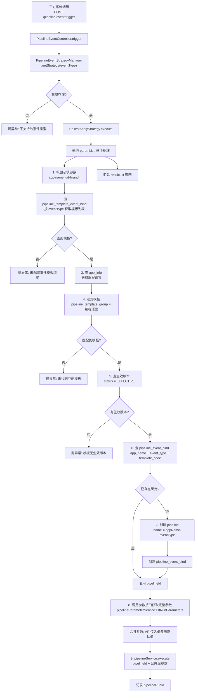

# 流水线事件触发系统 - 技术设计方案

## 一、背景与目标

### 1.1 现状

目前流水线执行仅支持前端页面手动填写参数后触发，缺乏第三方系统通过 API 自动触发流水线执行的能力。实际业务中，第三方系统（如效能平台、CI/CD 上游系统等）需要在特定事件发生时自动拉起流水线，无需人工介入。

### 1.2 目标

引入**事件触发**机制，规范化第三方 API 的触发方式：

1. **事件定义**：使用事件（event）定义不同的触发源，如 `epTestApply`（效能平台提测）、`gitPush`、`gitMrOpen` 等，每个事件有唯一的编码值。
2. **事件-模板绑定**：通过后台配置，建立事件与流水线模板的关联关系。一个事件可绑定多个模板（适配不同编程语言），一种事件下一种编程语言只需绑定一个模板。
3. **事件-pipeline 绑定**：事件首次触发某应用时，自动创建 pipeline 实例并建立绑定关系；后续触发直接复用已绑定的 pipeline。
4. **策略模式**：不同事件类型的参数解析、校验逻辑不同，采用策略模式隔离差异，便于扩展。
5. **批量触发**：支持单次请求传入多个应用的参数，批量触发流水线。

### 1.3 非目标（本期不实现）

- Git webhook 事件触发（gitPush / gitMrOpen / gitMrMerge 等），本期仅实现第三方 API 调用类事件。
- 分布式锁与并发安全（流水线模板和 pipeline 的并发创建保护）。
- 触发历史记录表。
- 触发接口的认证鉴权（本期开放调用，后续按需补充 API Token 机制）。

---

## 二、整体架构

### 2.1 分层职责

```
┌──────────────────────────────────────────────────────────┐
│  前端 (pipeline-frontend)                                 │
│  后台配置菜单                                              │
│    ├── 触发事件枚举页面（字典表 CRUD，dict_type 固定）       │
│    └── 模板事件配置页面（pipeline_template_event_bind CRUD）│
├──────────────────────────────────────────────────────────┤
│  后端 (pipeline-server)                                   │
│  PipelineEventController（触发入口，无认证）                │
│    └── POST /pipeline/event/trigger                       │
│  PipelineTemplateEventBindController（后台配置 CRUD）       │
│  PipelineEventStrategyManager（策略路由）                   │
│    └── Spring Map 注入，按 eventType 路由                  │
│  PipelineEventStrategy（策略接口）                          │
│    └── EpTestApplyStrategy（本期实现）                      │
│  事件触发核心服务                                           │
│    ├── 模板匹配（事件 → 语言过滤 → 生效版本）               │
│    ├── pipeline 自动创建与复用                              │
│    └── 调用 PipelineService.execute 执行                   │
├──────────────────────────────────────────────────────────┤
│  数据层                                                   │
│    dict_data（事件类型枚举，dict_type = pipeline_event_type）│
│    pipeline_template_event_bind（事件-模板绑定）             │
│    pipeline_event_bind（事件-pipeline绑定）                 │
└──────────────────────────────────────────────────────────┘
```

### 2.2 核心设计模式

| 模式 | 应用场景 |
|------|---------|
| 策略模式 | 事件触发策略（按 `eventType` 路由到具体策略类），不同事件类型的参数校验、解析逻辑隔离 |
| Spring Map 注入 | 策略管理器通过 `@Autowired Map<String, PipelineEventStrategy>` 自动装配所有策略 Bean，key = Bean 名称（= eventType） |

### 2.3 核心流程图



---

## 三、数据模型设计

### 3.1 事件类型（复用已有字典表）

事件类型使用已有的 `dict_data` 表管理，`dict_type` 固定为 `pipeline_event_type`。

**初始化数据示例：**

```sql
-- 先确保字典类型存在
INSERT INTO dict_type (dict_type, dict_name, remark) 
VALUES ('pipeline_event_type', '流水线触发事件类型', '定义所有支持的触发事件编码');

-- 事件类型数据
INSERT INTO dict_data (dict_type, dict_key, dict_value, dict_sort, remark, enabled) 
VALUES ('pipeline_event_type', 'epTestApply', '效能平台提测', 1, '效能平台提测事件', 1);
```

**字段说明：**

| 字段 | 说明 | 示例 |
|------|------|------|
| `dict_type` | 固定值 `pipeline_event_type` | `pipeline_event_type` |
| `dict_key` | 事件编码（唯一标识，策略路由 key） | `epTestApply` |
| `dict_value` | 事件中文名称（展示用） | `效能平台提测` |
| `dict_sort` | 排序值 | `1` |
| `remark` | 备注说明 | `效能平台提测事件` |
| `enabled` | 是否启用 | `1` |

### 3.2 新增表：事件-模板绑定表 `pipeline_template_event_bind`

**用途**：后台配置，定义"哪种事件可以触发哪些流水线模板"。由管理员通过前端"模板事件配置"页面维护。

```sql
CREATE TABLE `pipeline_template_event_bind` (
  `id` bigint NOT NULL AUTO_INCREMENT,
  `event_type` varchar(100) NOT NULL COMMENT '事件类型，对应字典 pipeline_event_type 的 dict_key',
  `pipeline_template_code` varchar(200) NOT NULL COMMENT '关联的流水线模板编码，对应 pipeline_template.pipeline_template_code',
  `creator` varchar(45) NOT NULL COMMENT '创建人',
  `create_time` datetime NOT NULL DEFAULT CURRENT_TIMESTAMP,
  `update_time` datetime NOT NULL DEFAULT CURRENT_TIMESTAMP ON UPDATE CURRENT_TIMESTAMP,
  `deleted` tinyint(1) NOT NULL DEFAULT '0',
  PRIMARY KEY (`id`),
  KEY `idx_event_type` (`event_type`)
) ENGINE=InnoDB DEFAULT CHARSET=utf8mb3 COMMENT='事件与流水线模板的绑定关系表，后台配置，一个事件可绑定多个模板';
```

**设计说明：**

- 一个事件（`event_type`）可绑定多个模板（`pipeline_template_code`），适配不同编程语言。例如 `epTestApply` 可同时绑定 Java 模板、Golang 模板、Node.js 模板。
- 一般情况下，一种事件下，一种编程语言只需绑定一个模板。
- 唯一性约束（`event_type` + `pipeline_template_code` 在未删除记录中唯一）由应用层保证，不在数据库层面加 UNIQUE 索引（与项目现有逻辑删除策略一致）。

### 3.3 新增表：事件-pipeline 绑定表 `pipeline_event_bind`

**用途**：记录"哪个应用的哪个事件实际绑定了哪条 pipeline"。事件首次触发某应用时自动创建，后续触发直接复用。

```sql
CREATE TABLE `pipeline_event_bind` (
  `id` bigint NOT NULL AUTO_INCREMENT,
  `pipeline_id` bigint NOT NULL COMMENT '关联的 pipeline.id',
  `event_type` varchar(100) NOT NULL COMMENT '事件类型，对应字典 pipeline_event_type 的 dict_key',
  `app_name` varchar(200) NOT NULL COMMENT '应用名称，对应 app_info.app_name',
  `pipeline_template_code` varchar(200) NOT NULL COMMENT '流水线模板编码',
  `creator` varchar(45) NOT NULL COMMENT '创建人',
  `create_time` datetime NOT NULL DEFAULT CURRENT_TIMESTAMP,
  `update_time` datetime NOT NULL DEFAULT CURRENT_TIMESTAMP ON UPDATE CURRENT_TIMESTAMP,
  `deleted` tinyint(1) NOT NULL DEFAULT '0',
  PRIMARY KEY (`id`),
  KEY `idx_app_event_template` (`app_name`, `event_type`, `pipeline_template_code`)
) ENGINE=InnoDB DEFAULT CHARSET=utf8mb3 COMMENT='事件与pipeline实例的绑定关系表，事件首次触发时自动创建';
```

**设计说明：**

- 同一个 `app_name + event_type + pipeline_template_code` 组合，在未删除记录中只允许存在一条（应用层先查再插保证）。
- `pipeline_id` 指向自动创建的 pipeline 实例，后续事件触发时直接复用。
- 本表由系统自动维护，前端不直接操作。

### 3.4 表关系总览

```
dict_data (dict_type=pipeline_event_type)
    │ dict_key = event_type
    │
    ▼
pipeline_template_event_bind          ← 后台配置（管理员维护）
    │ event_type + pipeline_template_code
    │
    ▼
pipeline_template                     ← 模板定义
    │ pipeline_template_code
    │ pipeline_template_group (= 编程语言)
    │
    ▼
pipeline_template_version             ← 版本管理（取 EFFECTIVE）
    │ pipeline_template_code + status
    │
app_info                              ← 应用信息
    │ app_name → programming_language
    │
    ▼
pipeline_event_bind                   ← 自动创建（系统维护）
    │ app_name + event_type + pipeline_template_code → pipeline_id
    │
    ▼
pipeline                              ← 流水线实例
    │ id (pipeline_id)
    │
    ▼
pipeline_run                          ← 执行记录
```

---

## 四、接口设计

### 4.1 事件触发接口

**接口路径**：`POST /pipeline/event/trigger`

**认证**：无（本期不鉴权）

**入参** `PipelineEventTriggerRequest`：

```json
{
  "eventType": "epTestApply",
  "paramList": [
    {
      "app-name": "go-web-demo",
      "git-branch": "feature/test"
    },
    {
      "app-name": "pipeline-server",
      "git-branch": "main"
    }
  ]
}
```

| 字段 | 类型 | 必填 | 说明 |
|------|------|------|------|
| `eventType` | String | 是 | 事件类型编码，对应字典 `pipeline_event_type` 的 `dict_key` |
| `paramList` | List\<Map\<String, String\>\> | 是 | 参数列表，每个元素对应一个应用的触发参数。不同事件要求的参数 key 不同，由策略类定义 |

**出参** `Result<Object>`（具体类型由策略实现决定，`EpTestApplyStrategy` 返回 `PipelineEventTriggerResponse`）：

```json
{
  "code": 200,
  "message": "success",
  "data": {
    "resultList": [
      {
        "appName": "go-web-demo",
        "pipelineRunId": 1001,
        "errorMessage": null,
        "requestParams": {
          "app-name": "go-web-demo",
          "git-branch": "feature/test"
        }
      },
      {
        "appName": "pipeline-server",
        "pipelineRunId": null,
        "errorMessage": "未找到匹配的流水线模板",
        "requestParams": {
          "app-name": "pipeline-server",
          "git-branch": "main"
        }
      }
    ]
  }
}
```

| 字段 | 类型 | 说明 |
|------|------|------|
| `resultList` | List\<PipelineEventTriggerResult\> | 每个应用的触发结果，顺序与入参 `paramList` 一致 |

**PipelineEventTriggerResult 字段：**

| 字段 | 类型 | 说明 |
|------|------|------|
| `appName` | String | 应用名称（取自入参 param 中的 `app-name`） |
| `pipelineRunId` | Long | 流水线运行记录 ID，触发失败时为 null |
| `errorMessage` | String | 错误信息，触发成功时为 null |
| `requestParams` | Map\<String, String\> | 原始请求参数（原样回传入参 param，方便调用方核对） |

**设计说明：**

- `paramList` 中每个 Map 的原始 key-value 会原样回传到对应 result 中（不仅仅是 `app-name`，所有传入的参数都会返回），方便调用方核对。
- 单个应用触发失败不影响其他应用，错误信息记录在对应 result 的 `errorMessage` 中。
- 整体 HTTP 状态码始终为 200，通过 `resultList` 中每条记录的 `errorMessage` 区分成功/失败。

### 4.2 事件-模板绑定管理接口（后台配置）

标准 CRUD，遵循项目现有规范。

**接口路径**：`/pipeline-template-event-bind`

| 方法 | 路径 | 说明 |
|------|------|------|
| POST | `/pipeline-template-event-bind` | 新增绑定 |
| PUT | `/pipeline-template-event-bind` | 修改绑定 |
| DELETE | `/pipeline-template-event-bind/{id}` | 删除绑定 |
| GET | `/pipeline-template-event-bind/{id}` | 查询单条 |
| GET | `/pipeline-template-event-bind/page` | 分页查询 |

**新增入参** `PipelineTemplateEventBindCreateRequest`：

| 字段 | 类型 | 必填 | 说明 |
|------|------|------|------|
| `eventType` | String | 是 | 事件类型（需存在于字典 `pipeline_event_type` 且 enabled=1） |
| `pipelineTemplateCode` | String | 是 | 流水线模板编码（需存在于 `pipeline_template` 表） |

**分页查询入参** `PipelineTemplateEventBindQueryRequest`：

| 字段 | 类型 | 必填 | 说明 |
|------|------|------|------|
| `eventType` | String | 否 | 事件类型（精确过滤） |
| `pageNum` | int | 是 | 页码，默认 1 |
| `pageSize` | int | 是 | 每页条数，默认 10 |

---

## 五、核心模块设计

### 5.1 包结构

```
pipeline-server-service/
└── src/main/java/com/ci/pipeline/service/
    ├── controller/
    │   ├── PipelineEventController.java              ← 事件触发入口（无认证）
    │   ├── PipelineTemplateEventBindController.java   ← 事件-模板绑定管理（需认证）
    │   └── ...现有Controller
    ├── service/
    │   ├── PipelineEventService.java                  ← 事件触发服务接口
    │   ├── PipelineTemplateEventBindService.java      ← 事件-模板绑定服务接口
    │   ├── PipelineEventBindService.java              ← 事件-pipeline绑定服务接口
    │   └── impl/
    │       ├── PipelineEventServiceImpl.java
    │       ├── PipelineTemplateEventBindServiceImpl.java
    │       └── PipelineEventBindServiceImpl.java
    └── strategy/
        └── event/
            ├── PipelineEventStrategy.java             ← 策略接口
            ├── PipelineEventStrategyManager.java      ← 策略管理器
            └── impl/
                └── EpTestApplyStrategy.java           ← 效能平台提测策略

pipeline-server-dao/
└── src/main/java/com/ci/pipeline/dao/
    ├── entity/
    │   ├── PipelineTemplateEventBind.java             ← 事件-模板绑定实体
    │   └── PipelineEventBind.java                     ← 事件-pipeline绑定实体
    ├── mapper/
    │   ├── PipelineTemplateEventBindMapper.java
    │   └── PipelineEventBindMapper.java
    └── repository/
        ├── PipelineTemplateEventBindRepository.java
        └── PipelineEventBindRepository.java

pipeline-server-facade/
└── src/main/java/com/ci/pipeline/facade/
    ├── request/
    │   ├── PipelineEventTriggerRequest.java           ← 触发入参
    │   ├── PipelineTemplateEventBindCreateRequest.java
    │   ├── PipelineTemplateEventBindUpdateRequest.java
    │   └── PipelineTemplateEventBindQueryRequest.java
    └── response/
        ├── PipelineEventTriggerResponse.java          ← 触发出参
        └── PipelineEventTriggerResult.java            ← 单条触发结果
```

### 5.2 策略接口设计

**PipelineEventStrategy.java**

```java
package com.ci.pipeline.service.strategy.event;

import com.ci.pipeline.facade.request.PipelineEventTriggerRequest;
import com.ci.pipeline.facade.response.PipelineEventTriggerResponse;

/**
 * 流水线事件触发策略接口。
 * <p>每种事件类型对应一个策略实现类，负责该事件的参数校验与触发执行。
 * <p>策略 Bean 名称必须与事件类型编码（dict_data.dict_key）一致，
 * 通过 Spring Map 注入由 PipelineEventStrategyManager 自动路由。
 */
public interface PipelineEventStrategy {

    /**
     * 事件类型编码（对应字典 pipeline_event_type 的 dict_key）
     */
    String eventType();

    /**
     * 执行事件触发
     * <p>不同策略的出参结构可能不同，因此返回 Object。
     * 调用方（Controller）拿到 Object 后，按具体策略的响应类型强转。
     *
     * @param request 触发请求（含 eventType 和 paramList）
     * @return 触发结果，具体类型由策略实现决定
     */
    Object execute(PipelineEventTriggerRequest request);
}
```

**PipelineEventStrategyManager.java**

```java
package com.ci.pipeline.service.strategy.event;

import org.springframework.beans.factory.annotation.Autowired;
import org.springframework.stereotype.Component;

import java.util.Map;

/**
 * 事件触发策略管理器。
 * <p>利用 Spring 的 Map 注入机制，自动装配所有 PipelineEventStrategy 实现。
 * key = Bean 名称（= eventType），value = 策略实例。
 */
@Component
public class PipelineEventStrategyManager {

    @Autowired
    private Map<String, PipelineEventStrategy> strategyMap;

    /**
     * 根据事件类型获取策略
     *
     * @param eventType 事件类型编码
     * @return 策略实例
     * @throws IllegalArgumentException 不支持的事件类型
     */
    public PipelineEventStrategy getStrategy(String eventType) {
        PipelineEventStrategy strategy = strategyMap.get(eventType);
        if (strategy == null) {
            throw new IllegalArgumentException(
                    String.format("不支持的事件类型: %s", eventType));
        }
        return strategy;
    }
}
```

### 5.3 策略实现：EpTestApplyStrategy

**EpTestApplyStrategy.java**

```java
package com.ci.pipeline.service.strategy.event.impl;

import com.ci.pipeline.facade.request.PipelineEventTriggerRequest;
import com.ci.pipeline.facade.response.PipelineEventTriggerResponse;
import com.ci.pipeline.facade.response.PipelineEventTriggerResult;
import com.ci.pipeline.service.strategy.event.PipelineEventStrategy;
import lombok.extern.slf4j.Slf4j;
import org.apache.commons.collections4.CollectionUtils;
import org.apache.commons.lang3.StringUtils;
import org.springframework.beans.factory.annotation.Autowired;
import org.springframework.stereotype.Component;

import java.util.ArrayList;
import java.util.List;
import java.util.Map;

/**
 * 效能平台提测事件策略。
 * <p>Bean 名称 "epTestApply" 与事件类型编码一致，由策略管理器自动路由。
 * <p>必填参数：app-name、git-branch
 */
@Slf4j
@Component("epTestApply")
public class EpTestApplyStrategy implements PipelineEventStrategy {

    @Autowired
    private PipelineEventService pipelineEventService;

    @Override
    public String eventType() {
        return "epTestApply";
    }

    @Override
    public Object execute(PipelineEventTriggerRequest request) {
        List<PipelineEventTriggerResult> resultList = new ArrayList<>();

        List<Map<String, String>> paramList = request.getParamList();
        if (CollectionUtils.isEmpty(paramList)) {
            throw new IllegalArgumentException("paramList不能为空");
        }

        for (Map<String, String> param : paramList) {
            PipelineEventTriggerResult result = PipelineEventTriggerResult.builder()
                    .requestParams(param)
                    .build();
            try {
                // 校验必填参数
                String appName = param.get("app-name");
                String gitBranch = param.get("git-branch");
                if (StringUtils.isBlank(appName)) {
                    throw new IllegalArgumentException("app-name不能为空");
                }
                if (StringUtils.isBlank(gitBranch)) {
                    throw new IllegalArgumentException("git-branch不能为空");
                }

                // 委托核心服务执行
                Long pipelineRunId = pipelineEventService.triggerAndExecute(
                        request.getEventType(), appName, param);
                result.setAppName(appName);
                result.setPipelineRunId(pipelineRunId);
            } catch (Exception e) {
                log.error("事件触发失败, eventType={}, param={}, error={}",
                        request.getEventType(), param, e.getMessage(), e);
                result.setAppName(param.get("app-name"));
                result.setErrorMessage(e.getMessage());
            }
            resultList.add(result);
        }

        return PipelineEventTriggerResponse.builder()
                .resultList(resultList)
                .build();
    }
}
```

### 5.4 核心服务设计

**PipelineEventService 接口：**

```java
package com.ci.pipeline.service.service;

import java.util.Map;

/**
 * 流水线事件触发核心服务。
 * <p>负责：模板匹配 → pipeline 自动创建/复用 → 执行流水线
 */
public interface PipelineEventService {

    /**
     * 事件触发并执行流水线。
     * <p>核心流程：
     * 1. 根据 eventType 查 pipeline_template_event_bind 获取模板列表
     * 2. 根据 appName 查 app_info 获取编程语言，过滤匹配的模板
     * 3. 查模板的生效版本（EFFECTIVE）
     * 4. 查 pipeline_event_bind，存在则复用 pipelineId，不存在则创建 pipeline + 绑定
     * 5. 调用参数接口获取完整参数（合并 API 传入值与默认值）
     * 6. 调用 PipelineService.execute 执行流水线
     *
     * @param eventType 事件类型
     * @param appName   应用名称
     * @param params    触发参数（含 git-branch 等）
     * @return pipelineRunId 流水线运行记录 ID
     */
    Long triggerAndExecute(String eventType, String appName, Map<String, String> params);
}
```

**PipelineEventServiceImpl 核心实现逻辑（伪代码）：**

```java
@Autowired
private PipelineTemplateEventBindService pipelineTemplateEventBindService;
@Autowired
private AppInfoService appInfoService;
@Autowired
private PipelineTemplateService pipelineTemplateService;
@Autowired
private PipelineTemplateVersionService pipelineTemplateVersionService;
@Autowired
private PipelineEventBindService pipelineEventBindService;
@Autowired
private PipelineService pipelineService;
@Autowired
private PipelineParameterService pipelineParameterService;

@Override
public Long triggerAndExecute(String eventType, String appName, Map<String, String> params) {
    // Step 1: 根据 eventType 查询绑定的模板编码列表
    List<String> templateCodes = pipelineTemplateEventBindService
            .listTemplateCodesByEventType(eventType);
    if (CollectionUtils.isEmpty(templateCodes)) {
        throw new PipelineException(
                String.format("事件类型[%s]未配置模板绑定", eventType));
    }

    // Step 2: 根据 appName 查询应用信息，获取编程语言
    AppInfo appInfo = appInfoService.getByAppName(appName);
    if (appInfo == null) {
        throw new PipelineException(
                String.format("应用[%s]不存在", appName));
    }
    String programmingLanguage = appInfo.getProgrammingLanguage();

    // Step 3: 根据编程语言过滤模板（pipeline_template_group = 编程语言）
    PipelineTemplate matchedTemplate = pipelineTemplateService
            .getByTemplateCodesAndGroup(templateCodes, programmingLanguage);
    if (matchedTemplate == null) {
        throw new PipelineException(
                String.format("应用[%s]的编程语言[%s]未找到匹配的模板", appName, programmingLanguage));
    }
    String pipelineTemplateCode = matchedTemplate.getPipelineTemplateCode();

    // Step 4: 查询模板是否有生效版本
    PipelineTemplateVersion effectiveVersion = pipelineTemplateVersionService
            .getEffectiveByCode(pipelineTemplateCode);
    if (effectiveVersion == null) {
        throw new PipelineException(
                String.format("模板[%s]没有生效版本", pipelineTemplateCode));
    }

    // Step 5: 查询或创建 pipeline_event_bind
    PipelineEventBind eventBind = pipelineEventBindService
            .getByAppNameAndEventTypeAndTemplateCode(appName, eventType, pipelineTemplateCode);
    Long pipelineId;
    if (eventBind != null) {
        // 已存在绑定，复用 pipelineId
        pipelineId = eventBind.getPipelineId();
    } else {
        // 不存在，创建 pipeline（name = appName-eventType）
        pipelineId = createPipelineForEvent(appName, eventType, pipelineTemplateCode);
        // 创建 pipeline_event_bind
        pipelineEventBindService.create(appName, eventType, pipelineTemplateCode, pipelineId);
    }

    // Step 6: 调用参数接口，获取完整的用户参数列表
    // 模拟用户点击执行弹框加载参数：系统参数自动填充，user 参数使用默认值，
    // 同时将 API 传入的参数值作为 currentValues 预填覆盖默认值
    PipelineParametersRequest parametersRequest = new PipelineParametersRequest();
    parametersRequest.setPipelineId(pipelineId);
    parametersRequest.setCurrentValues(params);
    List<PipelineRunParameterResponse> runParameters = pipelineParameterService
            .listRunParameters(parametersRequest);

    // Step 7: 合并参数，构建执行入参
    // listRunParameters 返回的参数已包含计算后的值（默认值或 API 传入值），
    // 将其转换为 Map<String, String> 形式
    Map<String, String> executeParams = new HashMap<>();
    if (CollectionUtils.isNotEmpty(runParameters)) {
        for (PipelineRunParameterResponse param : runParameters) {
            executeParams.put(param.getName(), param.getValue());
        }
    }

    // Step 8: 执行流水线
    PipelineExecuteRequest executeRequest = new PipelineExecuteRequest();
    executeRequest.setPipelineId(pipelineId);
    executeRequest.setParameters(executeParams);
    PipelineExecuteResponse response = pipelineService.execute(executeRequest);

    return response.getPipelineRunId();
}

/**
 * 为事件触发创建 pipeline 实例。
 * name 规则：appName-eventType，如 go-web-demo-epTestApply
 */
private Long createPipelineForEvent(String appName, String eventType, String pipelineTemplateCode) {
    PipelineCreateRequest createRequest = new PipelineCreateRequest();
    createRequest.setAppName(appName);
    createRequest.setPipelineTemplateCode(pipelineTemplateCode);
    createRequest.setName(appName + "-" + eventType);
    PipelineResponse response = pipelineService.create(createRequest);
    return response.getId();
}
```

### 5.5 Controller 设计

**PipelineEventController.java（触发入口，无认证）：**

```java
package com.ci.pipeline.service.controller;

import com.ci.pipeline.common.result.Result;
import com.ci.pipeline.facade.request.PipelineEventTriggerRequest;
import com.ci.pipeline.service.strategy.event.PipelineEventStrategy;
import com.ci.pipeline.service.strategy.event.PipelineEventStrategyManager;
import lombok.extern.slf4j.Slf4j;
import org.springframework.beans.factory.annotation.Autowired;
import org.springframework.web.bind.annotation.PostMapping;
import org.springframework.web.bind.annotation.RequestBody;
import org.springframework.web.bind.annotation.RequestMapping;
import org.springframework.web.bind.annotation.RestController;

/**
 * 流水线事件触发控制器（对外开放，无认证）
 */
@Slf4j
@RestController
@RequestMapping("/pipeline/event")
public class PipelineEventController {

    @Autowired
    private PipelineEventStrategyManager strategyManager;

    /**
     * 事件触发流水线
     */
    @PostMapping("/trigger")
    public Result<Object> trigger(
            @RequestBody PipelineEventTriggerRequest request) {
        PipelineEventStrategy strategy = strategyManager.getStrategy(request.getEventType());
        return Result.success(strategy.execute(request));
    }
}
```

> **注意**：此 Controller **不加** `@RequireLogin` 注解，与现有其他 Controller 区分，允许第三方系统直接调用。

**PipelineTemplateEventBindController.java（后台配置，需认证）：**

```java
package com.ci.pipeline.service.controller;

import com.ci.pipeline.common.auth.RequireLogin;
import com.ci.pipeline.common.result.Result;
import com.ci.pipeline.facade.request.PipelineTemplateEventBindCreateRequest;
import com.ci.pipeline.facade.request.PipelineTemplateEventBindQueryRequest;
import com.ci.pipeline.facade.request.PipelineTemplateEventBindUpdateRequest;
import com.ci.pipeline.facade.response.PageResponse;
import com.ci.pipeline.facade.response.PipelineTemplateEventBindResponse;
import com.ci.pipeline.service.service.PipelineTemplateEventBindService;
import lombok.extern.slf4j.Slf4j;
import org.springframework.beans.factory.annotation.Autowired;
import org.springframework.web.bind.annotation.*;

/**
 * 事件-模板绑定管理控制器（后台配置）
 */
@Slf4j
@RestController
@RequestMapping("/pipeline-template-event-bind")
@RequireLogin
public class PipelineTemplateEventBindController {

    @Autowired
    private PipelineTemplateEventBindService pipelineTemplateEventBindService;

    @PostMapping
    public Result<PipelineTemplateEventBindResponse> create(
            @RequestBody PipelineTemplateEventBindCreateRequest request) {
        return Result.success(pipelineTemplateEventBindService.create(request));
    }

    @PutMapping
    public Result<PipelineTemplateEventBindResponse> update(
            @RequestBody PipelineTemplateEventBindUpdateRequest request) {
        return Result.success(pipelineTemplateEventBindService.update(request));
    }

    @DeleteMapping("/{id}")
    public Result<Void> delete(@PathVariable("id") Long id) {
        pipelineTemplateEventBindService.deleteById(id);
        return Result.success();
    }

    @GetMapping("/{id}")
    public Result<PipelineTemplateEventBindResponse> get(@PathVariable("id") Long id) {
        return Result.success(pipelineTemplateEventBindService.getById(id));
    }

    @GetMapping("/page")
    public Result<PageResponse<PipelineTemplateEventBindResponse>> page(
            PipelineTemplateEventBindQueryRequest query) {
        return Result.success(pipelineTemplateEventBindService.page(query));
    }
}
```

---

## 六、DTO 设计

### 6.1 触发相关

**PipelineEventTriggerRequest.java**

```java
package com.ci.pipeline.facade.request;

import lombok.Data;
import java.io.Serializable;
import java.util.List;
import java.util.Map;

/**
 * 流水线事件触发请求
 */
@Data
public class PipelineEventTriggerRequest implements Serializable {

    private static final long serialVersionUID = 1L;

    /**
     * 事件类型编码（对应字典 pipeline_event_type 的 dict_key）
     */
    private String eventType;

    /**
     * 参数列表，每个元素对应一个应用的触发参数。
     * 不同事件要求的参数 key 不同，由策略类定义。
     * 例如 epTestApply 事件要求：app-name、git-branch
     */
    private List<Map<String, String>> paramList;
}
```

**PipelineEventTriggerResponse.java**

```java
package com.ci.pipeline.facade.response;

import lombok.Builder;
import lombok.Data;
import java.io.Serializable;
import java.util.List;

/**
 * 流水线事件触发响应
 */
@Data
@Builder
public class PipelineEventTriggerResponse implements Serializable {

    private static final long serialVersionUID = 1L;

    /**
     * 每个应用的触发结果列表，顺序与入参 paramList 一致
     */
    private List<PipelineEventTriggerResult> resultList;
}
```

**PipelineEventTriggerResult.java**

```java
package com.ci.pipeline.facade.response;

import lombok.Builder;
import lombok.Data;
import java.io.Serializable;
import java.util.Map;

/**
 * 单个应用的触发结果
 */
@Data
@Builder
public class PipelineEventTriggerResult implements Serializable {

    private static final long serialVersionUID = 1L;

    /**
     * 应用名称（原样返回入参中的 app-name）
     */
    private String appName;

    /**
     * 流水线运行记录 ID，触发失败时为 null
     */
    private Long pipelineRunId;

    /**
     * 错误信息，触发成功时为 null
     */
    private String errorMessage;

    /**
     * 原始请求参数（原样回传，方便调用方核对）
     */
    private Map<String, String> requestParams;
}
```

### 6.2 事件-模板绑定管理相关

**PipelineTemplateEventBindCreateRequest.java**

```java
package com.ci.pipeline.facade.request;

import lombok.Data;
import java.io.Serializable;

@Data
public class PipelineTemplateEventBindCreateRequest implements Serializable {

    private static final long serialVersionUID = 1L;

    /**
     * 事件类型（需存在于字典 pipeline_event_type 且 enabled=1）
     */
    private String eventType;

    /**
     * 流水线模板编码（需存在于 pipeline_template 表）
     */
    private String pipelineTemplateCode;
}
```

**PipelineTemplateEventBindUpdateRequest.java**

```java
package com.ci.pipeline.facade.request;

import lombok.Data;
import java.io.Serializable;

@Data
public class PipelineTemplateEventBindUpdateRequest implements Serializable {

    private static final long serialVersionUID = 1L;

    /**
     * 主键
     */
    private Long id;

    /**
     * 事件类型（需存在于字典 pipeline_event_type 且 enabled=1）
     */
    private String eventType;

    /**
     * 流水线模板编码（需存在于 pipeline_template 表）
     */
    private String pipelineTemplateCode;
}
```

**PipelineTemplateEventBindResponse.java**

```java
package com.ci.pipeline.facade.response;

import lombok.Data;
import java.io.Serializable;
import java.util.Date;

@Data
public class PipelineTemplateEventBindResponse implements Serializable {

    private static final long serialVersionUID = 1L;

    private Long id;
    private String eventType;                // 事件类型编码
    private String eventTypeDesc;           // 事件类型中文名（关联字典翻译）
    private String pipelineTemplateCode;    // 流水线模板编码
    private String pipelineTemplateName;    // 模板名称（关联翻译）
    private String creator;
    private Date createTime;
    private Date updateTime;
}
```

---

## 七、Entity / Mapper / Repository 设计

### 7.1 PipelineTemplateEventBind

**Entity：**

```java
package com.ci.pipeline.dao.entity;

import com.baomidou.mybatisplus.annotation.IdType;
import com.baomidou.mybatisplus.annotation.TableId;
import com.baomidou.mybatisplus.annotation.TableName;
import lombok.Data;
import java.io.Serializable;
import java.util.Date;

/**
 * 事件与流水线模板的绑定关系（后台配置）
 */
@Data
@TableName("pipeline_template_event_bind")
public class PipelineTemplateEventBind implements Serializable {

    private static final long serialVersionUID = 1L;

    @TableId(value = "id", type = IdType.AUTO)
    private Long id;

    /**
     * 事件类型，对应字典 pipeline_event_type 的 dict_key
     */
    private String eventType;

    /**
     * 关联的流水线模板编码
     */
    private String pipelineTemplateCode;

    private String creator;
    private Date createTime;
    private Date updateTime;
    private Integer deleted;
}
```

**Mapper：**

```java
package com.ci.pipeline.dao.mapper;

import com.baomidou.mybatisplus.core.mapper.BaseMapper;
import com.ci.pipeline.dao.entity.PipelineTemplateEventBind;
import org.apache.ibatis.annotations.Mapper;

@Mapper
public interface PipelineTemplateEventBindMapper extends BaseMapper<PipelineTemplateEventBind> {
}
```

**Repository：**

```java
package com.ci.pipeline.dao.repository;

import com.ci.pipeline.dao.entity.PipelineTemplateEventBind;
import com.ci.pipeline.dao.mapper.PipelineTemplateEventBindMapper;
import org.springframework.beans.factory.annotation.Autowired;
import org.springframework.stereotype.Repository;

import java.util.List;

@Repository
public class PipelineTemplateEventBindRepository {

    @Autowired
    private PipelineTemplateEventBindMapper mapper;

    /**
     * 根据事件类型查询所有绑定的模板编码（仅未删除）
     */
    public List<String> listTemplateCodesByEventType(String eventType) {
        // 使用 LambdaQueryWrapper 查询，提取 pipelineTemplateCode 字段
        // ...
    }

    public int insert(PipelineTemplateEventBind entity) {
        return mapper.insert(entity);
    }

    public PipelineTemplateEventBind selectById(Long id) {
        return mapper.selectById(id);
    }

    public int updateById(PipelineTemplateEventBind entity) {
        return mapper.updateById(entity);
    }

    public int deleteById(Long id) {
        return mapper.deleteById(id);
    }
}
```

### 7.2 PipelineEventBind

**Entity：**

```java
package com.ci.pipeline.dao.entity;

import com.baomidou.mybatisplus.annotation.IdType;
import com.baomidou.mybatisplus.annotation.TableId;
import com.baomidou.mybatisplus.annotation.TableName;
import lombok.Data;
import java.io.Serializable;
import java.util.Date;

/**
 * 事件与pipeline实例的绑定关系（系统自动维护）
 */
@Data
@TableName("pipeline_event_bind")
public class PipelineEventBind implements Serializable {

    private static final long serialVersionUID = 1L;

    @TableId(value = "id", type = IdType.AUTO)
    private Long id;

    /**
     * 关联的 pipeline.id
     */
    private Long pipelineId;

    /**
     * 事件类型
     */
    private String eventType;

    /**
     * 应用名称
     */
    private String appName;

    /**
     * 流水线模板编码
     */
    private String pipelineTemplateCode;

    private String creator;
    private Date createTime;
    private Date updateTime;
    private Integer deleted;
}
```

**Mapper：**

```java
package com.ci.pipeline.dao.mapper;

import com.baomidou.mybatisplus.core.mapper.BaseMapper;
import com.ci.pipeline.dao.entity.PipelineEventBind;
import org.apache.ibatis.annotations.Mapper;

@Mapper
public interface PipelineEventBindMapper extends BaseMapper<PipelineEventBind> {
}
```

**Repository：**

```java
package com.ci.pipeline.dao.repository;

import com.ci.pipeline.dao.entity.PipelineEventBind;
import com.ci.pipeline.dao.mapper.PipelineEventBindMapper;
import org.springframework.beans.factory.annotation.Autowired;
import org.springframework.stereotype.Repository;

@Repository
public class PipelineEventBindRepository {

    @Autowired
    private PipelineEventBindMapper mapper;

    /**
     * 根据 appName + eventType + pipelineTemplateCode 查询绑定记录（仅未删除）
     */
    public PipelineEventBind selectByUniqueKey(String appName, String eventType,
                                                String pipelineTemplateCode) {
        // 使用 LambdaQueryWrapper 精确查询
        // ...
    }

    public int insert(PipelineEventBind entity) {
        return mapper.insert(entity);
    }
}
```

---

## 八、Service 层设计

### 8.1 PipelineTemplateEventBindService（事件-模板绑定管理）

```java
package com.ci.pipeline.service.service;

import com.ci.pipeline.facade.request.PipelineTemplateEventBindCreateRequest;
import com.ci.pipeline.facade.request.PipelineTemplateEventBindQueryRequest;
import com.ci.pipeline.facade.request.PipelineTemplateEventBindUpdateRequest;
import com.ci.pipeline.facade.response.PageResponse;
import com.ci.pipeline.facade.response.PipelineTemplateEventBindResponse;

import java.util.List;

public interface PipelineTemplateEventBindService {

    PipelineTemplateEventBindResponse create(PipelineTemplateEventBindCreateRequest request);

    PipelineTemplateEventBindResponse update(PipelineTemplateEventBindUpdateRequest request);

    void deleteById(Long id);

    PipelineTemplateEventBindResponse getById(Long id);

    PageResponse<PipelineTemplateEventBindResponse> page(PipelineTemplateEventBindQueryRequest query);

    /**
     * 根据事件类型查询所有绑定的模板编码列表
     */
    List<String> listTemplateCodesByEventType(String eventType);
}
```

**创建校验逻辑：**

1. `eventType` 必须存在于字典表 `dict_data`（`dict_type = pipeline_event_type`，`enabled = 1`），否则抛异常。
2. `pipelineTemplateCode` 必须存在于 `pipeline_template` 表（未删除），否则抛异常。
3. 同一 `eventType + pipelineTemplateCode` 组合在未删除记录中不能重复（应用层先查再插）。

### 8.2 PipelineEventBindService（事件-pipeline绑定管理）

```java
package com.ci.pipeline.service.service;

import com.ci.pipeline.dao.entity.PipelineEventBind;

public interface PipelineEventBindService {

    /**
     * 根据 appName + eventType + pipelineTemplateCode 查询绑定记录
     */
    PipelineEventBind getByAppNameAndEventTypeAndTemplateCode(
            String appName, String eventType, String pipelineTemplateCode);

    /**
     * 创建绑定记录
     */
    void create(String appName, String eventType, String pipelineTemplateCode, Long pipelineId);
}
```

### 8.3 PipelineEventService（事件触发核心服务）

见 [5.4 核心服务设计](#54-核心服务设计)。

---

## 九、前端设计

### 9.1 菜单结构

在现有「后台配置」一级菜单下新增两个子菜单：

```
后台配置
├── 触发事件枚举      ← 新增（复用字典表 CRUD，dict_type 固定为 pipeline_event_type）
└── 模板事件配置      ← 新增（pipeline_template_event_bind CRUD）
```

### 9.2 触发事件枚举页面

**功能**：管理事件类型，底层走字典表接口。

**交互**：
- 列表展示 `dict_type = pipeline_event_type` 的字典数据。
- 新建/编辑表单字段：事件编码（`dict_key`）、事件名称（`dict_value`）、排序（`dict_sort`）、备注（`remark`）、是否启用（`enabled`）。
- `dict_type` 字段对用户不可见，固定传 `pipeline_event_type`。
- 可复用现有字典数据管理页面组件，传入固定的 `dictType` 参数即可。

### 9.3 模板事件配置页面

**功能**：管理事件与流水线模板的绑定关系。

**列表页**：
- 列：事件类型编码、事件类型（中文名）、模板编码、模板名称、创建人、创建时间。
- 支持按事件类型筛选。

**新建/编辑表单**：
- 事件类型：下拉选择（数据来源：`dict_data`，`dict_type = pipeline_event_type`，`enabled = 1`）。下拉项同时展示编码和名称，格式如 `epTestApply（效能平台提测）`，值为 `dict_key`。
- 流水线模板：下拉选择（数据来源：`pipeline_template` 表）。下拉项同时展示编码和名称，格式如 `go-build-template（Go 构建模板）`，值为 `pipeline_template_code`。

---

## 十、关键设计决策

### 10.1 pipeline name 生成规则

事件首次触发某应用时，自动创建 pipeline，name 规则为：`{appName}-{eventType}`

**示例**：`go-web-demo-epTestApply`

**理由**：
- 保证同一 appName 下不同事件的 pipeline 不重名。
- 从 name 可直观看出是哪个应用的哪个事件触发的。
- 与手动创建的 pipeline 区分开。

### 10.2 参数合并机制

事件触发时，第三方 API 可能只传入部分必要参数（如 `app-name`、`git-branch`），其余参数需要使用默认值。因此，在执行流水线前，必须先调用参数接口（`PipelineParameterService.listRunParameters`）获取完整的用户参数列表。

**流程**：
1. 将 API 传入的参数作为 `currentValues` 传入 `listRunParameters`。
2. `listRunParameters` 内部会：系统参数自动填充、user 参数按默认值策略链计算初始值、API 传入值覆盖对应参数的默认值。
3. 返回的参数列表即为完整的执行参数，转换为 `Map<String, String>` 后传给 `PipelineService.execute`。

**优先级**：API 传入值 > 默认值策略链计算的值。

### 10.3 模板匹配策略

当事件绑定了多个模板时，按以下规则匹配唯一模板：

1. 根据 `eventType` 查询 `pipeline_template_event_bind`，获取所有绑定的 `pipelineTemplateCode` 列表。
2. 根据 `appName` 查询 `app_info`，获取 `programmingLanguage`。
3. 根据 `pipelineTemplateCode` 列表查询 `pipeline_template`，过滤 `pipeline_template_group = programmingLanguage` 的模板。
4. 取过滤后的第一个模板（正常情况下只有一条）。

**约定**：一种事件下，一种编程语言只绑定一个模板。如果配置了多个，取第一条（按 `id` 升序）。

### 10.4 并发安全（本期不处理）

本期不做分布式锁和并发安全保护。应用层采用"先查再插"模式：

```java
PipelineEventBind existing = repository.selectByUniqueKey(appName, eventType, templateCode);
if (existing != null) {
    return existing.getPipelineId();
}
// 并发场景下可能重复创建，本期接受这个风险
pipelineId = createPipelineForEvent(...);
repository.create(...);
```

**已知风险**：同一应用的同一事件并发触发时，可能创建多条 pipeline 和绑定记录。后续迭代可通过分布式锁或数据库唯一索引解决。

### 10.5 错误处理策略

- **整体级别**：仅当 `eventType` 不支持（字典中不存在或无对应策略类）时，抛异常返回错误。
- **单条级别**：`paramList` 中单个应用触发失败（模板未找到、pipeline 创建失败等），记录错误信息到对应 result，不影响其他应用。
- **错误信息**：直接使用异常 `getMessage()` 作为 `errorMessage` 返回给调用方。

---

## 十一、实现清单

### 11.1 SQL（2 张新表 + 字典初始化数据）

| 文件 | 说明 |
|------|------|
| `sql/pipeline_template_event_bind.sql` | 事件-模板绑定表 DDL |
| `sql/pipeline_event_bind.sql` | 事件-pipeline绑定表 DDL |
| 字典初始化 SQL | `dict_type` 插入 `pipeline_event_type`，`dict_data` 插入 `epTestApply` |

### 11.2 DAO 层（4 个文件 × 2 个实体 = 8 个文件）

| Entity | Mapper | Repository |
|--------|--------|------------|
| `PipelineTemplateEventBind` | `PipelineTemplateEventBindMapper` | `PipelineTemplateEventBindRepository` |
| `PipelineEventBind` | `PipelineEventBindMapper` | `PipelineEventBindRepository` |

### 11.3 Facade 层（6 个 DTO）

| Request | Response |
|---------|----------|
| `PipelineEventTriggerRequest` | `PipelineEventTriggerResponse` |
| `PipelineTemplateEventBindCreateRequest` | `PipelineEventTriggerResult` |
| `PipelineTemplateEventBindUpdateRequest` | `PipelineTemplateEventBindResponse` |
| `PipelineTemplateEventBindQueryRequest` | |

### 11.4 Service 层（3 个接口 + 3 个实现）

| 接口 | 实现 |
|------|------|
| `PipelineEventService` | `PipelineEventServiceImpl` |
| `PipelineTemplateEventBindService` | `PipelineTemplateEventBindServiceImpl` |
| `PipelineEventBindService` | `PipelineEventBindServiceImpl` |

### 11.5 Strategy 层（3 个文件）

| 文件 | 说明 |
|------|------|
| `PipelineEventStrategy` | 策略接口 |
| `PipelineEventStrategyManager` | 策略管理器 |
| `EpTestApplyStrategy` | 效能平台提测策略实现 |

### 11.6 Controller 层（2 个文件）

| 文件 | 路径 | 认证 |
|------|------|------|
| `PipelineEventController` | `/pipeline/event` | 无 |
| `PipelineTemplateEventBindController` | `/pipeline-template-event-bind` | `@RequireLogin` |

### 11.7 前端（2 个页面）

| 页面 | 功能 |
|------|------|
| 触发事件枚举 | 字典表 CRUD（`dict_type = pipeline_event_type`） |
| 模板事件配置 | `pipeline_template_event_bind` CRUD |

---

## 十二、测试要点

### 12.1 功能测试

| 场景 | 预期结果 |
|------|---------|
| 首次触发 epTestApply（应用有匹配模板） | 自动创建 pipeline + 绑定，返回 pipelineRunId |
| 再次触发同一应用同一事件 | 复用已绑定的 pipeline，返回新的 pipelineRunId |
| 触发未配置模板绑定的事件 | 对应 result 的 errorMessage 提示"未配置模板绑定" |
| 触发应用编程语言无匹配模板的事件 | errorMessage 提示"未找到匹配模板" |
| 模板无生效版本 | errorMessage 提示"没有生效版本" |
| paramList 包含多个应用 | 每个应用独立处理，互不影响 |
| 单个应用参数缺失（如无 git-branch） | 对应 result 报错，其他应用正常 |

### 12.2 边界测试

| 场景 | 预期结果 |
|------|---------|
| eventType 不存在 | 抛异常"不支持的事件类型" |
| paramList 为空 | 抛异常"paramList不能为空" |
| appName 不存在于 app_info | errorMessage 提示"应用不存在" |
