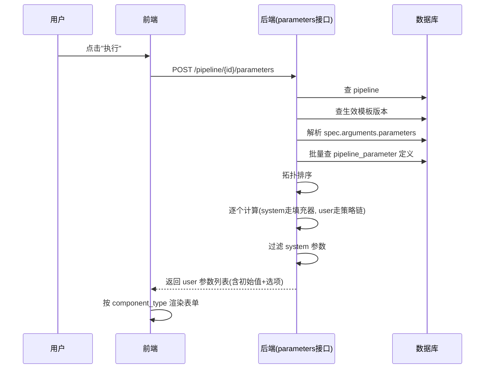
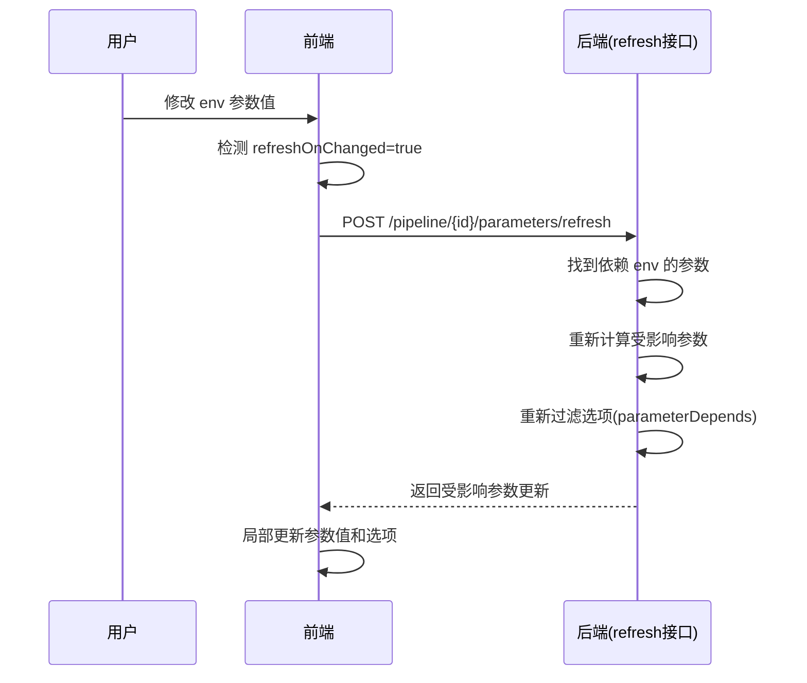
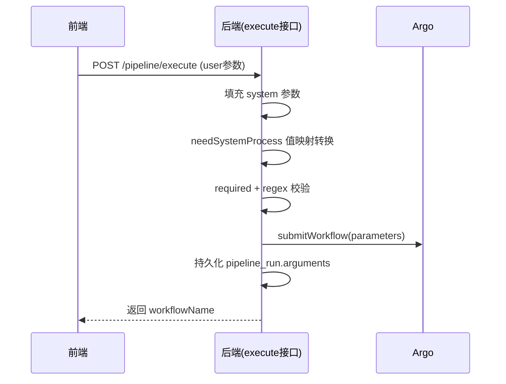
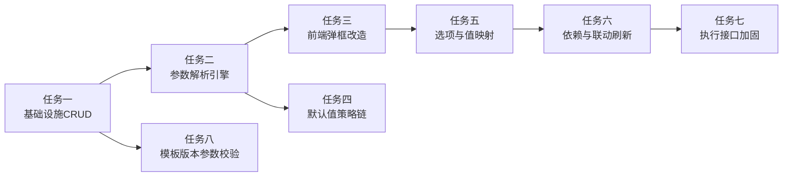

# 流水线参数管理系统 - 技术设计方案

## 一、背景与目标

### 1.1 现状

当前流水线执行时，参数处理采用"纯透传"模式：

- 执行弹框的参数列表直接来自 Argo WorkflowTemplate 的 `spec.arguments.parameters`，前端统一渲染为 `el-input` 文本框。
- 用户需要手动填写所有参数，包括 `app-name` 这类本应由平台自动填充的参数。
- 参数无元数据管理、无校验、无默认值策略、无依赖联动。
- 流水线模板 JSON 直接保存到 Argo，参数随意填写，没有任何校验。

### 1.2 目标

引入全局参数定义表，规范化参数的展示、校验、默认值计算、依赖联动，提升用户填写执行参数的体验与准确性：

1. **系统参数自动填充**：`app-name` 等参数由平台从流水线上下文自动获取，不暴露给用户。
2. **差异化组件渲染**：根据参数类型渲染输入框、下拉框、单选框、Git 目录树等组件。
3. **参数依赖与联动**：参数之间存在依赖关系（如 Maven 版本依赖 JDK 版本），支持值变动后联动刷新。
4. **默认值策略链**：支持多种默认值来源（App 配置、最近成功记录、静态默认值），按优先级计算。
5. **参数校验**：前端 + 后端双层校验（必填 + 正则）。

### 1.3 非目标（本期不实现）

- 触发器触发场景的参数处理（后续迭代）。
- 条件配置（`conditionConfig`，参数行为的动态调整）。
- App 配置表的扩展（`AppConfig` 策略给空实现，预留扩展点）。

---

## 二、整体架构

### 2.1 分层职责

```
┌─────────────────────────────────────────────────────┐
│  前端 (pipeline-frontend)                            │
│  PipelineExecuteDialog.vue                           │
│    ├── 参数渲染引擎（按 component_type 动态渲染）      │
│    ├── 联动刷新交互（监听 refresh_on_changed）         │
│    └── 前端校验（required + regex）                   │
├─────────────────────────────────────────────────────┤
│  后端 (pipeline-server)                              │
│  PipelineParameterController                         │
│    ├── 参数定义管理 CRUD                              │
│  PipelineController（扩展）                           │
│    ├── 参数列表接口（解析 + 计算）                      │
│    ├── 参数刷新接口（联动重算）                        │
│    └── 执行接口（合并 + 转换 + 校验）                  │
│  参数解析与计算引擎                                    │
│    ├── 模板参数解析（spec.arguments.parameters）       │
│    ├── 拓扑排序（按 depend_params）                   │
│    ├── 系统参数填充器（策略模式）                      │
│    ├── 默认值策略链（策略模式）                        │
│    └── 值映射转换（value → realValue）                │
├─────────────────────────────────────────────────────┤
│  数据层                                              │
│    pipeline_parameter（全局参数定义表）                │
│    pipeline_run（执行记录，参数记忆来源）              │
└─────────────────────────────────────────────────────┘
```

### 2.2 核心设计模式

| 模式 | 应用场景 |
|------|---------|
| 策略模式 | 系统参数填充器（按 `name` 路由）、默认值策略链（按 `strategyType` 路由） |
| 模板方法 | 参数计算流程骨架（解析 → 排序 → 逐个计算 → 过滤返回） |
| 责任链 | 默认值策略按 `priority` 降序遍历，取第一个非 null 结果 |

---

## 三、数据模型设计

### 3.1 参数定义表 `pipeline_parameter`

```sql
CREATE TABLE `pipeline_parameter` (
  `id` bigint NOT NULL AUTO_INCREMENT,
  `name` varchar(100) NOT NULL COMMENT '参数名，全局唯一，对应argo yaml中参数的name字段，例如：app-name、env等等',
  `label` varchar(100) NOT NULL COMMENT '参数中文名称，前端表单展示的时候用，用于表单的label值',
  `description` varchar(500) DEFAULT NULL COMMENT '参数详细描述，可以用于前端表单tooltip展示',
  `component_type` varchar(50) DEFAULT NULL COMMENT '前端组件类型，参数的展示方式，比如：input、select、radio等等',
  `param_type` varchar(50) NOT NULL COMMENT '参数类型：system-系统参数（用户不可见，系统自动填充）、user-用户参数（用户可见，需填写/选择）',
  `required` tinyint(1) NOT NULL DEFAULT '0' COMMENT '参数是否必填',
  `default_value` varchar(200) DEFAULT NULL COMMENT '参数的默认值，如果其它所有的数据源都获取不到默认值，则使用该默认值',
  `need_system_process` tinyint(1) NOT NULL DEFAULT '0' COMMENT '是否需要系统内部处理，用户/外部传入的参数值需要经过系统额外处理（如值映射转换）',
  `regex_pattern` varchar(100) DEFAULT NULL COMMENT '参数需要满足的正则表达式，定义了对参数的校验规则',
  `depend_params` varchar(500) DEFAULT NULL COMMENT '依赖的参数，JSON数组格式，如 ["build-jdk-version"]；被依赖的参数需先求值',
  `refresh_on_changed` tinyint(1) NOT NULL DEFAULT '0' COMMENT '参数值变动后是否刷新整体的参数，一般是参数被其它参数依赖的时候',
  `param_group` varchar(50) NOT NULL COMMENT '参数所属的组别，用于分类展示参数',
  `param_group_sort` int NOT NULL DEFAULT '0' COMMENT '参数在所属组别里面的排序值，定义了展示顺序',
  `option_config` text COMMENT '参数选项配置，JSON数组格式，用于下拉选择、单选按钮等场景',
  `default_value_strategy_config` text COMMENT '默认值计算策略配置，JSON数组格式，定义默认值的来源和优先级',
  `creator` varchar(45) NOT NULL COMMENT '创建人',
  `create_time` datetime NOT NULL DEFAULT CURRENT_TIMESTAMP,
  `update_time` datetime NOT NULL DEFAULT CURRENT_TIMESTAMP ON UPDATE CURRENT_TIMESTAMP,
  `deleted` tinyint(1) NOT NULL DEFAULT '0',
  PRIMARY KEY (`id`),
  KEY `idx_param_name` (`name`)
) ENGINE=InnoDB DEFAULT CHARSET=utfmb3 COMMENT='流水线参数定义表，全局共享，规范化argo workflow template的参数管理';
```

### 3.2 配置 JSON 结构定义

#### 3.2.1 `option_config`（选项配置）

用于 `select`、`radio` 等组件的选项列表：

```json
[
    {
        "value": "jdk8",
        "label": "jdk8",
        "realValue": "jdk:8u202",
        "asDefault": false,
        "parameterDepends": null
    },
    {
        "value": "maven:3.6.3",
        "label": null,
        "realValue": "maven:3.6.3-jdk-8u202",
        "asDefault": true,
        "parameterDepends": [
            {
                "name": "jdk-version",
                "value": "jdk:8u202"
            }
        ]
    }
]
```

| 字段 | 类型 | 说明 |
|------|------|------|
| `value` | String | 选项值，用户选择后提交的值（映射前） |
| `label` | String | 选项展示文案，为 null 时用 `value` 展示 |
| `realValue` | String | 实际传给 Argo 的值（值映射转换后的值） |
| `asDefault` | Boolean | 是否为默认选中项 |
| `parameterDepends` | Array | 选项的显示条件，为 null 表示无条件显示；非 null 时需所有条件匹配才显示 |

`parameterDepends` 元素结构：

| 字段 | 类型 | 说明 |
|------|------|------|
| `name` | String | 依赖的参数名 |
| `value` | String | 依赖参数需等于该值时，本选项才显示 |

#### 3.2.2 `default_value_strategy_config`（默认值策略配置）

```json
[
    {
        "strategyType": "AppConfig",
        "priority": 0
    },
    {
        "strategyType": "LastSuccessfulRun",
        "priority": 1
    }
]
```

| 字段 | 类型 | 说明 |
|------|------|------|
| `strategyType` | String | 策略类型，对应 `DefaultValueStrategyTypeEnum` |
| `priority` | Integer | 优先级，**越大越优先** |

计算规则：按 `priority` 降序遍历所有策略，取第一个非 null 结果；全部为 null 则使用 `default_value` 兜底。

#### 3.2.3 `depend_params`（依赖参数）

JSON 数组格式，元素为参数名字符串：

```json
["build-jdk-version", "env"]
```

被依赖的参数必须先求值，当前参数才能正确计算。

### 3.3 枚举定义

> 命名规范：新增枚举类统一以 `Enum` 结尾，位于 `com.ci.pipeline.common.enums`。

#### 3.3.1 `ParamTypeEnum`（参数类型）

| code | description | 说明 |
|------|-------------|------|
| `system` | 系统参数 | 用户不可见，系统自动从流水线上下文填充 |
| `user` | 用户参数 | 用户可见，需在弹框中填写或选择 |

#### 3.3.2 `ComponentTypeEnum`（前端组件类型）

| code | description | 说明 |
|------|-------------|------|
| `input` | 输入框 | 文本输入 |
| `select` | 下拉框 | 选项来自 `option_config` |
| `radio` | 单选框组 | 选项来自 `option_config` |
| `git-tree` | Git目录树 | Git 仓库目录树选择器 |
| `disabled-input` | 只读输入框 | 系统填充，用户不可改 |
| `hidden` | 隐藏 | 不展示 |

#### 3.3.3 `DefaultValueStrategyTypeEnum`（默认值策略类型）

| code | description | 说明 |
|------|-------------|------|
| `AppConfig` | 应用配置 | 从应用配置读取（本期空实现，预留扩展） |
| `LastSuccessfulRun` | 最近成功记录 | 从最近一次执行成功的记录读取参数值 |

---

## 四、后端设计

### 4.1 模块划分与包结构

```
pipeline-server-common/  com.ci.pipeline.common
  ├── enums/
  │   ├── ParamTypeEnum.java              ← 新增
  │   ├── ComponentTypeEnum.java          ← 新增
  │   └── DefaultValueStrategyTypeEnum.java ← 新增
  └── constants/
      └── PipelineParameterConstants.java ← 新增

pipeline-server-dao/     com.ci.pipeline.dao
  ├── entity/
  │   └── PipelineParameter.java          ← 新增
  ├── mapper/
  │   └── PipelineParameterMapper.java    ← 新增
  └── repository/
      └── PipelineParameterRepository.java ← 新增

pipeline-server-facade/  com.ci.pipeline.facade
  ├── request/
  │   ├── PipelineParameterCreateRequest.java   ← 新增
  │   ├── PipelineParameterUpdateRequest.java   ← 新增
  │   ├── PipelineParameterQueryRequest.java    ← 新增
  │   ├── PipelineParametersRequest.java        ← 新增（参数列表）
  │   └── PipelineParametersRefreshRequest.java ← 新增（参数刷新）
  └── response/
      ├── PipelineParameterResponse.java        ← 新增
      └── PipelineRunParameterResponse.java     ← 新增（执行弹框参数项）

pipeline-server-service/ com.ci.pipeline.service
  ├── controller/
  │   └── PipelineParameterController.java      ← 新增
  ├── service/
  │   ├── PipelineParameterService.java         ← 新增（接口，参数定义CRUD + 执行参数解析计算）
  │   ├── impl/
  │   │   └── PipelineParameterServiceImpl.java
  │   └── strategy/                             ← 新增子包（策略类统一放这里）
  │       ├── systemparam/                      ← 系统参数填充器
  │       │   ├── SystemParamFiller.java        ← 接口
  │       │   ├── SystemParamFillerManager.java ← 路由管理
  │       │   └── impl/
  │       │       ├── AppNameParamFiller.java   ← app-name 填充器
  │       │       └── ...                       ← 其他系统参数填充器
  │       └── defaultvalue/                     ← 默认值策略
  │           ├── DefaultValueStrategy.java     ← 接口
  │           ├── DefaultValueStrategyManager.java ← 策略链管理
  │           └── impl/
  │               ├── AppConfigStrategy.java    ← 空实现
  │               └── LastSuccessfulRunStrategy.java
  └── util/
      └── ArgoWorkflowUtil.java                 ← 复用，扩展参数解析方法
```

### 4.2 参数定义管理接口（CRUD）

#### 4.2.1 Controller

`PipelineParameterController`，路径 `/pipeline-parameter`：

```java
@Slf4j
@RestController
@RequestMapping("/pipeline-parameter")
@RequireLogin
public class PipelineParameterController {

    @Autowired
    private PipelineParameterService pipelineParameterService;

    @PostMapping
    public Result<PipelineParameterResponse> create(
            @RequestBody PipelineParameterCreateRequest request);

    @PutMapping
    public Result<PipelineParameterResponse> update(
            @RequestBody PipelineParameterUpdateRequest request);

    @DeleteMapping("/{id}")
    public Result<Void> delete(@PathVariable("id") Long id);

    @GetMapping("/{id}")
    public Result<PipelineParameterResponse> get(@PathVariable("id") Long id);

    @GetMapping("/page")
    public Result<PageResponse<PipelineParameterResponse>> page(
            PipelineParameterQueryRequest query);
}
```

#### 4.2.2 Request / Response DTO

**PipelineParameterCreateRequest**：

```java
@Data
public class PipelineParameterCreateRequest implements Serializable {
    private String name;                    // 必填，全局唯一
    private String label;                   // 必填
    private String description;
    private String componentType;           // 对应 ComponentTypeEnum
    private String paramType;               // 必填，对应 ParamTypeEnum
    private Boolean required;               // 默认 false
    private String defaultValue;
    private Boolean needSystemProcess;      // 默认 false
    private String regexPattern;
    private String dependParams;            // JSON 数组字符串
    private Boolean refreshOnChanged;       // 默认 false
    private String paramGroup;              // 必填
    private Integer paramGroupSort;         // 默认 0
    private String optionConfig;            // JSON 数组字符串
    private String defaultValueStrategyConfig; // JSON 数组字符串
}
```

**PipelineParameterUpdateRequest**：同 Create，增加 `id` 必填字段。

**PipelineParameterQueryRequest**：

```java
@Data
public class PipelineParameterQueryRequest implements Serializable {
    private String name;        // 模糊匹配
    private String label;       // 模糊匹配
    private String paramType;   // 精确匹配
    private String paramGroup;  // 精确匹配
    private String sortField;
    private String sortOrder;
    private Long pageNum;
    private Long pageSize;
}
```

**PipelineParameterResponse**：包含全部字段 + `createTime` / `updateTime`。

#### 4.2.3 校验规则

- `name`：非空，全局唯一（排除自身），符合 `^[a-z][a-z0-9-]*$` 格式。
- `paramType`：必须是 `ParamTypeEnum` 的合法 code。
- `componentType`：若非 null，必须是 `ComponentTypeEnum` 的合法 code。
- `optionConfig`：若非 null，必须是合法 JSON 数组，元素结构符合 `OptionConfig` 定义。
- `default_value_strategy_config`：若非 null，必须是合法 JSON 数组，元素结构符合策略配置定义，`strategyType` 必须是合法枚举值。
- `dependParams`：若非 null，必须是合法 JSON 字符串数组，引用的参数名必须已存在。
- 校验失败统一抛 `BusinessException(PipelineParameterConstants.MSG_XXX)`。

### 4.3 参数解析与计算引擎（核心）

> 参数定义 CRUD 与参数解析计算统一由 `PipelineParameterService` 提供，避免领域服务拆分过细。

#### 4.3.1 入口接口

扩展 `PipelineController`，新增两个接口（参考参数弹框 + 刷新的设计），Controller 内调用 `PipelineParameterService` 的参数解析方法：

```java
@ApiOperation("流水线执行参数列表")
@PostMapping("/{pipelineId}/parameters")
public Result<List<PipelineRunParameterResponse>> parameters(
        @PathVariable("pipelineId") Long pipelineId);

@ApiOperation("刷新流水线执行参数")
@PostMapping("/{pipelineId}/parameters/refresh")
public Result<List<PipelineRunParameterResponse>> refreshParameters(
        @PathVariable("pipelineId") Long pipelineId,
        @RequestBody PipelineParametersRefreshRequest request);
```

**PipelineParametersRefreshRequest**：

```java
@Data
public class PipelineParametersRefreshRequest implements Serializable {
    private String changedParamName;              // 变动的参数名
    private Map<String, String> currentValues;    // 当前所有参数值（key=参数名）
}
```

#### 4.3.2 参数列表计算流程（`parameters` 接口）

```
1. 查 pipeline → 获取 appName、pipelineTemplateCode
2. 查生效模板版本 → 解析 spec.arguments.parameters 得到参数名列表
3. 按 name 批量查 pipeline_parameter 定义（未定义的参数降级为普通 input）
4. 构建参数依赖图，拓扑排序（按 depend_params）
5. 构建参数计算上下文 ParamResolveContext：
     - pipelineId, appName, pipelineTemplateCode
     - 已计算参数值 Map（逐步填充）
6. 按拓扑顺序逐个计算参数初始值：
     ├── paramType = system → SystemParamFillerManager.fill(name, context)
     │     └── 找不到填充器则用 defaultValue 兜底
     └── paramType = user → DefaultValueStrategyManager.resolve(name, config, context)
           └── 按 priority 降序遍历策略，取第一个非 null；全 null 用 defaultValue
7. 过滤掉 paramType = system 的参数，只返回 user 参数给前端
8. 按 param_group + param_group_sort 排序返回
```

#### 4.3.3 参数刷新流程（`refreshParameters` 接口）

```
1. 查 pipeline + 模板参数名列表 + 参数定义（同上）
2. 将 request.currentValues 合并到计算上下文
3. 找到所有 dependParams 包含 changedParamName 的参数（直接依赖）
4. 递归找到间接依赖的参数（依赖链）
5. 对受影响的参数重新计算：
     ├── system 参数 → 重新走 SystemParamFiller
     └── user 参数 → 重新走默认值策略链（此时上下文已含最新值）
6. 重新计算受影响参数的 optionConfig 可见选项（按 parameterDepends 过滤）
7. 返回受影响参数的最新值和选项（前端局部更新）
```

#### 4.3.4 响应结构 `PipelineRunParameterResponse`

```java
@Data
public class PipelineRunParameterResponse implements Serializable {
    private String name;
    private String label;
    private String description;
    private String componentType;
    private String paramType;
    private Boolean required;
    private Boolean refreshOnChanged;
    private String regexPattern;
    private String paramGroup;
    private Integer paramGroupSort;
    private String value;                 // 当前值（已计算）
    private List<OptionItem> options;     // 过滤后的可见选项（select/radio 用）
    private Boolean hidden;               // 是否隐藏（条件不满足时）

    @Data
    public static class OptionItem implements Serializable {
        private String value;
        private String label;
        private Boolean asDefault;
    }
}
```

> 注意：`realValue` 不返回给前端，值映射转换在后端执行接口完成，避免敏感信息暴露。

### 4.4 系统参数填充器（策略模式）

#### 4.4.1 接口定义

```java
public interface SystemParamFiller {
    /**
     * 填充器支持的参数名
     */
    String paramName();

    /**
     * 获取参数值
     * @param context 参数计算上下文（含 pipelineId、appName 等）
     * @return 参数值，返回 null 表示无法填充
     */
    String fill(ParamResolveContext context);
}
```

#### 4.4.2 路由管理器

```java
@Component
public class SystemParamFillerManager {
    private final Map<String, SystemParamFiller> fillers; // key = paramName()

    @Autowired
    public SystemParamFillerManager(List<SystemParamFiller> fillerList) {
        this.fillers = fillerList.stream()
            .collect(Collectors.toMap(SystemParamFiller::paramName, f -> f));
    }

    public String fill(String paramName, ParamResolveContext context) {
        SystemParamFiller filler = fillers.get(paramName);
        return filler != null ? filler.fill(context) : null;
    }
}
```

#### 4.4.3 首期实现

| 填充器 | paramName | 值来源 |
|--------|-----------|--------|
| `AppNameParamFiller` | `app-name` | `pipeline.getAppName()` |
| `PipelineIdParamFiller` | `pipeline-id` | `pipeline.getId()` |
| `PipelineTemplateCodeParamFiller` | `pipeline-template-name` | `pipeline.getPipelineTemplateCode()` |

后续按需扩展，新增填充器只需实现接口 + 注册为 Spring Bean。

### 4.5 默认值策略链（策略模式）

#### 4.5.1 接口定义

```java
public interface DefaultValueStrategy {
    /**
     * 策略类型，对应 DefaultValueStrategyTypeEnum
     */
    String strategyType();

    /**
     * 获取默认值
     * @param paramName 参数名
     * @param context 参数计算上下文
     * @return 默认值，返回 null 表示该策略未命中
     */
    String getValue(String paramName, ParamResolveContext context);
}
```

#### 4.5.2 策略管理器

```java
@Component
public class DefaultValueStrategyManager {
    private final Map<String, DefaultValueStrategy> strategies;

    @Autowired
    public DefaultValueStrategyManager(List<DefaultValueStrategy> strategyList) {
        this.strategies = strategyList.stream()
            .collect(Collectors.toMap(DefaultValueStrategy::strategyType, s -> s));
    }

    /**
     * 按 priority 降序遍历策略，取第一个非 null 结果
     */
    public String resolve(String paramName, String strategyConfigJson,
                          ParamResolveContext context) {
        List<StrategyConfig> configs = parseConfig(strategyConfigJson);
        // priority 降序
        configs.sort((a, b) -> b.getPriority() - a.getPriority());
        for (StrategyConfig config : configs) {
            DefaultValueStrategy strategy = strategies.get(config.getStrategyType());
            if (strategy != null) {
                String value = strategy.getValue(paramName, context);
                if (value != null) {
                    return value;
                }
            }
        }
        return null; // 全部未命中，由调用方用 defaultValue 兜底
    }
}
```

#### 4.5.3 首期实现

| 策略类 | strategyType | 实现 |
|--------|-------------|------|
| `AppConfigStrategy` | `AppConfig` | 空实现，直接返回 null（预留扩展） |
| `LastSuccessfulRunStrategy` | `LastSuccessfulRun` | 查 `pipeline_run` 表，取该 pipeline 最近一次 `Succeeded` 记录的 `arguments` JSON，提取对应参数值 |

### 4.6 执行接口改造

`PipelineServiceImpl.execute()` 增加参数处理逻辑：

```
1. 接收 PipelineExecuteRequest（含 pipelineId + 用户填写的 user 参数 Map）
2. 查 pipeline + 模板参数名列表 + 参数定义
3. 构建完整参数 Map：
     ├── user 参数：来自 request.parameters
     └── system 参数：SystemParamFillerManager 自动填充
4. 对 needSystemProcess = true 的参数做值映射转换：
     └── 查 option_config，找到 value 匹配的选项，替换为 realValue
5. 后端校验：
     ├── required 参数非空校验
     └── regexPattern 正则校验
6. 组装为 Argo name=value 列表，提交 Workflow
7. 持久化 pipeline_run.arguments（存转换后的值）
```

### 4.7 参数计算上下文

```java
@Data
@Builder
public class ParamResolveContext {
    private Long pipelineId;
    private String appName;
    private String pipelineTemplateCode;
    private String namespace;
    /** 已计算的参数值，计算过程中逐步填充 */
    private Map<String, String> resolvedValues;
}
```

---

## 五、前端设计

### 5.1 执行弹框组件抽离

将内联在 `PipelineList.vue` 的执行弹框抽为独立组件：

```
src/views/pipeline/components/PipelineExecuteDialog.vue
```

**Props**：

```ts
interface Props {
  modelValue: boolean          // v-model 控制显隐
  pipelineId: number           // 流水线 ID
}

/** Emits */
emit('update:modelValue', value: boolean)
emit('success', workflowName: string)
```

### 5.2 参数渲染引擎

根据 `componentType` 动态渲染：

| componentType | 渲染组件 | 说明 |
|---------------|---------|------|
| `input` | `el-input` | 文本输入 |
| `select` | `el-select` + `el-option` | 选项来自 `options` |
| `radio` | `el-radio-group` + `el-radio` | 选项来自 `options` |
| `git-tree` | `GitTreeSelector.vue`（新增） | Git 目录树选择（首期可简化为 input） |
| `disabled-input` | `el-input` + `disabled` | 只读展示 |
| `hidden` | 不渲染 | — |

**参数分组展示**：按 `paramGroup` 分组，组内按 `paramGroupSort` 排序，使用 `el-collapse` 或分区标题展示。

### 5.3 联动刷新交互

```ts
// 监听参数值变化
watch(execValues, (newValues, oldValues) => {
  for (const [name, newVal] of Object.entries(newValues)) {
    const oldVal = oldValues[name]
    if (newVal !== oldVal) {
      const param = execParams.find(p => p.name === name)
      if (param?.refreshOnChanged) {
        // 调刷新接口
        refreshParameters(pipelineId, {
          changedParamName: name,
          currentValues: newValues
        }).then(affected => {
          // 局部更新受影响的参数值和选项
          mergeAffectedParams(affected)
        })
      }
    }
  }
}, { deep: true })
```

### 5.4 前端校验

提交前统一校验：

```ts
function validate(): boolean {
  for (const param of execParams) {
    const val = execValues[param.name]
    if (param.required && !val) {
      ElMessage.error(`参数[${param.label}]不能为空`)
      return false
    }
    if (val && param.regexPattern) {
      const regex = new RegExp(param.regexPattern)
      if (!regex.test(val)) {
        ElMessage.error(`参数[${param.label}]格式不正确`)
        return false
      }
    }
  }
  return true
}
```

### 5.5 参数定义管理后台页面

```
src/views/pipeline-parameter/
  ├── PipelineParameterList.vue       # 列表页（分页 + 查询）
  └── PipelineParameterEdit.vue       # 新增/编辑页
```

- `optionConfig` 和 `defaultValueStrategyConfig` 首期使用 Monaco 代码编辑器（JSON 模式）编辑，后续可做可视化编辑器。

### 5.6 API 接口定义

新增 `src/api/pipelineParameter.ts`：

```ts
/** 参数定义 CRUD */
export function pagePipelineParameter(query: PipelineParameterQuery)
export function createPipelineParameter(dto: PipelineParameterCreate)
export function updatePipelineParameter(dto: PipelineParameterUpdate)
export function deletePipelineParameter(id: number)
export function getPipelineParameter(id: number)

/** 执行参数列表与刷新（扩展 pipeline.ts） */
export function listRunParameters(pipelineId: number)
export function refreshRunParameters(pipelineId: number, req: PipelineParametersRefresh)
```

---

## 六、关键流程时序图

### 6.1 执行弹框打开 - 参数加载



### 6.2 参数联动刷新



### 6.3 执行提交 - 参数处理



---

## 七、实施任务拆分（递进式）

功能分步实现，每个任务可独立交付，任务之间递进依赖，便于跨会话平滑推进。

### 任务一：基础设施（参数定义 CRUD）

**目标**：建立参数定义表和管理后台。

**范围**：
- 建表 `pipeline_parameter`
- Entity / Mapper / Repository
- 枚举类（`ParamTypeEnum` / `ComponentTypeEnum` / `DefaultValueStrategyTypeEnum`）
- 常量类 `PipelineParameterConstants`
- Request / Response DTO
- Controller / Service CRUD 接口
- 前端参数管理页面（列表 + 新增 + 编辑）
- `optionConfig` / `default_value_strategy_config` 用代码编辑器编辑

**依赖**：无

**交付物**：可在管理后台维护参数定义。

---

### 任务二：参数解析引擎（执行弹框参数列表）

**目标**：执行弹框的参数列表改为从参数定义表解析，系统参数自动填充。

**范围**：
- 在 `PipelineParameterService` 中扩展参数解析计算能力（不新增 Service）
- 参数解析引擎（模板参数 ↔ 参数定义关联）
- 拓扑排序（`depend_params`）
- `SystemParamFiller` 策略模式 + 首期填充器（`app-name` 等）
- 静态默认值（`default_value` 兜底）
- `parameters` 接口
- 过滤 system 参数，返回 user 参数

**依赖**：任务一

**交付物**：执行弹框参数列表从参数定义表来，系统参数自动填充。

---

### 任务三：前端弹框改造（差异化渲染）

**目标**：执行弹框按 `component_type` 差异化渲染，分组展示，基础校验。

**范围**：
- 抽离 `PipelineExecuteDialog.vue` 组件
- 参数渲染引擎（input / select / radio / disabled-input）
- 参数分组展示（`param_group` + `param_group_sort`）
- 前端校验（required + regex）
- 对接 `parameters` 接口

**依赖**：任务二

**交付物**：执行弹框体验显著提升，参数按类型差异化展示。

---

### 任务四：默认值策略链

**目标**：实现默认值多策略组合 + 优先级计算。

**范围**：
- `DefaultValueStrategy` 策略模式
- `DefaultValueStrategyManager`（按 priority 降序遍历）
- `AppConfigStrategy`（空实现）
- `LastSuccessfulRunStrategy`（查最近成功记录）
- 集成到参数解析引擎

**依赖**：任务二

**交付物**：参数默认值按策略链计算，支持参数记忆。

---

### 任务五：选项与值映射

**目标**：`option_config` 渲染、条件过滤、值映射转换。

**范围**：
- 前端 select / radio 渲染选项
- `parameterDepends` 选项过滤（前端本地过滤）
- `asDefault` 默认选中
- 后端执行接口值映射转换（`value` → `realValue`）
- `needSystemProcess` 处理逻辑

**依赖**：任务三

**交付物**：下拉/单选参数正常工作，值映射转换生效。

---

### 任务六：依赖与联动刷新

**目标**：参数依赖联动，前端驱动刷新。

**范围**：
- `refreshParameters` 接口
- 依赖链递归查找
- 受影响参数重新计算
- 选项重新过滤
- 前端联动交互（监听 `refresh_on_changed`）
- 循环依赖检测（启动时校验 `depend_params` 无环）

**依赖**：任务五

**交付物**：参数联动刷新完整可用。

---

### 任务七：执行接口加固

**目标**：执行接口完整参数处理与校验。

**范围**：
- 执行接口合并 user + system 参数
- `needSystemProcess` 值转换
- 后端校验（required + regex）
- 参数定义与模板参数名不一致的容错（未定义参数降级为普通 input）
- 历史兼容（`arguments` 字段格式不变）

**依赖**：任务六

**交付物**：参数处理链路完整闭环，校验严格。

---

### 任务八：模板版本参数校验

**目标**：新增/编辑流水线模板版本时，校验模板详情中的输入参数是否都在参数定义表中配置。

**范围**：
- 在流水线模板版本的新增/编辑接口中增加参数校验逻辑
- 解析模板详情 `templateDetail` 中的 `spec.arguments.parameters`，提取所有参数名
- 逐个校验参数名是否存在于 `pipeline_parameter` 表中
- 未配置的参数名收集后，抛 `BusinessException` 提示"以下模板参数未在参数定义表中配置：xxx"
- 保证模板发布到 Argo 前，其参数都已规范化管理

**依赖**：任务一

**交付物**：模板版本参数必须先在参数定义表中配置，否则无法保存。

---

### 任务依赖关系



---

## 八、风险与注意事项

### 8.1 全局参数定义修改的影响面

参数定义全局共享，修改某个参数的配置会影响所有用到它的模板。建议：
- 管理后台编辑参数时提示"该参数被 N 个模板引用"。
- 关键字段（`name`、`param_type`）修改需二次确认。

### 8.2 参数定义与模板参数名不一致

模板中声明了参数名，但参数定义表中未配置。处理策略：
- **降级处理**：未定义的参数按普通 `input` 渲染，使用模板中的 `default` 值。
- 不阻断执行，但在管理后台提示"以下模板参数未在参数定义表中配置"。

### 8.3 联动刷新的循环依赖

`depend_params` 可能形成环（A 依赖 B，B 依赖 A）。处理策略：
- 参数定义保存时做环检测，存在环则拒绝保存。
- 运行时拓扑排序若检测到环，跳过该参数并记录告警日志。

### 8.4 历史兼容

- `pipeline_run.arguments` 字段格式不变（JSON Map），存转换后的最终值。
- 已有的流水线执行记录不受影响。

### 8.5 性能

- 全局参数数量有限（预计百级），参数列表接口可接受多次 DB 查询。
- 联动刷新只返回受影响参数，避免全量返回。
- 后续若参数定义访问频繁，可加本地缓存。

---

## 九、附录

### 9.1 常量类示例

```java
public final class PipelineParameterConstants {
    private PipelineParameterConstants() {}

    public static final String MSG_NAME_REQUIRED = "参数名不能为空";
    public static final String MSG_NAME_FORMAT = "参数名格式不正确，需符合 ^[a-z][a-z0-9-]*$";
    public static final String MSG_NAME_DUPLICATED = "参数名已存在：%s";
    public static final String MSG_LABEL_REQUIRED = "参数中文名称不能为空";
    public static final String MSG_PARAM_TYPE_INVALID = "参数类型不合法：%s";
    public static final String MSG_COMPONENT_TYPE_INVALID = "组件类型不合法：%s";
    public static final String MSG_OPTION_CONFIG_INVALID = "选项配置格式不正确";
    public static final String MSG_STRATEGY_CONFIG_INVALID = "默认值策略配置格式不正确";
    public static final String MSG_DEPEND_PARAM_NOT_EXIST = "依赖的参数不存在：%s";
    public static final String MSG_DEPEND_CIRCULAR = "参数依赖存在循环：%s";
    public static final String MSG_PARAM_REQUIRED = "参数[%s]不能为空";
    public static final String MSG_PARAM_REGEX_FAIL = "参数[%s]格式不正确";
}
```

### 9.2 Entity 示例

```java
@Data
@TableName("pipeline_parameter")
public class PipelineParameter implements Serializable {
    @TableId(type = IdType.AUTO)
    private Long id;
    private String name;
    private String label;
    private String description;
    private String componentType;
    private String paramType;
    private Boolean required;
    private String defaultValue;
    private Boolean needSystemProcess;
    private String regexPattern;
    private String dependParams;
    private Boolean refreshOnChanged;
    private String paramGroup;
    private Integer paramGroupSort;
    private String optionConfig;
    private String defaultValueStrategyConfig;
    private String creator;
    private Date createTime;
    private Date updateTime;
    private Integer deleted;
}
```
